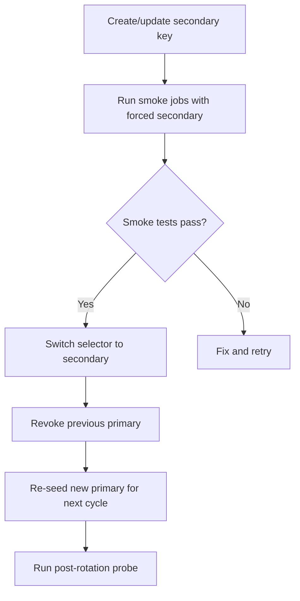

import Tabs from '@theme/Tabs';
import TabItem from '@theme/TabItem';

Gemini API keys are now under stricter governance: leaked keys can be disabled by Google, and API terms and cloud key controls are evolving. Agent workflows that chain multiple jobs and providers are the most exposed. A single leaked key in logs, prompts, or commits can halt automation and trigger incident response.

I reviewed the policy changes and built a concrete key management update plan.

<!-- truncate -->

## The Policy Signals

> "Google documents that exposed API keys can be proactively disabled and owners may be notified."
>
> — Google, [API Key Best Practices](https://cloud.google.com/docs/authentication/api-keys-best-practices)

:::info[Context]
Google API Terms changed with an effective date of **December 18, 2025**. This is a trigger for periodic compliance reviews. Google Cloud API key guidance emphasizes API restrictions, application restrictions, and minimizing unrestricted key use. Leaked keys can now be automatically disabled.
:::

## Secure Key-Management for Agent Workflows

**1. Classification**

| Key Type | Classification | Example |
|---|---|---|
| Production execution | `Secret / Tier-1 / Production-impacting` | `gemini-prod-job-execution` |
| Staging validation | `Secret / Tier-2 / Non-customer-facing` | `gemini-staging-validation` |
| Dev/local | `Sensitive / Tier-3 / Developer-scoped` | `gemini-dev-local` |

Record owner, scope, rotation interval, and last validation date for every key.

**2. Storage**

```bash title="Environment contract"
# highlight-next-line
GEMINI_API_KEY_PRIMARY=<resolved from secret manager>
GEMINI_API_KEY_SECONDARY=<resolved from secret manager>
GEMINI_API_KEY_ACTIVE=primary
```

- Keep active keys in a secret manager or protected runtime env, **never in repo files**.
- Keep `.env.example` with placeholders only. No real values.
- Use one active slot selector and resolve the actual value at runtime.
- Block key material from logs, error traces, and job summaries.

**3. Rotation**



- Fixed rotation SLO: every 30 days for prod, every 14 days for shared staging.
- Post-rotation probes call a minimal Gemini endpoint to verify auth and quota.

**4. Leakage Prevention**

| Control | Implementation |
|---|---|
| Pre-commit scanning | `ggshield` or similar for Gemini key patterns |
| CI secret scanning | Push protection on GitHub |
| Runtime redaction | Middleware for prompt archives, logs, crash dumps |
| Incident runbook | Disable key, rotate to clean slot, review 7-day logs |

## The Real Risk

| Risk | Impact |
|---|---|
| Leaked key in commit | Google auto-disables key, agent workflows halt |
| Key in logs | Exposed to anyone with log access |
| Key in prompt archive | Replayable by anyone with archive access |
| No rotation policy | Single compromised key has unlimited blast radius |
| No dual-slot pattern | Rotation causes downtime |

:::caution[Reality Check]
The major operational risk is not only misuse cost, but service interruption when leaked keys are automatically disabled by Google. A dual-slot pattern keeps rotations and incidents low-downtime for long-running agent workflows. If you are running agent jobs that chain across multiple providers, a single disabled key can cascade into a full pipeline halt.
:::

<details>
<summary>Minimal implementation checklist</summary>

- Add or verify env contract: `GEMINI_API_KEY_PRIMARY`, `GEMINI_API_KEY_SECONDARY`, `GEMINI_API_KEY_ACTIVE`
- Ensure all Gemini calls resolve keys through one key-loader module (no direct `process.env` scatter)
- Enforce CI fail on secret-scan findings
- Schedule monthly rotation job with evidence log (`date`, `operator`, `slot switched`, `probe status`)

</details>

## Why this matters for Drupal and WordPress

Agent workflows that generate Drupal or WordPress code, triage issues, or run content pipelines often call Gemini (or similar) from CI or from long-running jobs. A single leaked key in logs or a repo can get disabled by Google and break all of that automation. Maintainers and agencies using Gemini for contrib, plugins, or internal tooling should treat key management as required: dual-slot rotation, central resolution (no raw env scatter), and secret scanning as a hard CI gate. Plan for keys being disabled on leak; it is no longer hypothetical.

## What I Learned

- The major operational risk is not only misuse cost, but service interruption when leaked keys are automatically disabled.
- A dual-slot pattern keeps rotations and incidents low-downtime for long-running agent workflows.
- The fastest reliability win is central key resolution plus strict leak scanning at commit and CI time.
- Google is getting more aggressive about disabling exposed keys. Plan for it.

## References

- [Gemini API Key Documentation](https://ai.google.dev/gemini-api/docs/api-key)
- [Google API Key Support](https://support.google.com/googleapi/answer/178723?hl=en)
- [Google Cloud API Keys Best Practices](https://cloud.google.com/docs/authentication/api-keys-best-practices)
- [Gemini API Terms](https://ai.google.dev/gemini-api/terms)


***
*Need an Enterprise CMS Architect to modernize your legacy PHP platforms? View my case studies at [victorjimenezdev.github.io](https://victorjimenezdev.github.io) or connect with me on LinkedIn.*
