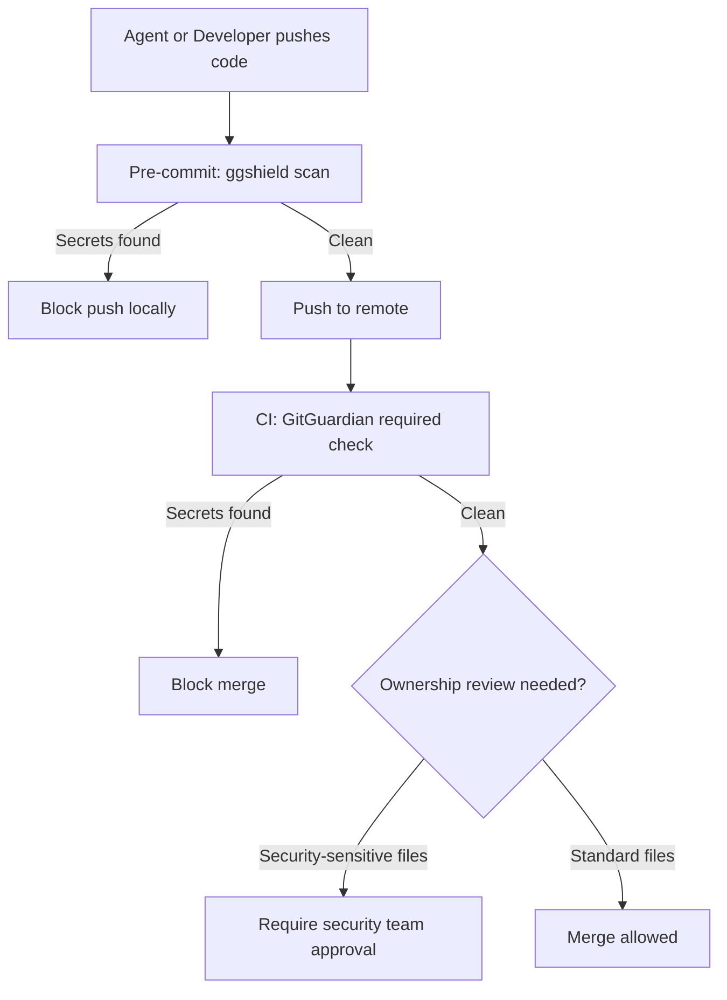

import Tabs from '@theme/Tabs';
import TabItem from '@theme/TabItem';

If AI agents can open pull requests, secret scanning must become a hard merge gate, not a best-effort report. The practical baseline is: pre-commit scanning for fast feedback, CI blocking checks for enforceability, and policy-controlled break-glass paths with audit logs.

I reviewed the GitGuardian MCP integration pattern and tested it against agent-generated PRs.

<!-- truncate -->

## What Breaks Without a Gate

> "Teams adopting agent-generated code often add scanners but keep them non-blocking. That pattern fails."

:::info[Context]
The failure mode is simple: leaked credentials reach protected branches when scans run only locally, CI jobs are optional, or exceptions are handled in chat instead of policy. Agent-generated code is especially risky because it is produced at high volume and often reviewed with less scrutiny than human-written code.
:::

| Failure Mode | Why It Happens |
|---|---|
| Scans run only locally | Agent bypasses local hooks entirely |
| CI jobs are optional | Status check not required for merge |
| Exceptions in chat | No audit trail, no policy enforcement |
| Scanner reports but does not block | Credential reaches protected branch anyway |

## Enforceable Integration Pattern

Use GitGuardian capabilities in two layers:

<Tabs>
<TabItem value="ci" label="CI Gate (GitHub Actions)">

```yaml title=".github/workflows/secret-scan.yml" showLineNumbers
name: secret-scan

on:
  pull_request:
  push:
branches: [main]

jobs:
  gitguardian:
runs-on: ubuntu-latest
steps:
- uses: actions/checkout@v4
# highlight-next-line
- name: GitGuardian scan
uses: GitGuardian/ggshield/actions/secret@v1.37.0
env:
GITGUARDIAN_API_KEY: ${{ secrets.GITGUARDIAN_API_KEY }}
```

Then enforce this workflow as a **required status check** in branch protection. If the check fails, merge is blocked.

</TabItem>
<TabItem value="local" label="Local Pre-Commit">

```bash title="Pre-commit hook setup"
# Install ggshield
pip install ggshield

# Configure pre-commit
# highlight-next-line
ggshield install --mode pre-commit
```

This provides fast feedback to developers and agents before code reaches CI. But it is **not sufficient on its own** — agents can bypass local hooks.

</TabItem>
</Tabs>

## Agent-Safe Policy Contract



Treat every MCP-driven code contribution as untrusted until it passes:

| Gate | Purpose |
|---|---|
| Secret scanning gate | Prevent credential leakage |
| Unit/integration tests | Prevent functional regressions |
| Ownership review for security-sensitive files | Prevent unauthorized access changes |

:::caution[Reality Check]
The key is not tool installation, it is enforceability. If the secret-scanning job is not a required gate, you do not have a control. A minimal policy rule: no direct pushes to protected branches, and no bypass of required checks except a documented, time-bound break-glass process.
:::

## Recommended Rollout

| Step | Action | Timeline |
|---|---|---|
| 1 | Add `ggshield` scan in CI and set as required | Week 1 |
| 2 | Add local/pre-commit scanning for faster fixes | Week 1 |
| 3 | Track false positives and create explicit ignore governance | Week 2-3 |
| 4 | Audit exception usage monthly; reduce to near zero | Ongoing |

<details>
<summary>Break-glass process template</summary>

When a legitimate false positive blocks a critical merge:

1. Requester files a break-glass request with justification
2. Security team reviews within SLA (e.g., 1 hour for SEV-1)
3. Time-bound exception granted (e.g., 24 hours)
4. Exception logged with full audit trail
5. Root cause addressed: either fix the false positive rule or refactor the code
6. Exception revoked after time limit

Monthly audit: review all break-glass usage and reduce exceptions toward zero.

</details>

## Why this matters for Drupal and WordPress

Drupal contrib and WordPress plugin development increasingly involves AI-generated patches, automated dependency updates, and agent-assisted code. Secret scanning as an optional check is not enough: credentials still land in repos and get deployed. For maintainers and agencies shipping Drupal modules or WordPress plugins (whether on drupal.org, WordPress.org, or private repos), a **required** GitGuardian (or equivalent) gate in CI ensures that no merge happens with leaked API keys, tokens, or credentials. Apply the same pattern to any repo that feeds into a Drupal/WordPress build or deployment pipeline. The break-glass process and false-positive governance matter when release pressure is high — so define them before the first incident.

## What I Learned

- This approach is worth adopting now for teams shipping AI-assisted code.
- The key is not tool installation, it is enforceability: if the secret-scanning job is not a required gate, you do not have a control.
- Agent-generated code needs the same (or stricter) scanning as human code.
- False positive management is the operational cost of enforcement. Budget for it.

## References

- [ggshield Getting Started](https://docs.gitguardian.com/ggshield-docs/getting-started)
- [ggshield GitHub Actions Integration](https://docs.gitguardian.com/ggshield-docs/integrations/github-actions)
- [ggshield Repository](https://github.com/GitGuardian/ggshield)
- [ggshield Secret Action](https://github.com/GitGuardian/ggshield/tree/main/actions/secret)
- [GitGuardian MCP](https://github.com/GitGuardian/gg-mcp)


***
*Need an Enterprise CMS Architect to modernize your legacy PHP platforms? View my case studies at [victorjimenezdev.github.io](https://victorjimenezdev.github.io) or connect with me on LinkedIn.*
