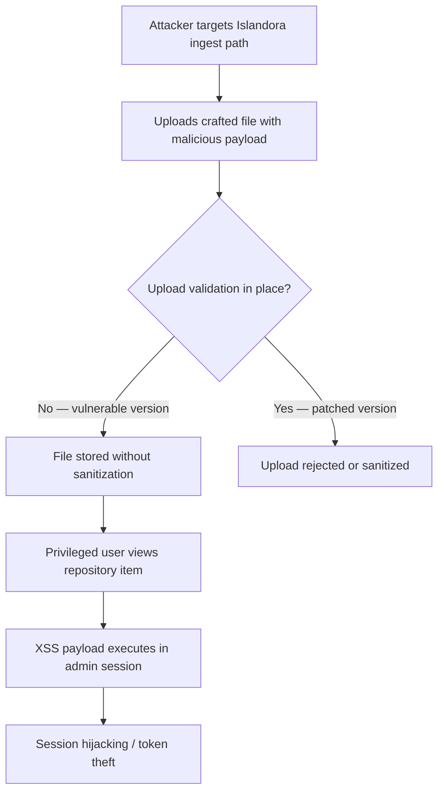

SA-CONTRIB-2026-016 combines two dangerous vulnerability classes in one module path: arbitrary file upload and cross-site scripting. Upload a payload through the repository interface, trigger script execution in a privileged session. That is a practical attack chain, not a theoretical one.

<!-- truncate -->

:::danger[Arbitrary Upload + XSS Chain]
CVE-2026-3215 allows arbitrary file upload combined with XSS in Islandora. If you run `drupal/islandora` below 2.17.5, attackers can store payloads through repository interfaces and execute scripts in privileged browser sessions. Update now.
:::

## Severity Snapshot

| SA ID | CVE | Severity | Affected Versions | Patched Version | Action |
|---|---|---|---|---|---|
| SA-CONTRIB-2026-016 | CVE-2026-3215 | Moderately Critical | `< 2.17.5` | `2.17.5` | Update immediately |

## What Happened

The Drupal Security Team published SA-CONTRIB-2026-016 on February 25, 2026 for the Islandora module (`drupal/islandora`). The advisory covers both arbitrary file upload and cross-site scripting.

The root cause: a validation and output handling gap across upload and render paths. Attacker-controlled files or payloads can be stored and later executed in browser contexts.



> "A validation and output handling gap across upload and render paths creates conditions where attacker-controlled files or payloads can be stored and later executed in browser contexts."
>
> — Drupal Security Team, [SA-CONTRIB-2026-016](https://www.drupal.org/sa-contrib-2026-016)

## Why This Matters

Islandora deployments typically manage high-value repository assets and editorial workflows. The upload-to-XSS chain is practical: introduce payloads through repository interfaces, then trigger script execution in privileged sessions. This is not a low-probability edge case — it is a straightforward attack path.

:::tip[Fast Version Check]
Run `composer show drupal/islandora` to see your installed version. Anything below `2.17.5` needs immediate attention.
:::

## Triage Checklist

- [ ] Check installed version: `composer show drupal/islandora`
- [ ] Verify current version is below `2.17.5`
- [ ] Apply patch: `composer require drupal/islandora:^2.17.5`
- [ ] Clear caches: `drush cr`
- [ ] Review upload permissions: `drush role:perm | grep -Ei "islandora|media|upload"`
- [ ] Test legitimate uploads still work in Islandora ingest paths
- [x] Confirm uploaded content cannot execute scripts in rendered output

```bash title="Terminal — patch Islandora"
composer require drupal/islandora:^2.17.5
drush cr
```

```bash title="Terminal — audit upload permissions"
drush role:perm | grep -Ei "islandora|media|upload"
```

<details>
<summary>Full advisory details</summary>

- **Project:** Islandora (`drupal/islandora`)
- **Advisory:** SA-CONTRIB-2026-016
- **CVE:** CVE-2026-3215
- **Published:** 2026-02-25
- **Risk:** Moderately critical
- **Type:** Arbitrary file upload, Cross-site scripting (XSS)
- **Affected versions:** `< 2.17.5`
- **Fixed version:** `2.17.5`

</details>

## Bottom Line

If your site runs Islandora below `2.17.5`, treat this as active patch work. Upgrade first, then validate upload and rendering paths under real editorial workflows. The upload + XSS combination is the kind of chain that turns a content management issue into an account compromise.

## References

- [SA-CONTRIB-2026-016](https://www.drupal.org/sa-contrib-2026-016)
- [OSV: DRUPAL-CONTRIB-2026-016](https://api.osv.dev/v1/vulns/DRUPAL-CONTRIB-2026-016)
- [Advisory JSON](https://github.com/DrupalSecurityTeam/drupal-advisory-database/blob/main/advisories/islandora/DRUPAL-CONTRIB-2026-016.json)
