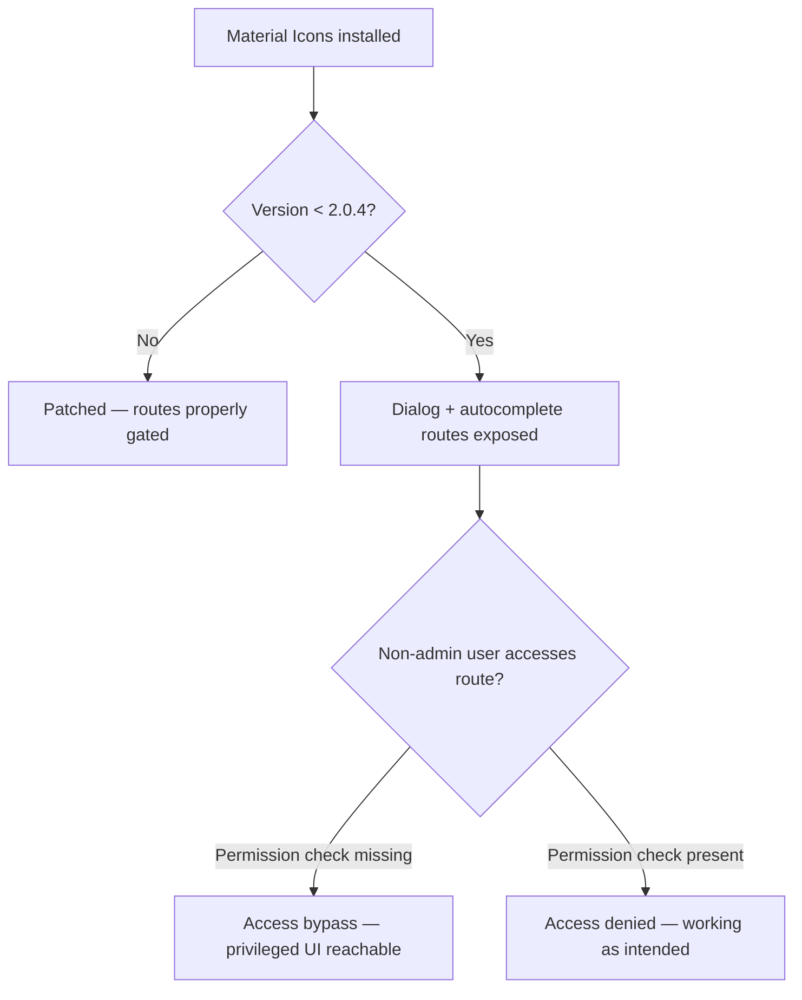

SA-CONTRIB-2026-011 is a classic route-protection bug: dialog and autocomplete routes were not sufficiently guarded by custom permission checks. Non-admin users could reach privileged UI endpoints.

<!-- truncate -->

:::danger[Access Bypass — Privileged Routes Exposed]
CVE-2026-3210 allows non-admin users to access Material Icons dialog and autocomplete routes that should be permission-gated. If you run `drupal/material_icons` below 2.0.4, your editor tooling permissions are wider than you think. Update now.
:::

## Severity Snapshot

| SA ID | CVE | Severity | Affected Versions | Patched Version | Action |
|---|---|---|---|---|---|
| SA-CONTRIB-2026-011 | CVE-2026-3210 | Moderately Critical | `< 2.0.4` | `2.0.4` | Update immediately |

## What Happened

The Drupal Security Team published SA-CONTRIB-2026-011 on February 25, 2026 for the Material Icons module. The advisory covers an access bypass where dialog and autocomplete routes were not sufficiently protected by custom permissions.

The root issue: routes were reachable without the intended permission checks, allowing broader access than designed.



> "Dialog and autocomplete routes were not sufficiently protected by custom permissions, allowing broader access than intended."
>
> — Drupal Security Team, [SA-CONTRIB-2026-011](https://www.drupal.org/sa-contrib-2026-011)

## Why This Matters

Material Icons integrates with CKEditor workflows. If editors or other non-admin roles can access routes that should be gated, you get permission boundary drift in content authoring flows. This is exactly the type of issue that goes unnoticed until an advisory forces an audit.

:::tip[Fast Triage — 10 Seconds]
Run `drush pm:list --status=enabled | grep material_icons` to check if you are affected. Then `composer show drupal/material_icons` for the version.
:::

## Triage Checklist

- [ ] Check if module is installed: `composer show drupal/material_icons`
- [ ] Verify current version is below `2.0.4`
- [ ] Apply patch: `composer require drupal/material_icons:^2.0.4`
- [ ] Clear caches and rebuild router: `drush cr`
- [ ] Review editor permissions: `drush role:perm | grep -Ei "material|ckeditor|icon"`
- [x] Verify least-privilege assignment for editor tooling

```bash title="Terminal — update Material Icons"
composer require drupal/material_icons:^2.0.4
drush cr
```

```bash title="Terminal — audit related permissions"
drush role:perm | grep -Ei "material|ckeditor|icon"
```

<details>
<summary>Full advisory details</summary>

- **Project:** Material Icons (`drupal/material_icons`)
- **Advisory:** SA-CONTRIB-2026-011
- **CVE:** CVE-2026-3210
- **Published:** 2026-02-25
- **Risk:** Moderately critical
- **Type:** Access bypass
- **Affected versions:** `< 2.0.4`
- **Fixed version:** `2.0.4`

</details>

## Why this matters for Drupal and WordPress

Route permission mistakes are the most common access bypass pattern in both Drupal contrib and WordPress plugins. In WordPress, the equivalent is registering REST API endpoints or `wp_ajax_` handlers without proper `current_user_can()` checks or nonce verification. Plugin developers on both platforms should audit every endpoint that serves UI components, autocomplete results, or dialog content to confirm that capability checks match the intended audience. This advisory is a textbook example of the kind of silent permission drift that sits unnoticed until exploitation.

## Bottom Line

If your site uses Material Icons and is below `2.0.4`, treat this as active patch work, not backlog work. Upgrade first, then validate role permissions around editor tooling. Route-protection bugs are silent — they do not break anything visible until someone exploits the gap.

## References

- [SA-CONTRIB-2026-011](https://www.drupal.org/sa-contrib-2026-011)
- [OSV: DRUPAL-CONTRIB-2026-011](https://api.osv.dev/v1/vulns/DRUPAL-CONTRIB-2026-011)
- [Advisory JSON](https://github.com/DrupalSecurityTeam/drupal-advisory-database/blob/main/advisories/material_icons/DRUPAL-CONTRIB-2026-011.json)


***
*Looking for an Architect who doesn't just write code, but builds the AI systems that multiply your team's output? View my enterprise CMS case studies at [victorjimenezdev.github.io](https://victorjimenezdev.github.io) or connect with me on LinkedIn.*
