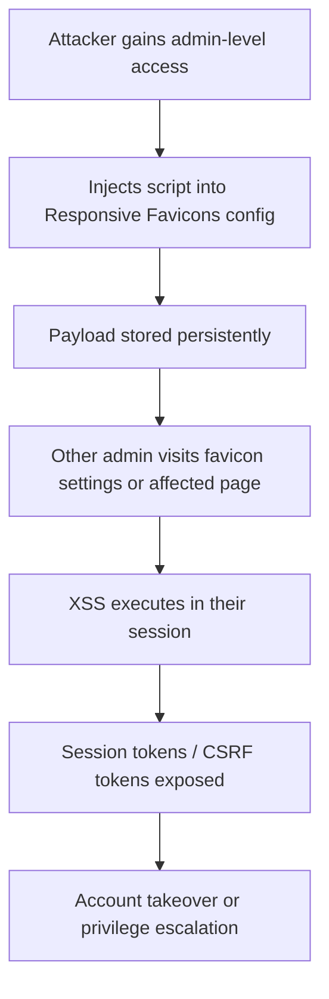

SA-CONTRIB-2026-019 is a persistent XSS issue in Responsive Favicons where admin-entered text was not properly filtered. The permission boundary helps, but a compromised or overly-broad admin account turns configuration fields into script injection points.

<!-- truncate -->

:::danger[Persistent XSS in Admin Config]
CVE-2026-3218 allows persistent cross-site scripting through the Responsive Favicons admin configuration. If you run `drupal/responsive_favicons` below 2.0.2, any user with `administer responsive favicons` can inject scripts that execute in every admin session. Update now.
:::

## Severity Snapshot

| SA ID | CVE | Severity | Affected Versions | Patched Version | Action |
|---|---|---|---|---|---|
| SA-CONTRIB-2026-019 | CVE-2026-3218 | Moderately Critical | `< 2.0.2` | `2.0.2` | Update immediately |

## What Happened

On February 25, 2026, Drupal published SA-CONTRIB-2026-019 for the Responsive Favicons module (`drupal/responsive_favicons`). The advisory is classified as moderately critical cross-site scripting.

The vulnerability: administrator-entered text in configuration fields was not properly filtered. The advisory notes that exploitation requires the `administer responsive favicons` permission — but that is cold comfort when admin accounts are phished, reused, or overly broad.



> "The vulnerability is mitigated by requiring the 'administer responsive favicons' permission, but that is still a meaningful risk in real teams where admin-level access is delegated or compromised."
>
> — Drupal Security Team, [SA-CONTRIB-2026-019](https://www.drupal.org/sa-contrib-2026-019)

## Why This Matters

Persistent XSS on any administrative configuration surface can become a pivot point. Payloads execute in privileged sessions, tamper with workflows, and expose tokens or sensitive UI actions. The permission boundary helps, but it does not eliminate impact if privileged accounts are phished, reused, or overly broad.

:::tip[Check Your Exposure]
Run `drush role:perm | grep "administer responsive favicons"` to see which roles have this permission. If it is granted to anything beyond a tightly-controlled superadmin role, tighten it now.
:::

## Triage Checklist

- [ ] Verify installed version: `composer show drupal/responsive_favicons`
- [ ] Upgrade if below `2.0.2`
- [ ] Clear caches: `drush cr`
- [ ] Restrict `administer responsive favicons` to minimum necessary roles
- [ ] Audit recent configuration changes for suspicious injected markup
- [x] Confirm admin UI renders configuration values safely

```bash title="Terminal — update Responsive Favicons"
composer require drupal/responsive_favicons:^2.0.2
drush cr
```

```bash title="Terminal — audit permission assignment"
drush role:perm | grep "administer responsive favicons"
```

<details>
<summary>Full advisory details</summary>

- **Project:** Responsive Favicons (`drupal/responsive_favicons`)
- **Advisory:** SA-CONTRIB-2026-019
- **CVE:** CVE-2026-3218
- **Published:** 2026-02-25
- **Risk:** Moderately critical
- **Type:** Cross-site scripting (XSS)
- **Affected versions:** `< 2.0.2`
- **Fixed version:** `2.0.2`
- **Note:** 3.x and 4.x branches are not affected

</details>

## Why this matters for Drupal and WordPress

Persistent XSS through admin configuration fields is one of the most underestimated vulnerability classes in both ecosystems. WordPress plugins that store admin-entered HTML or JavaScript snippets in `wp_options` without sanitization via `wp_kses()` or escaping on output via `esc_html()` are vulnerable to the exact same attack chain. Multisite environments and agencies with delegated admin roles are especially exposed because the trust boundary between "admin" and "superadmin" is thinner than most teams realize. Both Drupal and WordPress maintainers should treat admin-entered text as untrusted input.

## Bottom Line

If your site runs Responsive Favicons below `2.0.2`, this is immediate patch work. Upgrade first, then tighten `administer responsive favicons` assignment to the smallest possible set of trusted roles. Admin config XSS is the kind of bug that sits quietly until it is chained with a credential compromise.

## References

- [SA-CONTRIB-2026-019](https://www.drupal.org/sa-contrib-2026-019)
- [OSV: DRUPAL-CONTRIB-2026-019](https://api.osv.dev/v1/vulns/DRUPAL-CONTRIB-2026-019)
- [Advisory JSON](https://github.com/DrupalSecurityTeam/drupal-advisory-database/blob/main/advisories/responsive_favicons/DRUPAL-CONTRIB-2026-019.json)


***
*Need an Enterprise CMS Architect to modernize your legacy PHP platforms? View my case studies at [victorjimenezdev.github.io](https://victorjimenezdev.github.io) or connect with me on LinkedIn.*
