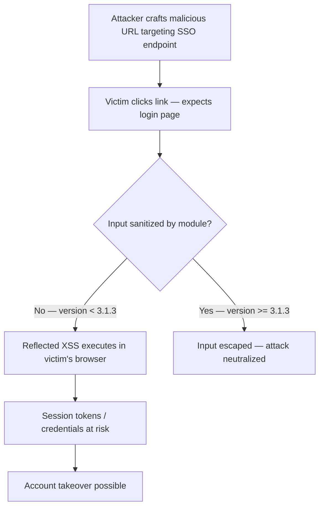

SA-CONTRIB-2026-018 is a critical reflected XSS in an identity-adjacent module. Attacker-controlled input reflects back into browser execution paths on SSO endpoints — the exact surfaces users trust during login.

<!-- truncate -->

:::danger[Critical — XSS on Authentication Endpoints]
CVE-2026-3217 allows reflected cross-site scripting on SAML SSO login endpoints. If you run `drupal/miniorange_saml` below 3.1.3, crafted URLs can execute scripts in users' browsers during the authentication flow. Patch immediately.
:::

## Severity Snapshot

| SA ID | CVE | Severity | Affected Versions | Patched Version | Action |
|---|---|---|---|---|---|
| SA-CONTRIB-2026-018 | CVE-2026-3217 | Critical | `< 3.1.3` | `3.1.3` | Patch immediately |

## What Happened

The Drupal Security Team published SA-CONTRIB-2026-018 on February 25, 2026 for the SAML SSO - Service Provider module (`drupal/miniorange_saml`). The advisory is marked critical and classified as reflected cross-site scripting.

The root issue: the module does not sufficiently sanitize user input, which allows reflected XSS via crafted requests to authentication endpoints.



> "The module does not sufficiently sanitize user input, which allows reflected XSS via crafted requests."
>
> — Drupal Security Team, [SA-CONTRIB-2026-018](https://www.drupal.org/sa-contrib-2026-018)

## Why This Matters

This module sits in the authentication flow. Reflected XSS on SSO endpoints is especially dangerous because:

1. **High-trust surface.** Users expect login pages to be safe. They click links to them without suspicion.
2. **Session context.** Scripts executing during authentication can capture credentials, tokens, or redirect flows.
3. **Blast radius.** Even though exploitation requires user interaction, the login page is the one URL every user visits.

:::tip[Fast Version Check]
Run `composer show drupal/miniorange_saml` to check your installed version. If it shows anything below `3.1.3`, patch now.
:::

## Triage Checklist

- [ ] Check installed version: `composer show drupal/miniorange_saml`
- [ ] Verify version is below `3.1.3`
- [ ] Apply patch: `composer require drupal/miniorange_saml:^3.1.3`
- [ ] Clear caches and rebuild router: `drush cr`
- [ ] Review SSO-related permissions: `drush role:perm | grep -Ei "saml|sso|miniorange"`
- [ ] Test SP-initiated and IdP-initiated login flows
- [x] Confirm error/query parameters on auth endpoints are escaped in rendered output

```bash title="Terminal — patch SAML SSO"
composer require drupal/miniorange_saml:^3.1.3
drush cr
```

```bash title="Terminal — audit SSO permissions"
drush role:perm | grep -Ei "saml|sso|miniorange"
```

<details>
<summary>Full advisory details</summary>

- **Project:** SAML SSO - Service Provider (`drupal/miniorange_saml`)
- **Advisory:** SA-CONTRIB-2026-018
- **CVE:** CVE-2026-3217
- **Published:** 2026-02-25
- **Risk:** Critical
- **Type:** Reflected cross-site scripting (XSS)
- **Affected versions:** `< 3.1.3`
- **Fixed version:** `3.1.3`

</details>

## Bottom Line

If your site uses SAML SSO - Service Provider and is below `3.1.3`, this is not backlog work. XSS on authentication endpoints is the highest-impact reflected XSS you can have — it targets the one page every user visits with full trust. Patch first, then verify login flows and review SSO route exposure.

## References

- [SA-CONTRIB-2026-018](https://www.drupal.org/sa-contrib-2026-018)
- [OSV: DRUPAL-CONTRIB-2026-018](https://api.osv.dev/v1/vulns/DRUPAL-CONTRIB-2026-018)
- [Advisory JSON](https://github.com/DrupalSecurityTeam/drupal-advisory-database/blob/main/advisories/miniorange_saml/DRUPAL-CONTRIB-2026-018.json)
