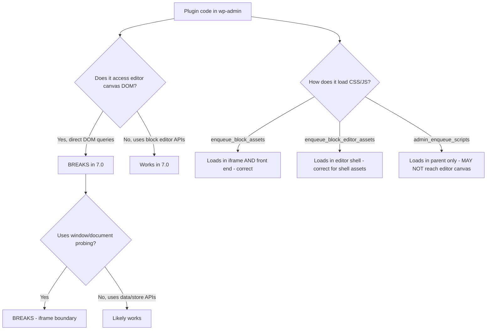

import Tabs from '@theme/Tabs';
import TabItem from '@theme/TabItem';

WordPress 7.0 makes the iframed editor path the practical baseline. Plugins that still assume same-document admin DOM access are the first likely breakpoints. Most upgrade checklists focus on features, but compatibility work is about execution context: iframe boundaries, asset loading, and editor-side JavaScript assumptions.

I wrote this as a migration lens teams can apply before beta/final cutovers.

<!-- truncate -->

## The Change

> "WordPress started loading post editor content in an iframe by default in 6.3 when all registered blocks were API v3+ and no classic metaboxes existed. WordPress 7.0 raises the urgency for plugins still depending on legacy assumptions."

:::info[Context]
The WordPress 7.0 release plan targets **Beta 1 on March 17, 2026** and **final on April 9, 2026**. Compatibility testing should happen now, not after final release. The iframed editor was introduced in 6.3 as conditional behavior. In 7.0, it is the baseline.
:::

## What Actually Changes

<Tabs>
  <TabItem value="before" label="Before (6.x)">

| Behavior | Condition |
|---|---|
| Editor in same document as admin | Classic metaboxes present OR blocks not all API v3+ |
| Editor in iframe | All blocks API v3+ AND no classic metaboxes |
| Plugin CSS/JS in editor context | Same document, direct DOM access works |

  </TabItem>
  <TabItem value="after" label="After (7.0)">

| Behavior | Condition |
|---|---|
| Editor always in iframe | **Default behavior** regardless of block API version |
| Plugin CSS/JS in editor context | Must use correct hooks to load in iframe |
| Direct DOM access from parent | **Broken** — iframe boundary prevents it |

  </TabItem>
</Tabs>

## Where Plugins Break

## The Pre-Upgrade Risk Check

| Risk Pattern | Detection Method | Fix |
|---|---|---|
| Custom metabox usage | Search for `add_meta_box()` | Migrate to block sidebar panels |
| TinyMCE-era selectors | Search for `tinymce`, `mce-content-body` | Remove or replace with block editor equivalents |
| Direct `window`/`document` probing | Search for `document.querySelector` in editor context | Use `wp.data.select()` and `wp.data.dispatch()` |
| CSS depending on wp-admin wrapper ancestry | Search for `.wp-admin` selectors in editor styles | Use `enqueue_block_assets` and scope to editor canvas |
| `admin_enqueue_scripts` for editor content styles | Check hook usage | Switch to `enqueue_block_assets` |

:::caution[Reality Check]
Code that queries editor-canvas DOM from the parent admin document is fragile. Block editor data/store APIs are the safer migration target. `enqueue_block_assets` is the right path for content styles/scripts that must run inside the editor canvas and on the front end. Editor shell assets should stay in `enqueue_block_editor_assets`.
:::

Full compatibility audit checklist

1. Search codebase for `add_meta_box()` calls
2. Search for `document.querySelector`, `document.getElementById` in editor-context JS
3. Search for `window.tinymce`, `mce-content-body` references
4. Audit all `admin_enqueue_scripts` hooks to determine if they target editor content
5. Check CSS selectors for `.wp-admin` wrapper dependencies
6. Test all plugin UI in the block editor with 7.0 beta
7. Verify sidebar panels render correctly inside iframe
8. Test any custom block controls for iframe compatibility
9. Verify print/export features that access editor content
10. Check for any `postMessage` usage that may need updating

## What I Learned

- WordPress 7.0 raises the urgency for plugins still depending on same-document DOM access between admin and editor.
- Block editor data/store APIs are the safer migration target vs direct DOM queries.
- `enqueue_block_assets` is the correct hook for content styles/scripts inside the editor canvas.
- The concrete pre-upgrade risk check: custom metabox usage, TinyMCE-era selectors, direct `window`/`document` editor probing, and CSS that depends on wp-admin wrapper ancestry.
- Compatibility testing should happen now. The beta is March 17, 2026. Final is April 9, 2026.

## References

- [Enqueueing Assets in the Editor](https://developer.wordpress.org/block-editor/how-to-guides/enqueueing-assets-in-the-editor/)
- [Editor Filters and Hooks](https://developer.wordpress.org/block-editor/how-to-guides/curating-the-editor-experience/filters-and-hooks/)
- [WordPress 6.3 Editor Changes](https://make.wordpress.org/core/2023/07/18/miscellaneous-editor-changes-in-wordpress-6-3/)
- [WordPress 6.9 Release](https://wordpress.org/news/2025/12/wordpress-6-9/)
- [WordPress Roadmap](https://wordpress.org/about/roadmap/)
