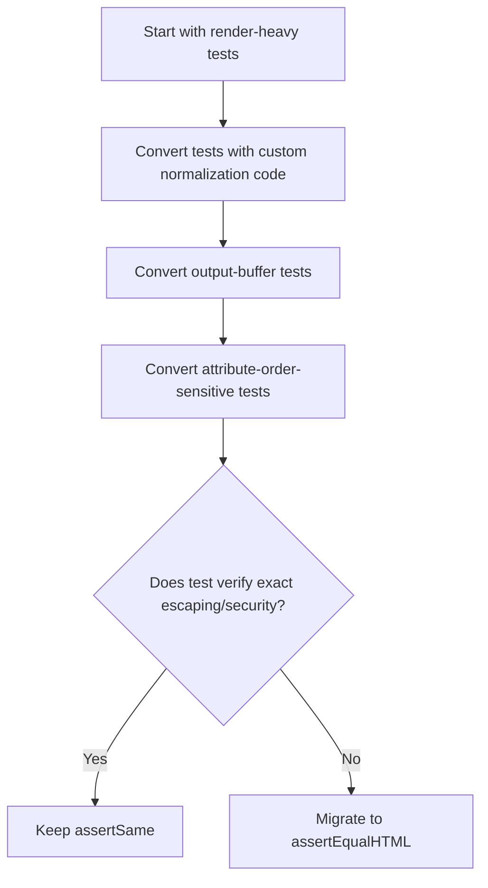

import Tabs from '@theme/Tabs';
import TabItem from '@theme/TabItem';

WordPress 6.9 added `assertEqualHTML()`, which removes a whole category of brittle test failures caused by formatting-only HTML differences. I reviewed the implementation and mapped out concrete migration patterns for plugin and theme test suites.

If your test suite has ever failed because of a whitespace difference in rendered HTML, this is for you.

<!-- truncate -->

## The Problem

> "In plugin and theme suites, many HTML tests still use strict string equality and fail on whitespace, indentation, or equivalent tag formatting instead of real behavior regressions."

:::info[Context]
`assertEqualHTML()` landed in WordPress core test tools in 6.9. It compares HTML equivalence, not raw string identity. The method normalizes whitespace, attribute order, and insignificant formatting differences before comparison. This means `<a class="btn" href="/docs">` and `<a href="/docs" class="btn">` are treated as equivalent.
:::

## Migration Patterns

<Tabs>
<TabItem value="direct" label="1. Direct String to Semantic">

**Before:**
```php title="tests/test-output.php"
$this->assertSame(
'<p class="notice">Saved</p>',
$actual_html
);
```

**After:**
```php title="tests/test-output.php"
// highlight-next-line
$this->assertEqualHTML(
'<p class="notice">Saved</p>',
$actual_html
);
```

</TabItem>
<TabItem value="normalize" label="2. Remove Custom Normalization">

**Before:**
```php title="tests/test-render.php"
$normalize = static fn( $html ) => preg_replace( '/\s+/', ' ', trim( $html ) );
$this->assertSame( $normalize( $expected ), $normalize( $actual ) );
```

**After:**
```php title="tests/test-render.php"
// highlight-next-line
$this->assertEqualHTML( $expected, $actual );
```

No more hand-rolled normalization functions.

</TabItem>
<TabItem value="buffer" label="3. Output Buffer Render Tests">

**Before:**
```php title="tests/test-blocks.php"
ob_start();
render_banner_block( array( 'message' => 'Hi' ) );
$actual = ob_get_clean();

$this->assertSame(
'<section class="banner"><p>Hi</p></section>',
$actual
);
```

**After:**
```php title="tests/test-blocks.php"
ob_start();
render_banner_block( array( 'message' => 'Hi' ) );
$actual = ob_get_clean();

// highlight-next-line
$this->assertEqualHTML(
'<section class="banner"><p>Hi</p></section>',
$actual
);
```

</TabItem>
<TabItem value="attr" label="4. Attribute Order Noise">

**Before (fails):**
```php title="tests/test-links.php"
$expected = '<a class="btn primary" href="/docs">Docs</a>';
$actual   = '<a href="/docs" class="btn primary">Docs</a>';
$this->assertSame( $expected, $actual ); // FAILS
```

**After (passes):**
```php title="tests/test-links.php"
// highlight-next-line
$this->assertEqualHTML( $expected, $actual ); // PASSES
```

</TabItem>
</Tabs>

## When to Use Which Assertion

| Assertion | Use When |
|---|---|
| `assertEqualHTML()` | Rendered markup where DOM meaning matters more than exact serialization |
| `assertSame()` | Exact escaping, spacing, or deterministic serialization matters |
| `assertEqualHTML()` | Tests compensating for formatting differences |
| `assertSame()` | Security assertions verifying exact output |

## Version-Safe Bridge

If your suite runs against WordPress versions older than 6.9:

```php title="tests/helpers/compat.php"
private function assertHtmlEquivalent( string $expected, string $actual ): void {
    if ( method_exists( $this, 'assertEqualHTML' ) ) {
        // highlight-next-line
        $this->assertEqualHTML( $expected, $actual );
        return;
    }
    // Fallback for pre-6.9
    $this->assertSame( trim( $expected ), trim( $actual ) );
}
```

:::caution[Reality Check]
Do not over-migrate. Keep `assertSame()` for escaping/security assertions and exact output contracts. A two-lane assertion policy (`assertEqualHTML()` for semantics, `assertSame()` for exactness) keeps intent explicit. If you replace every assertion with `assertEqualHTML()`, you lose the ability to catch real escaping bugs.
:::

## Rollout Guidance



<details>
<summary>Full rollout checklist</summary>

1. Start with render-heavy tests (`render_callback`, shortcode output, template helpers)
2. Convert only tests currently compensating for formatting differences
3. Keep `assertSame()` for escaping/security assertions and exact output contracts
4. Add a short team note: "Use `assertEqualHTML()` for semantic markup checks"
5. Delete hand-rolled normalization helper functions
6. Run full suite after migration to catch any tests that were silently relying on exact formatting
7. Document the two-lane policy in your testing guidelines

</details>

## Why this matters for Drupal and WordPress

WordPress plugin and theme developers can immediately reduce flaky CI failures by migrating render tests to `assertEqualHTML()`. Drupal developers writing Kernel or Functional tests for render arrays and Twig output face the same problem: comparing rendered HTML with `assertEquals()` breaks on insignificant whitespace and attribute order changes between Drupal core versions. Drupal teams can adopt the same two-lane assertion strategy (semantic comparison for markup, strict comparison for escaping) in their PHPUnit suites, even without a built-in `assertEqualHTML()` equivalent, by writing a thin normalization wrapper.

## What I Learned

- `assertEqualHTML()` landed in WordPress core test tools in 6.9 and compares HTML equivalence, not raw string identity.
- Most migration wins come from deleting custom normalization code and reducing flaky failures.
- A two-lane assertion policy (`assertEqualHTML()` for semantics, `assertSame()` for exactness) keeps intent explicit and avoids over-migration.
- This is one of the most underrated testing improvements in recent WordPress history.

## References

- [WordPress 6.9 Developer Changes](https://make.wordpress.org/core/2025/04/16/miscellaneous-developer-changes-in-wordpress-6-9/)
- [Core Changeset 60301](https://core.trac.wordpress.org/changeset/60301)


***
*Need an Enterprise CMS Architect to modernize your legacy PHP platforms? View my case studies at [victorjimenezdev.github.io](https://victorjimenezdev.github.io) or connect with me on LinkedIn.*
