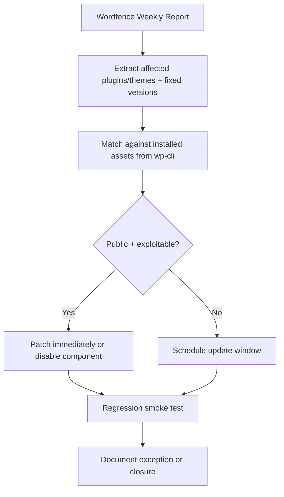

## The Hook
Wordfence’s February 9-15, 2026 report is a reminder that WordPress security is not a reading hobby, it is an operations loop, and sites that treat it like newsletter content are volunteering for downtime.

## Why I Built It
I got tired of the same fake-security ritual: someone drops a vuln report in Slack, everyone reacts with alarm emojis, then nothing gets patched until next week.  
That is not a process. That is theater.

Most WordPress breaches are not zero-days with movie soundtrack energy. They are old plugin bugs sitting unpatched because teams run “content workflows” for security tasks. If your response time is measured in meetings, attackers are already done.

So I framed a stricter workflow: weekly feed in, affected assets mapped, exposure scored, patch or isolate within 24 hours. Boring? Yes. Effective? Also yes.

## The Solution
I treat the weekly report as input to a deterministic triage pipeline:

### What matters technically
1. Use `wp plugin list --format=json` and `wp theme list --format=json` as your source of truth, not memory.
2. Compare installed versions against “fixed in” versions from the report.
3. Prioritize by exposure:
   - Internet-facing forms
   - Authenticated contributor/editor paths
   - Admin-only surfaces
4. If no patch exists, disable feature access and add a WAF rule as a temporary control.

:::warning
If your “mitigation” is “we’ll patch in the next sprint,” that is not mitigation.
:::

### Maintained plugin/module check
Yes, maintained defensive plugins exist, and you should use them:
- `Wordfence Security` is active and maintained, useful for virtual patching and monitoring.
- A maintained security plugin is not a substitute for patching vulnerable plugins. It is a seatbelt, not a teleportation device.

## The Code
No separate repo, because this is an operational playbook built from a vulnerability intelligence report, not a standalone software deliverable.

## What I Learned
- Worth trying when you run multiple WP installs: centralize `wp-cli` inventories and diff them against weekly vulnerability feeds automatically.
- Avoid in production: “security by announcement,” where reports are shared but no owner/time-to-fix SLA is assigned.
- Worth trying when patch windows are constrained: define “patch now / isolate now / monitor now” buckets before incidents happen.
- Avoid in production: relying only on scanner plugins without removing or updating vulnerable components.
- Worth trying when teams are small: one 30-minute weekly vulnerability triage beats one 3-hour post-incident meeting every time.

## References
- [Wordfence Intelligence Weekly WordPress Vulnerability Report (February 9, 2026 to February 15, 2026)](https://www.wordfence.com/blog/2026/02/wordfence-intelligence-weekly-wordpress-vulnerability-report-february-9-2026-to-february-15-2026/)

