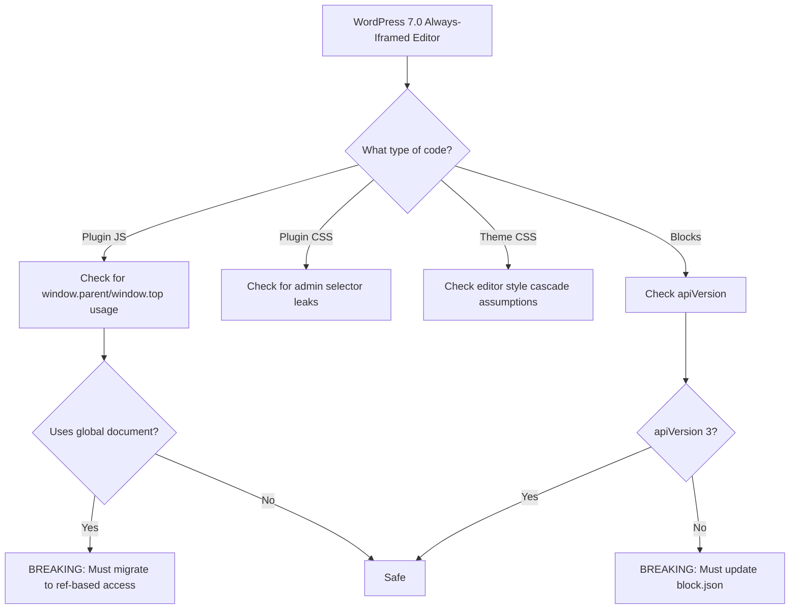

import Tabs from '@theme/Tabs';
import TabItem from '@theme/TabItem';

WordPress 7.0 is changing a long-standing editor behavior: the post editor is planned to always run inside an iframe. This removes a compatibility fallback that let older blocks keep the non-iframed post editor. For plugin and theme maintainers, this is a migration deadline, not just a UX tweak.

<!-- truncate -->

## Release context (as of February 26, 2026)

| Milestone | Date | Status |
|---|---|---|
| WordPress 6.9.1 | February 3, 2026 | Shipped |
| WordPress 7.0 Beta 1 | February 19, 2026 | Announced |
| WordPress 7.0 Final | April 9, 2026 | Planned |

:::warning[Migration Window]
Teams that migrate now in 6.9/7.0 beta cycles should avoid last-minute breakage near the April 9, 2026 release.
:::

## What changed before 7.0

WordPress 6.9 introduced prep work for full iframe integration:

- Console warnings for blocks registered with `apiVersion` 1 or 2 (with `SCRIPT_DEBUG` enabled).
- `block.json` schema validation now expects `apiVersion: 3` for new/updated blocks.

In 7.0, the post editor being always iframed means older assumptions become runtime risks.

## Compatibility impact



**High-risk plugin patterns:**

- JavaScript that touches `window.parent.document`, `window.top`, or admin DOM nodes outside the editor canvas.
- Editor customizations that assume one shared global `document` between wp-admin UI and content canvas.
- CSS relying on admin selectors leaking into editor content styles.

**Migration direction:**

```diff
- // Direct admin DOM access -- BROKEN in 7.0
- const adminEl = window.parent.document.querySelector('.wp-admin');
+ // Use block editor data stores and plugin slots instead
+ const { useSelect } = wp.data;
```

**High-risk theme patterns:**

- Editor styles that depended on admin screen cascade or reset behaviors.
- CSS targeting legacy wrappers instead of block/editor-supported scopes.
- Preview/layout rules that behaved differently in non-iframed post editor contexts.

**Migration direction:**

- Re-test `theme.json` and editor styles with iframe isolation in mind.
- Validate viewport/media-query behavior in editor and front end to confirm parity.
- Remove legacy selector hacks that only worked because admin and content lived in one DOM context.

## Practical migration checklist

- [ ] Enumerate all custom blocks and ensure `apiVersion: 3`
- [ ] Enable `SCRIPT_DEBUG` in staging and clear console warnings
- [ ] Search plugin/theme editor code for `window.parent`, `window.top`, and direct admin DOM selectors
- [ ] Re-run smoke tests in post, template, and site editors with block themes and classic themes
- [ ] Add CI checks for block metadata/schema validity and iframe-unsafe patterns
- [ ] Validate viewport/media-query behavior in editor vs. frontend
- [x] Remove legacy selector hacks from editor stylesheets

### WordPress version compatibility

| Feature | WP 6.8 | WP 6.9 | WP 7.0 |
|---|---|---|---|
| Iframed editor | Optional | Default with warnings | Always |
| `apiVersion` 1/2 blocks | Work | Work (console warnings) | Work (with fallback penalty) |
| `apiVersion` 3 blocks | Work | Work | Required for optimal behavior |
| Cross-frame DOM access | Works | Works | Broken |
| `SCRIPT_DEBUG` warnings | No | Yes | Yes |

<details>
<summary>Iframe-unsafe patterns to search for</summary>

```bash
# Search your plugin/theme codebase for these patterns
grep -rn 'window\.parent\|window\.top\|parent\.document' src/ assets/
grep -rn 'document\.querySelector.*wp-admin' src/ assets/
grep -rn 'document\.head\.appendChild' src/ assets/
```

Any matches indicate code that will break in WordPress 7.0's always-iframed editor.

</details>

## Bottom line

The biggest impact is not visual. It is architectural: code that depended on shared DOM context between wp-admin and editor content now needs explicit, supported integration points.

## Sources

- https://developer.wordpress.org/block-editor/reference-guides/block-api/block-api-versions/block-migration-for-iframe-editor-compatibility/
- https://make.wordpress.org/core/2025/11/12/preparing-the-post-editor-for-full-iframe-integration/
- https://make.wordpress.org/core/2025/11/25/wordpress-6-9-field-guide/
- https://developer.wordpress.org/news/2026/02/whats-new-for-developers-february-2026/
- https://wordpress.org/news/2026/02/wordpress-7-0-beta-1/
- https://wordpress.org/news/2026/02/wordpress-6-9-1-maintenance-release/
