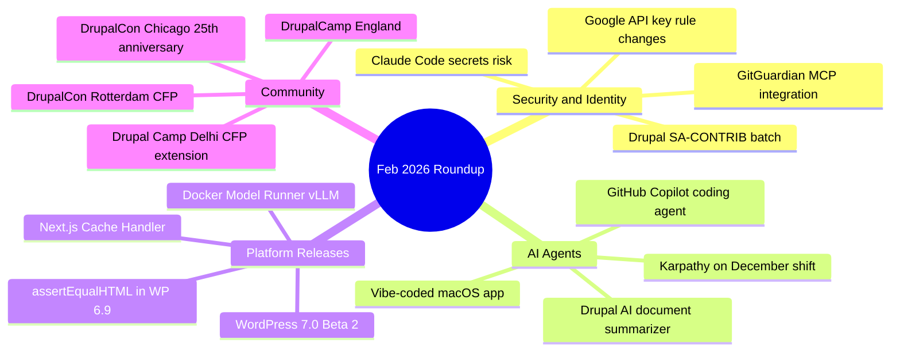

import TOCInline from '@theme/TOCInline';

February 2026 felt like the month where everyone agreed AI coding is "real now," then immediately discovered the bill: secrets sprawl, shaky governance, fragile tests, and communities trying to stay relevant without becoming AI-themed marketing departments.

<!-- truncate -->

<TOCInline toc={toc} minHeadingLevel={2} maxHeadingLevel={2} />

<details>
<summary>TL;DR — 30 second version</summary>

- Claude Code security: if agents can touch infra and tokens, identity boundaries are the blast radius
- GitHub Copilot coding agent: model picker, self-review, security scanning, CLI handoff -- practical upgrades
- WordPress 7.0 Beta 2 is out -- validate plugin/theme compatibility now, not after release
- Drupal security advisory batch + DrupalCon Rotterdam 2026 CFP open
- Docker Model Runner brings vLLM to Apple Silicon; GitGuardian MCP embeds security in agent workflows

</details>



## Security: Identity Is the New Front Line

### Claude Code Security

The useful point here is brutal: code bugs are no longer the only front line. If agents can touch infra, tokens, and cloud APIs, identity boundaries and secret hygiene become the actual blast radius control.

```bash title="Terminal — check for exposed secrets in agent workspace"
# Scan your project for leaked credentials before agent execution
git secrets --scan
# Or use GitGuardian CLI
ggshield secret scan repo .
```

:::warning[Agent Blast Radius]
If agents can touch infra, tokens, and cloud APIs, identity boundaries and secret hygiene become the actual blast radius control. Code bugs are no longer the only front line.
:::

### Shifting Security Left with GitGuardian MCP

Security tooling embedded into agent workflows is becoming mandatory. Catching leaked secrets and risky code during generation is cheaper than incident response later.

### Google API Keys and Gemini Rule Changes

If keys that used to be "public-ish" now unlock private/billable AI behavior, old key management assumptions are dead. Treat API keys by capability, not by legacy habit.

### Drupal Security Advisories (SA-CONTRIB-2026-019 to 011)

A concentrated advisory batch across contrib modules is a reminder that extension ecosystems are attack surfaces. Immediate version audits and updates are mandatory, not optional housekeeping.

## AI Agents: Getting Better, Getting Complicated

### GitHub Copilot Coding Agent Updates

Model picker, self-review, built-in security scanning, custom agents, and CLI handoff are practical upgrades, not fluff. This matters because teams can tune agent behavior and keep human control over review and execution paths.

```text title="Copilot coding agent new capabilities"
- Model picker: choose the right model for the task
- Self-review: agent reviews its own output before submitting
- Security scanning: built into the generation loop
- Custom agents: define specialized agent behaviors
- CLI handoff: direct terminal integration
```

### Quoting Andrej Karpathy on the December Shift

> Agents "basically work since December."

This tracks with what many devs felt: coherence and persistence improved quickly. Why it matters: workflows changed from autocomplete to delegation.

### AI-Assisted Drupal Document Summarizer Tooltip Prototype

A working prototype proves AI-assisted coding can ship useful Drupal features fast. The important nuance is documented limitations: velocity is up, but architecture and quality still need senior judgment.

### Vibe-Coded macOS Presentation App

> Great case study in "build exactly what you need tonight."

Fast custom tooling for one event shows the upside of AI-assisted prototyping. The catch: novelty prototypes are easy; maintainable software is still the hard part.

:::tip[Top Takeaway]
The winners won't be the teams with the flashiest demos. They will be the teams with disciplined security, reliable test practices, clear platform positioning, and communities that can adapt without losing the plot.
:::

### Quoting Benedict Evans on Capability vs Product-Market Fit

> Useful provocation: model capability does not guarantee daily user value.

If people don't use it regularly, your "breakthrough" may still be a feature looking for a product.

## Platform Releases and Updates

### WordPress 7.0 Beta 2

Beta availability means plugin/theme authors should validate compatibility now, not after release week panic. Early testing is how you avoid surprise regressions in production.

```bash title="Terminal — test plugin compatibility against WP 7.0 Beta 2"
# Set up a local test environment with WP 7.0 Beta 2
wp core download --version=7.0-beta2 --path=wp-70-test
wp core install --path=wp-70-test --url=localhost:8080 --title=Test --admin_user=admin --admin_email=test@test.com
# Activate and test your plugins
```

### WordPress `assertEqualHTML()` in 6.9

Semantic HTML assertions reduce test flakiness from irrelevant diffs like attribute order. This matters because stable tests improve release confidence and reduce wasted CI cycles.

:::info[Context]
Semantic HTML assertions in WordPress 6.9 mean your tests no longer break because of attribute reordering in rendered HTML. This is a quality-of-life improvement for anyone maintaining block-related tests.
:::

### Wordfence Weekly Vulnerability Report (Feb 16-22, 2026)

Weekly vuln cadence is a reminder that WordPress risk management is continuous operations, not quarterly cleanup. Patch discipline and inventory awareness beat heroics.

### Docker Model Runner Brings vLLM to Apple Silicon

`vllm-metal` on macOS lowers friction for local high-throughput inference. That matters because more developers can test serious model serving without cloud dependency.

### Next.js Cache Handler Package

Custom cache handlers matter for serious deployments where default caching is not enough. This gives real control over consistency across environments.

### ImageX Performance Boost in Drupal

Performance wins at render and delivery layers directly affect bounce rates and user trust. Faster media handling is one of the highest ROI improvements for content-heavy sites.

### Open WebUI + Docker Model Runner Integration

Auto-detection at `localhost:12434` reduces setup pain for self-hosted model stacks. Lower setup friction means more experimentation by small teams.

## Open Source and Community

### Why Drupal Must Move Beyond the Bubble in the AI Age

This is really about positioning, not branding theater. "Sovereign, AI-ready solutions" is a stronger sell than "just CMS," especially for public sector and regulated orgs.

### tldraw: Moving Tests to Closed Source Repo

This is a hard open-source business signal: test suites can act as executable specs for cloning. Teams now have to balance openness with commercial defensibility.

### DrupalCon Rotterdam 2026 Call for Speakers

Submission window and milestones are clear, so teams can plan content and travel early. Speaking remains one of the best ways to influence roadmap and hiring pipelines.

### Drupal 25th Anniversary Gala at DrupalCon Chicago

Community continuity has strategic value: platforms survive when contributors feel ownership. Culture is infrastructure, just less obvious on architecture diagrams.

### DrupalCamp England 2026

Good signal: focus on production realities, not AI demo magic. Accessibility debt and infra constraints are where real platform maturity is measured.

### Drupal Camp Delhi 2026 CFP Extension to Feb 28

Deadline extensions increase participation and diversity of talks. More voices usually means better practical content, fewer recycled keynotes.

### DrupalCon "Hallway Track" Spotlight

Unscheduled conversations are still where decisions and collaborations happen. Conferences are not just sessions; they are network compilers.

### WP Builds Podcast with Jonathan Desrosiers

Release strategy tied to major events sounds good until global scheduling constraints hit. Governance and logistics shape product quality as much as code does.

### WebMCP for Drupal (mark.ie)

Even early chatter matters: protocol-level integration ideas often start as side comments before becoming roadmap items. Keep an eye on this space.

### Drupal Workspaces Revisited

Workspaces pain points keep resurfacing, which means teams still need better patterns for editorial workflows. Revisiting fundamentals beats patching symptoms forever.

### Simon Willison: Hoard Things You Know How to Do

> Your leverage is knowing what is feasible and what to ask for.

Agents are faster when your mental map of systems is good; they are expensive chaos when it is not.

## Signal Summary

| Topic | Signal | Action | Priority |
|---|---|---|---|
| Claude Code Security | Agents touch infra = identity is blast radius | Audit secret hygiene in agent workflows | Critical |
| GitHub Copilot Agent | Practical upgrades (self-review, scanning) | Evaluate for team adoption | High |
| WordPress 7.0 Beta 2 | Beta available for testing | Validate plugin/theme compat now | High |
| Drupal SA-CONTRIB Batch | Concentrated advisory week | Update all affected contrib | Critical |
| GitGuardian MCP | Security in agent generation loop | Embed in CI/agent workflows | High |
| Docker vLLM on Apple Silicon | Local model serving | Test local inference stacks | Medium |
| tldraw Tests Closed | Tests as strategic IP | Review your test exposure | Medium |
| DrupalCon Rotterdam CFP | Submission window open | Submit talks + plan travel | Low |

## Why this matters for Drupal and WordPress

WordPress 7.0 Beta 2 and Drupal's concentrated SA-CONTRIB advisory batch both demand immediate action from site owners. WordPress plugin and theme developers should start compatibility testing against 7.0 Beta 2 now, while Drupal contrib maintainers need to audit and update affected modules across their portfolios. The AI agent security signals (Claude Code secrets risk, GitGuardian MCP) apply equally to both ecosystems as agencies integrate AI-assisted development into their Drupal module and WordPress plugin workflows.

## The Bottom Line

The signal across all of this is simple: AI coding is more usable, but the winners will not be the teams with the flashiest demos. They will be the teams with disciplined security, reliable test practices, clear platform positioning, and communities that can adapt without losing the plot.


***
*Need an Enterprise CMS Architect to modernize your legacy PHP platforms? View my case studies at [victorjimenezdev.github.io](https://victorjimenezdev.github.io) or connect with me on LinkedIn.*
