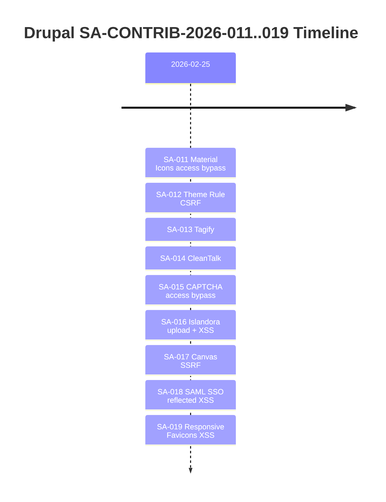

I reviewed Drupal advisories SA-CONTRIB-2026-011 through SA-CONTRIB-2026-019 (published on 2026-02-25) and mapped them against active `drupal-*` projects. Nine advisories, nine modules, one triage session.

<!-- truncate -->

:::warning[Nine Advisories in One Day]
Drupal published nine contrib security advisories on a single day. Even if none of these modules are in your current stack, add them to your dependency watchlist so you catch them if they show up later.
:::

## Advisory-to-Module Map

| SA ID | Module | CVE | Fix Version | Vulnerability Type |
|---|---|---|---|---|
| SA-CONTRIB-2026-011 | `drupal/material_icons` | CVE-2026-3210 | `2.0.4` | Access bypass |
| SA-CONTRIB-2026-012 | `drupal/theme_rule` | CVE-2026-3211 | `1.2.1` | CSRF |
| SA-CONTRIB-2026-013 | `drupal/tagify` | -- | `1.2.49` | -- |
| SA-CONTRIB-2026-014 | `drupal/cleantalk` | -- | `9.7.0` | -- |
| SA-CONTRIB-2026-015 | `drupal/captcha` | CVE-2026-3214 | `8.x-1.17` / `2.0.10` | Access bypass |
| SA-CONTRIB-2026-016 | `drupal/islandora` | CVE-2026-3215 | `2.17.5` | File upload + XSS |
| SA-CONTRIB-2026-017 | `drupal/canvas` | CVE-2026-3216 | `1.1.1` | SSRF + info disclosure |
| SA-CONTRIB-2026-018 | `drupal/miniorange_saml` | CVE-2026-3217 | `3.1.3` | Reflected XSS |
| SA-CONTRIB-2026-019 | `drupal/responsive_favicons` | CVE-2026-3218 | `2.0.2` | Persistent XSS |



## Current Project Impact

I scanned across `drupal-*` repositories in my active projects directory.

:::tip[Fast Dependency Check]
Run `composer show --locked | grep -E "material_icons|theme_rule|tagify|cleantalk|captcha|islandora|canvas|miniorange_saml|responsive_favicons"` against every `composer.lock` in your project portfolio.
:::

**Results:**
- `composer.json` direct requirements: **no matches** for affected packages
- `composer.lock` installed package names: **no matches** for affected packages
- Code-level references: one non-dependency mention of `tagify` API usage in `drupal-ai-context-issue-3572160`, but no `drupal/tagify` package requirement found

> "No currently affected active project dependencies detected for this advisory set."

## Upgrade and Mitigation Actions

Even with zero current matches, I set up forward-looking controls.

### If No Affected Modules Are Installed

- [ ] Add these package names to dependency watchlists in CI checks
- [ ] Re-run advisory triage whenever any of these modules are introduced
- [x] Document baseline clean status for audit trail

### If Any Affected Module Is Added Later

- [ ] Pin minimum safe versions immediately in `composer.json`
- [ ] Run `composer update drupal/<module> --with-all-dependencies`
- [ ] Verify role/permission hardening notes from each advisory before deploy
- [ ] Clear caches and rebuild router: `drush cr`
- [x] Test critical paths after update

```bash title="Terminal — batch check all affected packages"
composer show --locked | grep -E "material_icons|theme_rule|tagify|cleantalk|captcha|islandora|canvas|miniorange_saml|responsive_favicons"
```

```bash title="Terminal — example: pin safe version for captcha"
composer require drupal/captcha:^2.0.10
drush cr
```

<details>
<summary>Special note: SA-CONTRIB-2026-017 (Drupal Canvas)</summary>

If Canvas is adopted later, verify the hidden submodule `canvas_ai` state and related permissions as part of release QA. Recipe-driven enablement can introduce `canvas_ai` without explicit awareness.

Check with:
```bash
drush config:get core.extension | grep canvas_ai
```

If `canvas_ai` is enabled and users have the `use Drupal Canvas AI` permission, the SSRF and information disclosure vectors from SA-CONTRIB-2026-017 apply.

</details>

## Individual Advisory Reviews

For deep-dive analysis on each advisory, see the dedicated review posts:

- [SA-CONTRIB-2026-011: Material Icons](/2026-02-26-material-icons-sa-contrib-2026-011-review)
- [SA-CONTRIB-2026-012: Theme Rule](/drupal-theme-rule-sa-contrib-2026-012-review)
- [SA-CONTRIB-2026-015: CAPTCHA](/2026-02-26-captcha-sa-contrib-2026-015-review)
- [SA-CONTRIB-2026-016: Islandora](/2026-02-26-islandora-sa-contrib-2026-016-review)
- [SA-CONTRIB-2026-017: Canvas](/2026-02-26-drupal-canvas-sa-contrib-2026-017-review)
- [SA-CONTRIB-2026-018: SAML SSO](/2026-02-26-saml-sso-sa-contrib-2026-018-review)
- [SA-CONTRIB-2026-019: Responsive Favicons](/2026-02-26-responsive-favicons-sa-contrib-2026-019-review)

## Why this matters for Drupal and WordPress

Drupal agencies and site owners running contrib-heavy stacks need a repeatable triage workflow when advisory batches like this land. Modules like CAPTCHA, SAML SSO, and Islandora are common in enterprise Drupal builds, and missing even one patch can expose XSS or access-bypass vectors. WordPress teams maintaining parallel CMS portfolios should apply the same dependency-scanning discipline across both ecosystems since many hosting and CI pipelines serve both platforms.

## References

- [SA-CONTRIB-2026-011](https://www.drupal.org/sa-contrib-2026-011)
- [SA-CONTRIB-2026-012](https://www.drupal.org/sa-contrib-2026-012)
- [SA-CONTRIB-2026-013](https://www.drupal.org/sa-contrib-2026-013)
- [SA-CONTRIB-2026-014](https://www.drupal.org/sa-contrib-2026-014)
- [SA-CONTRIB-2026-015](https://www.drupal.org/sa-contrib-2026-015)
- [SA-CONTRIB-2026-016](https://www.drupal.org/sa-contrib-2026-016)
- [SA-CONTRIB-2026-017](https://www.drupal.org/sa-contrib-2026-017)
- [SA-CONTRIB-2026-018](https://www.drupal.org/sa-contrib-2026-018)
- [SA-CONTRIB-2026-019](https://www.drupal.org/sa-contrib-2026-019)


***
*Looking for an Architect who doesn't just write code, but builds the AI systems that multiply your team's output? View my enterprise CMS case studies at [victorjimenezdev.github.io](https://victorjimenezdev.github.io) or connect with me on LinkedIn.*
