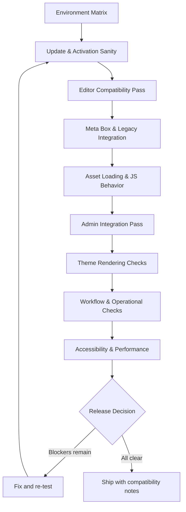

import Tabs from '@theme/Tabs';
import TabItem from '@theme/TabItem';

As of February 27, 2026, WordPress 7.0 Beta 2 (released February 26, 2026) is in active testing ahead of the planned final release on April 9, 2026. I reviewed what can break for custom plugins and themes, and built a minimal checklist to reduce upgrade risk.

<!-- truncate -->

## Top compatibility risks in 7.0 Beta 2

:::danger[Five Breaking Risk Areas]
These are the areas most likely to cause production issues for custom plugins and themes upgrading to WordPress 7.0.
:::

### Risk matrix

| Risk Area | Severity | Who is affected | Mitigation |
|---|---|---|---|
| Connectors UI extension surface | Medium | Plugins managing AI/provider UIs | Align to new extension model |
| Iframe-first editor | High | All block/editor plugins | Update to apiVersion 3 |
| Meta box compatibility debt | Medium | Classic-era plugins | Add compatibility flags |
| Script registration argument drift | Low-Medium | Plugins with custom asset loaders | Use `$args['strategy']` correctly |
| PHP floor change (7.4+) | High | Legacy environments | Validate on PHP 7.4+ and 8.x |

### 1. Connectors UI extension surface

Beta 2 introduces `Settings > Connectors`, plus a new `connections-wp-admin-init` hook and registration APIs.

:::warning[Collision Risk]
Custom plugins that also add AI/provider management UIs may collide on routing, capability checks, or duplicate settings UX if they do not align to the new extension model.
:::

### 2. Iframe-first editor migration pressure

WordPress is moving to full iframe integration for the post editor in 7.0.

```diff
- // apiVersion 1/2 -- generates console warnings in 6.9, risky in 7.0
- "apiVersion": 2
+ // apiVersion 3 -- iframe-safe
+ "apiVersion": 3
```

### 3. Meta box compatibility debt

Meta boxes still work in many cases, but advanced or DOM-heavy boxes are a known compatibility edge.

```php title="functions.php" showLineNumbers
add_meta_box(
    'my-meta-box',
    'My Meta Box',
    'my_meta_box_callback',
    null,
    'normal',
    'high',
    array(
        // highlight-next-line
        '__block_editor_compatible_meta_box' => false,
    )
);
```

### 4. Script registration argument drift

WordPress script APIs expect delayed loading via `$args['strategy']` (`defer`/`async`) rather than custom keys like `defer` directly in `$args`.

<Tabs>
<TabItem value="wrong" label="Wrong (Outdated)" default>

```php title="Incorrect argument shape"
wp_register_script('my-script', $url, [], '1.0', [
// highlight-next-line
'defer' => true,  // NOT a valid key
]);
```

</TabItem>
<TabItem value="correct" label="Correct (WP 7.0+)">

```php title="Correct argument shape" showLineNumbers
wp_register_script('my-script', $url, [], '1.0', [
// highlight-next-line
'strategy' => 'defer',  // Valid strategy key
'in_footer' => true,
]);
```

</TabItem>
</Tabs>

### 5. PHP floor change

WordPress 7.0 drops PHP 7.2/7.3 support and requires PHP 7.4+.

| PHP Version | WP 6.9 | WP 7.0 |
|---|---|---|
| 7.2 | Supported | Dropped |
| 7.3 | Supported | Dropped |
| 7.4 | Supported | Minimum |
| 8.1 | Supported | Supported |
| 8.2 | Supported | Supported |
| 8.3 | Supported | Supported |

## WordPress 7.0 migration test checklist

Use this as a release gate for custom plugins/themes.



### Full checklist

- [ ] **1. Environment matrix:** Test on WP 6.9.1, 7.0 Beta 2, PHP 7.4/8.1/8.2/8.3
- [ ] **2. Update sanity:** Upgrade staging to `7.0-beta2`, confirm plugins stay active, check Site Health + `WP_DEBUG_LOG`
- [ ] **3. Editor compatibility:** Create/edit posts, validate custom blocks, watch console for deprecated API warnings
- [ ] **4. Meta box pass:** Validate custom meta boxes in create/edit/update, confirm compatibility flags set
- [ ] **5. Asset loading:** Audit `wp_register_script()`/`wp_enqueue_script()` for valid `$args` keys
- [ ] **6. Admin integration:** Validate settings screens, routes, menu items, capability gates, test coexistence with `Settings > Connectors`
- [ ] **7. Theme rendering:** Verify frontend/editor parity for typography, spacing, colors, responsive behavior
- [ ] **8. Workflow checks:** Test media upload, scheduling, permalinks, forms, role-based permissions
- [ ] **9. Accessibility:** Run keyboard-only navigation and reduced-motion/contrast checks
- [x] **10. Release decision:** Ship only when no blockers remain in logs/console for core user flows

<details>
<summary>Quick grep commands for finding risky patterns</summary>

```bash
# Script argument issues
grep -rn "wp_register_script\|wp_enqueue_script" --include="*.php" | grep "defer"

# Iframe-unsafe patterns
grep -rn "window\.parent\|window\.top\|parent\.document" --include="*.js"

# Meta box without flags
grep -rn "add_meta_box" --include="*.php" | grep -v "compatible_meta_box\|back_compat"
```

</details>

## Why this matters for Drupal and WordPress

WordPress plugin and theme developers need to start compatibility testing now, not after the April 9 GA release. The iframe-first editor shift and PHP floor change to 7.4+ directly affect hosting providers serving both WordPress and Drupal sites on shared infrastructure. Drupal teams maintaining decoupled front-ends that consume WordPress content APIs should also validate that upstream WordPress upgrades do not break cross-CMS data flows.

## References

- https://wordpress.org/news/2026/02/wordpress-7-0-beta-2/
- https://make.wordpress.org/test/2026/02/20/help-test-wordpress-7-0/
- https://wordpress.org/about/roadmap/
- https://developer.wordpress.org/block-editor/reference-guides/block-api/block-api-versions/
- https://developer.wordpress.org/block-editor/reference-guides/block-api/block-api-versions/block-migration-for-iframe-editor-compatibility/
- https://make.wordpress.org/core/2025/11/12/preparing-the-post-editor-for-full-iframe-integration/
- https://developer.wordpress.org/block-editor/how-to-guides/metabox/
- https://developer.wordpress.org/reference/functions/wp_register_script/
- https://make.wordpress.org/core/2026/01/09/dropping-support-for-php-7-2-and-7-3/


***
*Need an Enterprise CMS Architect to modernize your legacy PHP platforms? View my case studies at [victorjimenezdev.github.io](https://victorjimenezdev.github.io) or connect with me on LinkedIn.*
