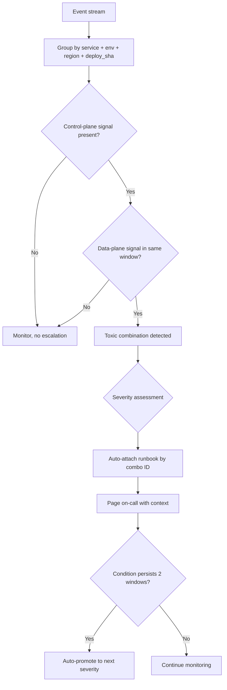

import Tabs from '@theme/Tabs';
import TabItem from '@theme/TabItem';

Cloudflare's "toxic combinations" lesson is simple: incidents often come from individually normal events that become dangerous only when correlated in a short time window. The useful operational takeaway is not just "be careful with change." It is to encode correlation logic that promotes stacked low-signal anomalies before they become user-visible incidents.

I turned their postmortem insight into an enforceable playbook.

<!-- truncate -->

## The Pattern

> "Incidents often come from individually normal events that become dangerous only when correlated in a short time window."
>
> — Cloudflare, [The Curious Case of Toxic Combinations](https://blog.cloudflare.com/the-curious-case-of-toxic-combinations/)

:::info[Context]
This is where single-metric alerting fails. Each signal below is individually normal and would not trigger an alert on its own. The danger is in the combination. The fix is a playbook that defines which low signals should be paired, correlation windows for each pair, and escalation thresholds tied to blast radius.
:::

## The Anti-Pattern

1. A change is valid in isolation.
2. Another change is also valid in isolation.
3. Existing controls evaluate each signal separately.
4. No control evaluates the combination in real time.
5. A low-probability overlap becomes a high-impact outage.

## Alert-Correlation Playbook

<Tabs>
  <TabItem value="combos" label="Toxic Combinations">

| Combo ID | Low-signal A | Low-signal B | Window | Escalate When | Severity |
|---|---|---|---|---|---|
| TC-01 | 2x deploys to same service in 30 min | p95 latency up 15% for 10 min | 30 min | Error budget burn >2%/hour | SEV-3 |
| TC-02 | WAF managed-rule update | 403 rate up 1.5x on authenticated paths | 15 min | >=2 regions or >=5% signed-in traffic | SEV-2 |
| TC-03 | Feature flag enabled for >=10% traffic | DB lock wait p95 >300ms for 5 min | 20 min | Checkout/login in impact set | SEV-2 |
| TC-04 | Secrets rotation completed | Auth token validation failures >0.7% | 20 min | Sustained 10 min after rotation | SEV-2 |
| TC-05 | Autoscaler event >=20% | Upstream 5xx rises above 0.5% | 15 min | Queue lag growth >25% | SEV-2 |
| TC-06 | Cache purge or key-schema change | Origin egress up 40% | 20 min | CDN hit ratio drops >=10 points | SEV-3 |
| TC-07 | Rate-limit policy change | Support error reports >=5 in 15 min | 15 min | Same route/tenant in both sets | SEV-3 |
| TC-08 | DNS/proxy config change | Regional timeout >1.2% | 30 min | Payment/auth path impacted | SEV-1 |

  </TabItem>
  <TabItem value="escalation" label="Escalation Thresholds">

| Trigger | Escalation | Required Actions |
|---|---|---|
| 1 toxic combo, non-critical path | SEV-3 | Assign incident lead, freeze non-critical deploys |
| 1 combo on auth/payments OR 2 combos in same service | SEV-2 | Incident bridge, canary-only deploy mode, page service + platform owner |
| 2+ combos across 2+ services or multi-region | SEV-1 | Org deploy freeze, rollback/kill-switch within 10 min |
| Customer-visible data risk or burn >10%/hour | SEV-1 Critical | Executive comms, status page, forensic timeline owner |

  </TabItem>
</Tabs>

## Correlation Rules to Implement First

Start with deterministic rules before ML anomaly scoring:

1. Group by `service + env + region + deploy_sha` in rolling windows.
2. Require at least one control-plane signal (deploy/config/policy) and one data-plane signal (latency/errors/timeouts).
3. Suppress duplicate pages for 15 minutes after acknowledgment, but keep event count rising in timeline.
4. Auto-attach runbook links by combo ID (`TC-01`...`TC-08`) in page payload.
5. Auto-promote to next severity tier if condition persists for 2 windows.

## Pre-Deploy Checklist for Agent Workflows

| # | Check | Block If "No" |
|---|---|---|
| 1 | Change coupling: did this touch auth, routing, flags, secrets, schema, or policy at the same time? | Advisory |
| 2 | Blast radius: if these fail together, is impact local, regional, or global? | Advisory |
| 3 | Concurrency: other in-flight deploys in same 30-60 min window? | Advisory |
| 4 | Control + data plane overlap: modified both control logic and request path? | **Block** |
| 5 | Rollback certainty: can we roll back every component independently in &lt;5 min? | **Block** |
| 6 | Guardrail coverage: tests assert interaction path, not just component paths? | Advisory |
| 7 | Canary realism: canary traffic includes high-risk edge cases? | Advisory |
| 8 | Signal correlation alert: alerts fire when two low-severity signals co-occur? | **Block** |
| 9 | Kill-switch readiness: verified emergency flag to disable new interaction path? | **Block** |
| 10 | Ownership clarity: single incident commander for this combined risk surface? | Advisory |

:::caution[Reality Check]
If any answer is "no" for items 4, 5, 8, or 9, block autonomous merge/deploy and require human approval. This is where most agent-driven deployments fail — they evaluate each change in isolation without considering the compound risk surface.
:::

Integration-specific security checks

- Verify every third-party integration has scoped tokens and per-environment credentials
- Require explicit allowlists for outbound hosts in agent actions and CI runners
- Deny silent fallback behavior when integration auth fails; fail fast and alert
- Confirm audit logs link each automated action to actor, workflow run, and change set
- Validate revocation path: rotating integration keys must complete without downtime

## Agent + CI Implementation

| Step | Action |
|---|---|
| 1 | Add `toxic_combo_id` evaluation in CI/CD metadata and runtime alert processor |
| 2 | Compute `compound_risk_score` from combo count, critical-path weight, and persistence |
| 3 | Fail closed when `compound_risk_score >= 70` and rollback certainty is not verified |
| 4 | Require two-key approval for any deploy touching control-plane + auth/routing paths |
| 5 | Emit `toxic_combination_candidate` events and review weekly, including near misses |

## What I Learned

- Cloudflare's "toxic combinations" is the most useful incident pattern I have seen for agent and CI workflows.
- Single-signal alerting misses real incidents. Compound signal detection is the fix.
- The pre-deploy checklist turns postmortem insight into enforceable automation.
- Start with deterministic correlation rules. ML anomaly scoring can come later.

## References

- [Cloudflare: The Curious Case of Toxic Combinations (October 26, 2025)](https://blog.cloudflare.com/the-curious-case-of-toxic-combinations/)
