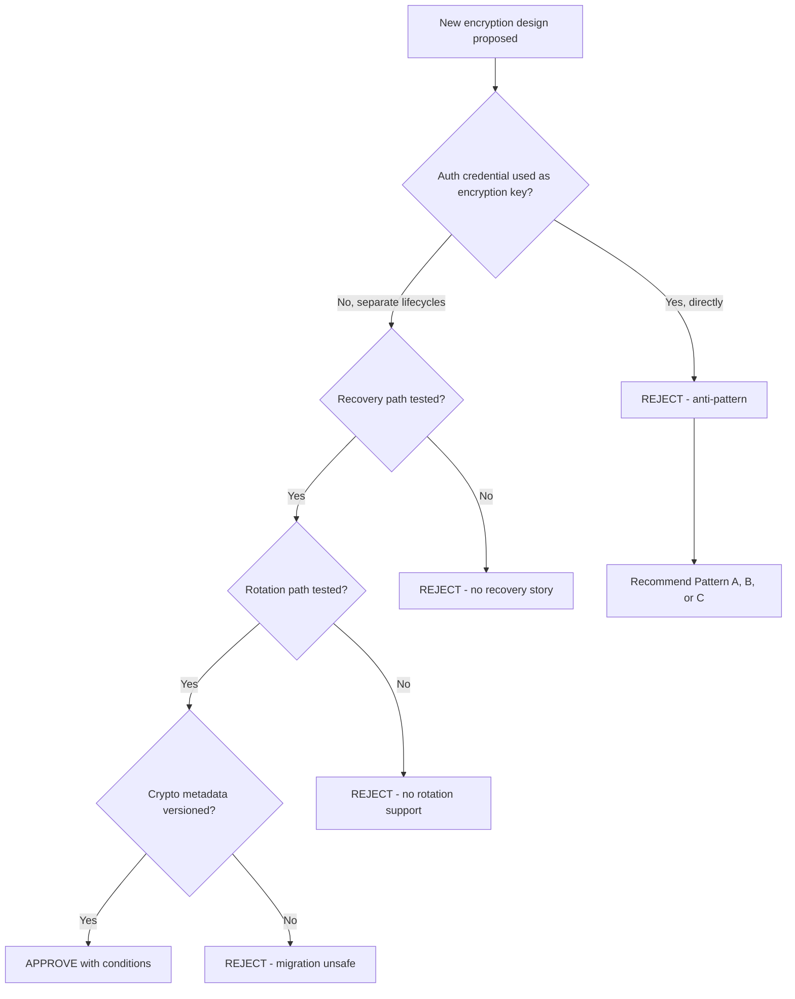

import Tabs from '@theme/Tabs';
import TabItem from '@theme/TabItem';

The passkeys critique surfaced a recurring architecture mistake: teams treat authentication credentials as direct data-encryption keys. That coupling is brittle and creates permanent data-loss risk for normal account lifecycle events (device loss, recovery, provider churn).

This review defines explicit guardrails for security design and architecture approvals.

<!-- truncate -->

## The Core Problem

> "Authentication proves user identity. Encryption protects data confidentiality. These controls can interact, but they must not be the same key lifecycle."

:::info[Context]
When a team derives encryption keys directly from passkey credentials, losing the passkey means losing the data. This is not a theoretical risk — it is the default failure mode for normal user behavior: switching devices, resetting accounts, or changing authentication providers. Architecture reviews must reject designs that cannot handle these events without irreversible data loss.
:::

## Approved Patterns for User-Data Encryption

<Tabs>
<TabItem value="patternA" label="Pattern A: Envelope Encryption">

Use per-record or per-tenant Data Encryption Keys (DEKs), wrapped by a Key Encryption Key (KEK) in KMS/HSM.

```text title="Data path"
Generate DEK for object/tenant scope
-> Encrypt plaintext with AEAD (AES-256-GCM or XChaCha20-Poly1305)
-> Wrap DEK with KEK in managed KMS/HSM
-> Store ciphertext + wrapped DEK + metadata (alg, version, aad-context)
```

| Benefit | Why |
|---|---|
| Clean key rotation | Rewrap DEKs without re-encrypting data |
| Scoped revocation | Revoke one tenant's keys without affecting others |
| Auditable key usage | KMS/HSM provides full audit trail |

</TabItem>
<TabItem value="patternB" label="Pattern B: Split-Key Derivation">

When user-controlled secrecy is required, derive a user component from a high-entropy secret using memory-hard KDF (`Argon2id`), then combine with service-held key material in KMS.

| Requirement | Implementation |
|---|---|
| Explicit recovery path | Trusted recovery secret, escrow, or threshold recovery |
| Brute-force resistance | Argon2id parameters tied to current hardware baseline |
| Key-version metadata | Transparent re-encryption support |

</TabItem>
<TabItem value="patternC" label="Pattern C: Hardware-Backed Keys">

Use platform authenticators/passkeys to **gate access and authorize key operations**, not to become sole raw encryption key material.

| Acceptable Use | Not Acceptable |
|---|---|
| Passkey-authenticated session obtains server authorization to unwrap DEK | Deriving irreversible data key directly from passkey credentials |
| WebAuthn signatures authorize cryptographic operations | Passkey as sole encryption key with no recovery path |

</TabItem>
</Tabs>

## Architecture Review Decision Flow



## Explicit Anti-Patterns to Block

| Anti-Pattern | Why It Fails |
|---|---|
| `Auth == Encryption key` | Passkey/credential loss = permanent data loss |
| `No recovery story` | "Data gone forever if credential lost" for mainstream products |
| `Client-only key custody by accident` | No backup, no escrow, no explicit user warning |
| `Nonce misuse` | AEAD nonce reuse or deterministic nonce without proven construction |
| `Homegrown crypto` | Custom primitives, unaudited constructions |
| `Single global DEK` | One compromise decrypts entire user population |
| `Soft-delete only` | Keys remain active after deletion request |
| `Opaque key metadata` | No key IDs, algorithm IDs, or version tags |
| `Silent downgrade` | Fallback to weaker crypto without explicit control and alerting |

:::caution[Reality Check]
Architecture reviews should reject any design where account recovery causes irreversible data loss, or where cryptographic compromise has a full-account blast radius. These are not edge cases — they are the normal lifecycle of user accounts.
:::

## Control Mapping for Review Boards

| Category | Controls |
|---|---|
| **Must-have** | Envelope encryption, key hierarchy documented, recovery and rotation runbooks, cryptographic logging and alerting |
| **Should-have** | Per-tenant key segmentation, periodic key health attestations, break-glass with dual authorization |
| **Blockers** | Irreversible user-data loss from normal auth lifecycle, missing incident response for key compromise, no test evidence for restore/rotation/deletion flows |

<details>
<summary>Practical default baseline for most SaaS products</summary>

- WebAuthn/passkeys for phishing-resistant **authentication**
- KMS-backed envelope encryption for user **data**
- Argon2id-derived user secret only where business requirements need user-side secrecy
- Documented recovery with explicit user communication

This gives strong authentication and durable encryption without coupling product data survival to a single credential artifact.

</details>

## What I Learned

- The passkeys critique exposed a fundamental architecture mistake that is more common than it should be.
- Authentication and encryption must have separate key lifecycles. This is not optional.
- Every encryption design needs a tested recovery path, a tested rotation path, and versioned metadata.
- The anti-pattern list is the most actionable artifact — use it as a checklist in architecture reviews.
