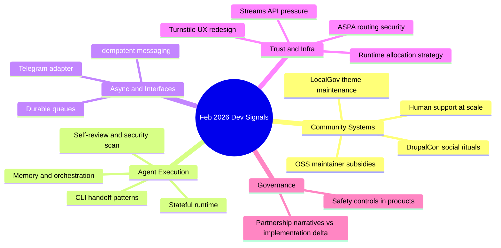

import Tabs from '@theme/Tabs';
import TabItem from '@theme/TabItem';
import TOCInline from '@theme/TOCInline';

February closed with a clear pattern: vendor demos are cheap, operating reliable developer systems is hard, and teams are finally admitting it. The real signal this month was around stateful agents, durable async pipelines, and community workflows that stay human under load. Marketing was loud; a few releases actually mattered.

<!-- truncate -->

<TOCInline toc={toc} minHeadingLevel={2} maxHeadingLevel={2} />

## Community Ops Is Becoming Product Surface

Mike Herchel’s DrupalCon Gala post and Mark Conroy’s LocalGov Drupal theme reset are small on paper, but they point to the same thing: communities still run on identity, rituals, and maintainers doing visible work. Anthropic’s six-month Claude Max offer for large OSS maintainers sits in the same lane: platform vendors are buying community goodwill because that’s where long-term distribution comes from.

> "Free Claude Max for (large project) open source maintainers"
>
> — Anthropic, [Claude for OSS](https://claude.com/contact-sales/claude-for-oss)

> "This month I gave myself one job to do: redesign the Scarfolk theme."
>
> — Mark Conroy, [mark.ie](https://mark.ie/)

| Item | Signal | Practical read |
|---|---|---|
| DrupalCon Gala push | Community events still matter | Trust compounds faster in person than in docs |
| LocalGov demo theme refresh | Design is governance | Better defaults reduce support load |
| Claude Max for OSS maintainers | Compute subsidy strategy | Accept it, but budget for post-subsidy cliff |
| “Hoard things you know how to do” | Agent-era craftsmanship | Reusable mental models beat prompt cargo cults |

:::info[Where the leverage actually is]
Treat community operations as an engineering system: response SLAs, escalation ownership, and maintained docs with clear lifecycles. That work outlasts temporary vendor credits and social media spikes.
:::

## Agents Are Moving From Chat To Stateful Execution

OpenAI+Microsoft and OpenAI+Amazon statements were expected; the meaningful part is Amazon Bedrock’s Stateful Runtime framing: persistent orchestration, memory, and controlled execution for multi-step agent workflows. GitHub Copilot coding agent updates (model picker, self-review, security scanning, custom agents, CLI handoff) push in the same direction: less “assistant autocomplete,” more autonomous task execution with guardrails.

<Tabs>
  <TabItem value="copilot" label="GitHub Copilot Agent" default>
  Best fit: repository-scoped implementation work with integrated review/security checkpoints.
  </TabItem>
  <TabItem value="bedrock" label="Bedrock Stateful Runtime">
  Best fit: enterprise orchestration where state persistence, policy boundaries, and runtime control matter more than IDE convenience.
  </TabItem>
  <TabItem value="frontier" label="OpenAI Frontier on AWS">
  Best fit: teams standardizing infra in AWS while consuming frontier models and agent capabilities without split-stack ops.
  </TabItem>
</Tabs>

```yaml title="agent-runbook.yaml" showLineNumbers
name: prod-agent-runbook
runtime: stateful
memory:
  type: scoped
  ttl_hours: 72
orchestration:
  max_steps: 24
  retry:
    strategy: exponential
    max_attempts: 5
    // highlight-next-line
    dead_letter_queue: s3://org-agent-dlq/prod/
security:
  // highlight-start
  allow_tools:
    - code_search
    - test_runner
    - policy_checker
  deny_tools:
    - unapproved_network_write
  // highlight-end
observability:
  trace_id_required: true
  pii_redaction: strict
```

:::caution[State without ownership is just hidden failure]
Persistent memory must have retention rules, redaction policy, and explicit replay boundaries. Without those, incidents become archaeology exercises and compliance turns into guesswork.
:::

## Async Infrastructure Finally Looks Adult

Vercel Queues entering public beta is useful because serverless systems need durable deferred work when functions crash or deployments rotate. Chat SDK adding Telegram adapter support shows the other half: teams want one bot codebase spanning Slack/Discord/GitHub/Teams/Telegram, not five half-maintained integrations.

> "Functions need a reliable way to defer expensive work and guarantee that tasks complete..."
>
> — Vercel, [Vercel Blog](https://vercel.com/blog)

```diff title="queue-config.diff"
- retries: 1
- backoff: fixed
- timeout_ms: 15000
+ retries: 5
+ backoff: exponential
+ timeout_ms: 60000
+ dead_letter_queue: "events.dlq"
+ idempotency_key: "event.id"
```

```bash title="telegram-adapter-smoke.sh"
#!/usr/bin/env bash
set -euo pipefail

export CHAT_ADAPTER=telegram
export BOT_TOKEN="$TELEGRAM_BOT_TOKEN"

curl -sS -X POST "$CHAT_SDK_URL/messages" \
  -H "Authorization: Bearer $BOT_TOKEN" \
  -H "Content-Type: application/json" \
  -d '{"channel":"dm","text":"adapter smoke test","idempotency_key":"smoke-2026-02-28"}'
```

## Security and Runtime Foundations Got Real Updates

Cloudflare redesigning Turnstile/Challenge pages at internet scale (7.6B daily challenges) is not cosmetic; trust UX is security infrastructure. Their ASPA adoption tracking in Radar is similarly practical: route-leak prevention only matters when operators can measure deployment progress. On the runtime side, “Allocating on the Stack” and the “better streams API” argument both push a familiar truth: abstractions optimized for portability often tax hot paths.

> "We serve 7.6 billion challenges daily."
>
> — Cloudflare, [Turnstile Redesign](https://blog.cloudflare.com/the-most-seen-ui-on-the-internet-redesigning-turnstile-and-challenge-pages/)

```ts title="streaming-boundary.ts" showLineNumbers
type Chunk = Uint8Array;

export async function* parseFrames(source: ReadableStream<Chunk>) {
  const reader = source.getReader();
  let carry = new Uint8Array(0);

  while (true) {
    const { value, done } = await reader.read();
    if (done) break;

    const next = concat(carry, value ?? new Uint8Array(0));
    // highlight-next-line
    const { frames, rest } = splitFrames(next);
    for (const frame of frames) yield frame;
    carry = rest;
  }
}

function concat(a: Uint8Array, b: Uint8Array): Uint8Array {
  const out = new Uint8Array(a.length + b.length);
  out.set(a);
  out.set(b, a.length);
  return out;
}
```

:::warning[“ReadableStream everywhere” is ~~zero-cost~~ not zero-cost]
Benchmark parser boundaries with real payloads before adopting stream-heavy designs in latency-sensitive paths. If stack allocation or simpler pull loops win in profiling, take the boring option.
:::

## Policy, Safety, and Corporate Statements: Read The Delta, Not The Headline

OpenAI’s mental-health safety update had concrete product controls (parental controls, trusted contacts, distress detection changes). Those are deployable patterns. By contrast, geopolitical statements and partnership press cycles are mostly directional context unless they alter APIs, pricing, or policy constraints this quarter.

<details>
<summary>Full changelog digest (operator view)</summary>

- OpenAI/Microsoft joint statement: partnership continuity signal, low immediate implementation delta.
- OpenAI/Amazon strategic partnership: potential infra and procurement simplification for AWS-heavy teams.
- Bedrock Stateful Runtime: direct architecture impact for multi-step agent systems.
- OpenAI mental health update: concrete safety-control patterns worth porting into high-risk app flows.
- Secretary of War comment response: monitor policy risk; no direct engineering action unless compliance scope changes.
- GitHub Copilot coding agent updates: practical workflow changes for teams using agent-mode coding.
- Vercel community + queues + chat adapter updates: operationally relevant for devrel and async/event pipelines.
- Drupal/LocalGov/community posts: social infrastructure still a technical multiplier.
- Streams + stack allocation essays: runtime ergonomics and performance tradeoffs remain unsettled.
</details>

## The Bigger Picture



## Bottom Line

Most teams should ignore hype cycles and harden three things: durable async processing, stateful agent boundaries, and community response systems with human escalation.

:::tip[Single action that pays off this week]
Ship one `agent-runbook.yaml` in production with explicit memory TTL, tool allow/deny lists, retry/dead-letter rules, and trace requirements. That single artifact forces architecture clarity and exposes every fake “autonomous” claim in one review.
:::
