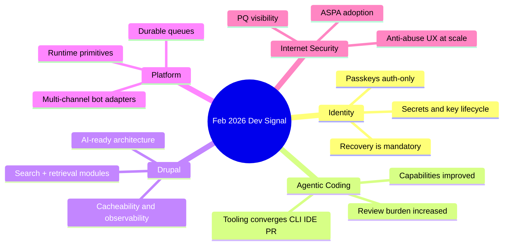

import Tabs from '@theme/Tabs';
import TabItem from '@theme/TabItem';
import TOCInline from '@theme/TOCInline';

February 2026 was a clean split between signal and noise. Signal: better agent tooling, better infra primitives, better observability, and practical Drupal ecosystem movement. Noise: people still shipping risky identity patterns and pretending automation replaces human support.

<!-- truncate -->

<TOCInline toc={toc} minHeadingLevel={2} maxHeadingLevel={2} />

## Passkeys for encryption is still a footgun
The sharpest warning this month came from Tim Cappalli: teams are using passkeys to encrypt user data, then acting surprised when recovery becomes impossible after normal passkey loss. That is not a UX issue; it is a data-destruction design.

> "please stop promoting and using passkeys to encrypt user data. I'm begging you."
>
> — Tim Cappalli, [Please, please, please stop using passkeys for encrypting user data](https://blog.timcappalli.me/p/passkeys-prf-warning/)

:::warning[Do not bind irreversible encryption keys to passkeys]
Use passkeys for authentication, not as the only root for decrypting user content. If recovery is impossible after device loss, ship server-side wrapped keys with explicit recovery controls, auditing, and revocation.
:::

```diff
- auth: passkey-only unlock for user vault
+ auth: passkey login + server-wrapped DEK + recovery flow
+ controls: rotate KEK on account recovery, log key events
```

## Coding agents crossed the usefulness threshold, not the risk threshold
Max Woolf's write-up and Karpathy's December inflection quote match what most practitioners saw: agents now finish meaningful tasks. That does not mean they are safe by default.

> "coding agents basically didn't work before December and basically work since"
>
> — Andrej Karpathy, [X post](https://twitter.com/karpathy/status/2026731645169185220)

<Tabs>
<TabItem value="copilot" label="Copilot Path" default>

Copilot CLI + coding agent updates (model picker, self-review, security scanning, custom agents, CLI handoff) make it easier to go from intent to PR with fewer context switches.

</TabItem>
<TabItem value="claude" label="Claude Path">

Claude Max for OSS (with strict project thresholds) is high-value for maintainers who already run disciplined review and secrets controls.

</TabItem>
<TabItem value="reality" label="Operational Reality">

Agent speed gains collapse if you skip guardrails: secret scanning, scoped credentials, and mandatory human review on infra/auth changes.

</TabItem>
</Tabs>

:::caution[Agent velocity without controls is regression-as-a-service]
Pair every agent-generated PR with policy checks for secrets, dependency risk, and auth surface changes. Faster output with weaker review increases incident rate, not productivity.
:::

## Drupal's AI ecosystem is maturing through boring engineering
The Drupal-related items were less "AI magic," more "maintenance discipline": SearXNG privacy-first search integration, GraphQL beta fixes, code search for Drupal 10+, structured Views extraction, AI digests for project tracking, and real performance diagnosis (cache tags, not vibes). That is the right trajectory.

| Area | What shipped | Why it matters |
|---|---|---|
| Search + AI | SearXNG module for Drupal assistants | Current web retrieval without default tracking |
| API stability | GraphQL 5.0.0-beta2 cacheability + preview support | Fewer broken preview/cache edge cases |
| Code intelligence | Drupal contrib code search (10+ compatible) | Faster upgrade triage and deprecation hunting |
| Runtime perf | Automated detection of missing cache tag causing 4.2s loads | Observability tied directly to fixable code defects |
| Programmatic data | Views Code Data module outputs structured formats | Reuse Views logic in non-render pipelines |

```php title="modules/custom/product_block/src/Plugin/Block/ProductBlock.php"
// highlight-next-line
$build['#cache']['tags'] = Cache::mergeTags($build['#cache']['tags'] ?? [], ['node:' . $product_id]);
```

## Infra and platform updates got more practical
Vercel Queues public beta, Telegram adapter support in Chat SDK, Cloudflare's PQ/ASPA/Radar transparency, and Turnstile redesign at huge scale all point to the same thing: reliability and security work is moving into defaults, but teams still need to wire it correctly.

```yaml title="ops/release-guardrails.yaml" showLineNumbers
checks:
  identity:
    - forbid_passkey_only_encryption: true
    - recovery_flow_required: true
  agents:
    - require_human_review_on:
        - auth/**
        - infra/**
        - secrets/**
    # highlight-next-line
    - security_scan: required
  platform:
    - async_jobs_must_be_idempotent: true
    - retries_backoff: exponential
    - dead_letter_queue: enabled
  network_security:
    - monitor_pq_adoption: true
    - monitor_aspa_coverage: true
```

## Smaller but useful engineering reads
Unicode binary search over HTTP range requests is a good reminder that protocol mechanics still unlock creative tooling. The "better Streams API" and "allocating on the stack" discussions are in the same category: less hype, more runtime mechanics that change performance and ergonomics when applied carefully.

:::info[The pattern across these posts]
The durable advantage is still understanding system boundaries: caching metadata, stream semantics, key lifecycle, queue idempotency, and routing trust. Tools changed; fundamentals did not.
:::

<details>
<summary>Full changelog snapshot from this learning batch</summary>

- Passkeys misuse warning (Tim Cappalli)
- Max Woolf deep agent-coding field report
- DrupalCon Gala announcement
- Claude Max for OSS maintainers
- Unicode Explorer using HTTP range requests
- GitHub Copilot CLI practical guide
- Drupal SearXNG module
- Dan Frost on controlled AI and AI-mode SEO (The Drop Times)
- Vercel community scaling with agents
- Vercel Queues public beta
- Chat SDK Telegram adapter
- Drupal contrib code search tool
- GraphQL for Drupal 5.0.0-beta2
- Views Code Data module
- LocalGov Drupal demo theme refresh
- Drupal Digests launch
- Cache-tag performance case study
- Claude Code security commentary
- Toxic combinations security model
- Better JS streams API proposal
- Cloudflare Turnstile/challenge redesign
- Cloudflare Radar transparency updates (PQ, KT, ASPA)
- ASPA routing security explainer
- Stack allocation changes
- Copilot coding agent updates
- Simon Willison's "hoard what you know how to do"
- Karpathy's December agent capability inflection quote

</details>

## The Bigger Picture



## Bottom Line
Tools are better, but bad architecture fails faster now. Ship controls first, then agent speed.

:::tip[Single action to take this week]
Add a release gate that blocks PRs touching `auth`, `secrets`, or `infra` unless security scan passes and a human reviewer signs off. This catches the highest-cost failures while keeping agent throughput high.
:::
