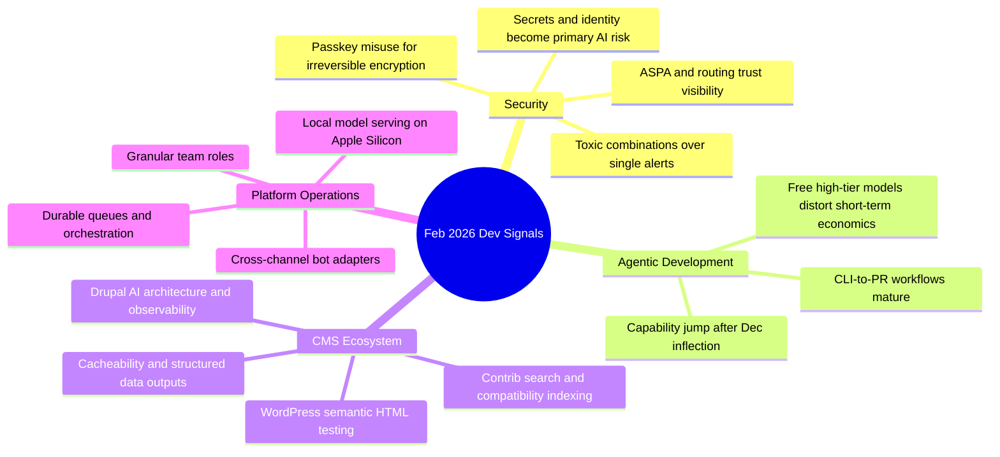

import Tabs from '@theme/Tabs';
import TabItem from '@theme/TabItem';
import TOCInline from '@theme/TOCInline';

February 2026 was a reality-check month: fewer shiny demos, more production constraints. The strongest signals were about recoverability, security boundaries, and maintainability under AI pressure. Hype kept talking; engineering got specific.

<!-- truncate -->

<TOCInline toc={toc} minHeadingLevel={2} maxHeadingLevel={2} />

## Passkeys Are Authentication, Not Data-Encryption Recovery

Tim Cappalli’s warning is blunt because the failure mode is brutal: users lose passkeys regularly, and encrypted data tied to that passkey can become permanently unrecoverable.

> "please stop promoting and using passkeys to encrypt user data"
>
> — Tim Cappalli, [Please, please, please stop using passkeys for encrypting user data](https://blog.timcappalli.me/p/passkeys-prf-warning/)

:::warning[Do not bind irreversible encryption to passkey availability]
Treat passkeys as authentication factors, not sole long-term data-recovery roots. Store encryption keys behind recoverable account controls: multi-device escrow, org-managed KMS, or user-controlled recovery kits with explicit backup UX and mandatory confirmation.
:::

```yaml title="security/key-recovery-policy.yaml" showLineNumbers
version: 1
rules:
  - id: passkey-auth-only
    statement: Passkeys authenticate sessions; they do not serve as sole data recovery keys.
  - id: recovery-required
    statement: Every encrypted user dataset must have at least one tested recovery path.
  - id: deletion-guard
    statement: Block passkey removal unless another recovery factor is confirmed.
  - id: restore-drill
    statement: Run quarterly restore drills with redacted production-like data.
controls:
  - owner: security-team
  - review_cycle: quarterly
```

## Coding Agents: Capability Jump Is Real, Governance Gap Is Real Too

Max Woolf’s detailed skeptic-to-practitioner write-up, Simon Willison’s “hoard things you know how to do,” and Karpathy’s December inflection point all converge on one pattern: agents now ship useful code, but unmanaged agent output still burns teams.

> "coding agents basically didn’t work before December and basically work since"
>
> — Andrej Karpathy, [quoted by Simon Willison](https://simonwillison.net/)

| Signal | What changed | What to do now |
|---|---|---|
| Agent quality jump | Better long-horizon coherence and persistence | Increase task scope, but keep hard review gates |
| Copilot CLI + coding agent updates | CLI handoff, self-review, security scanning, model picker | Standardize a PR checklist with mandatory scanner pass |
| Claude Max for OSS maintainers | Free temporary high-tier access for large projects | Use for backlog burn-down, not architecture decisions |

<Tabs>
  <TabItem value="copilot" label="GitHub Copilot Stack" default>
  Best for teams already on GitHub with existing review culture. Strong handoff from CLI to PR flow; value comes from guardrails, not autocomplete.
  </TabItem>
  <TabItem value="claude" label="Claude Max OSS">
  Great throughput boost for qualifying OSS maintainers. Six-month window means planning for the post-subsidy operating model now, not later.
  </TabItem>
  <TabItem value="custom" label="Custom Agent Setup">
  Maximum control and privacy options, maximum operational burden. Requires explicit prompt contracts, sandboxing, and secrets policy from day one.
  </TabItem>
</Tabs>

:::caution[Agent velocity without secrets discipline is a breach pipeline]
Use MCP/tool integrations that enforce secret scanning and identity controls before merge. “Review later” is how generated credential leaks become incident response work.
:::

## Drupal and WordPress: Practical AI, Better Testing, Better Searchability

Drupal ecosystem updates moved toward operational usefulness: AI-ready architecture discussions, privacy-first SearXNG search integration, contrib code search indexing, GraphQL cacheability fixes, and structured Views outputs for programmatic use. WordPress side delivered a practical test-quality upgrade with `assertEqualHTML()` and shipped 7.0 Beta 2 for early validation.

```diff title="modules/custom/catalog/src/Plugin/Block/ProductSummaryBlock.php"
- $build['summary'] = [
-   '#markup' => $summary,
- ];
+ $build['summary'] = [
+   '#markup' => $summary,
+   '#cache' => [
+     'tags' => ['node:' . $product->id()],
+     'contexts' => ['url.path'],
+   ],
+ ];
```

The cache-tag incident report (4.2s product pages fixed by proper metadata) is the month’s most useful reminder: performance regressions are often one missing invalidation away.

:::danger[Contrib utility modules without security coverage need compensating controls]
If a module is outside Drupal Security Advisory coverage, pin versions, isolate blast radius, and add runtime monitoring before production rollout.
:::

## Platforms and Infra: The Quietly Important Releases

Vercel shipped meaningful platform primitives: public-beta Queues, dashboard redesign default, Developer role for Pro, and Chat SDK Telegram adapter. Cloudflare published security-adjacent upgrades around PQ visibility, ASPA adoption tracking, and large-scale challenge-page redesign with accessibility focus.

```bash title="ops/release-gate.sh" showLineNumbers
#!/usr/bin/env bash
set -euo pipefail

# highlight-next-line
npm run lint
npm test
npm run security:scan
npm run deps:audit

# highlight-start
if grep -R --line-number "TODO:ship" src; then
  echo "Release blocked: unresolved ship TODOs"
  exit 1
fi
# highlight-end

echo "Release gate passed"
```

Also worth noting: Docker Model Runner bringing `vllm-metal` to Apple Silicon lowers local inference friction for macOS-heavy teams.

## Verified Feed Snapshot

<details>
<summary>Full changelog signals compiled this week</summary>

- Passkeys warning for data encryption misuse.
- Max Woolf’s detailed AI agent coding evaluation.
- DrupalCon Gala ticket push and hallway-track emphasis.
- Claude Max free plan window for qualifying OSS maintainers.
- Unicode explorer via HTTP range request binary search.
- GitHub Copilot CLI practical workflow guide.
- Drupal SearXNG module for privacy-first assistant search.
- Dan Frost interview on controlled AI, architecture, AI-mode SEO.
- Vercel post on keeping community human with agents.
- Vercel Queues public beta.
- Chat SDK Telegram adapter.
- Drupal contrib code search for D10+ projects.
- GraphQL for Drupal 5.0.0-beta2 (cacheability + preview support).
- Views Code Data module for structured outputs.
- LocalGov Drupal demo theme redesign.
- Drupal Digests for AI-generated development tracking.
- Cache-tag root-cause case study with measurable performance recovery.
- Claude Code security perspective: identity/secrets over classic vulns.
- Toxic combination security model for correlated weak signals.
- JS Streams API critique and modernization proposal.
- Cloudflare Turnstile/challenge page redesign at Internet scale.
- Cloudflare Radar transparency additions: PQ, KT, ASPA.
- ASPA routing-security explainer.
- Stack allocation updates.
- Copilot coding agent feature expansion.
- Simon Willison’s “hoard things you know how to do.”
- Karpathy’s December AI coding inflection quote.
- Drupal document summarizer tooltip prototype via AI-assisted coding.
- Drupal positioning beyond community bubble in AI era.
- WordPress 6.9 `assertEqualHTML()` testing improvement.
- WordPress 7.0 Beta 2 availability.
- Wordfence weekly vulnerability report (Feb 16–22, 2026).
- DrupalCon Rotterdam 2026 CFP timeline (close: April 13, 2026).
- DrupalCamp England focus on accessibility, scale, AI in production.
- Drupal Camp Delhi CFP extended to February 28, 2026.
- Note: one feed item references a March 25, 2025 gala date and is historical context, not a 2026 event.

</details>

## The Bigger Picture



## Bottom Line

Shipping with AI in 2026 is mostly boring engineering discipline: recoverability, cache correctness, access boundaries, and explicit quality gates. ~~“Model quality alone solves delivery”~~ is dead.

:::tip[Single highest-leverage move]
Add a mandatory pre-merge gate that combines tests, security scanning, and recovery checks for any feature touching auth, encryption, or generated code. One enforced gate prevents a month of incident cleanup.
:::
