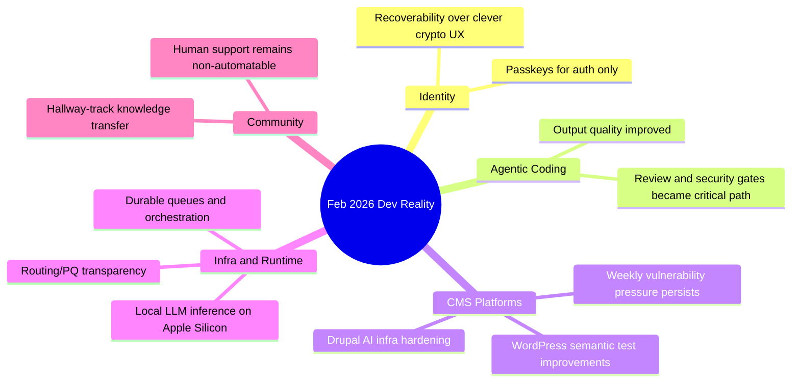

import Tabs from '@theme/Tabs';
import TabItem from '@theme/TabItem';
import TOCInline from '@theme/TOCInline';

February 2026 was the month where marketing claims collided with production reality. The useful signal: identity boundaries, cacheability, test robustness, and operational guardrails. The noise: “AI everywhere” announcements without threat models or maintenance plans.
<!-- truncate -->

<TOCInline toc={toc} minHeadingLevel={2} maxHeadingLevel={2} />

## Passkeys are for auth, not for encrypting user data

Tim Cappalli said the quiet part out loud: teams are misusing passkeys as irreversible data-encryption anchors, then acting surprised when recovery is impossible.

> "please stop promoting and using passkeys to encrypt user data. I’m begging you."
>
> — Tim Cappalli, [Please, please, please stop using passkeys for encrypting user data](https://blog.timcappalli.me/p/passkeys-prf-warning/)

:::warning[Data-loss pattern to remove now]
If a user loses the passkey device and encrypted data depends on that secret, recovery is dead. Replace passkey-derived data keys with server-managed KEKs in KMS/HSM plus account recovery controls. Keep passkeys for authentication and phishing resistance only.
:::

```diff title="docs/passkey-migration.diff"
- data_key = HKDF(passkey_prf_output)
- ciphertext = AES_GCM(data_key, user_blob)
+ data_key = random(256)
+ wrapped_key = KMS_WRAP(kek_id, data_key)
+ ciphertext = AES_GCM(data_key, user_blob)
+ store(kek_id, wrapped_key, ciphertext)
```

## Coding agents crossed the threshold, but quality gates are now the bottleneck

Max Woolf’s field report and Karpathy’s “December shift” take point to the same thing: agents now produce plausible velocity on non-trivial projects. ~~Agents eliminate engineering judgment~~. They shift engineering judgment into review, test design, and security controls.

> "coding agents basically didn’t work before December and basically work since"
>
> — Andrej Karpathy, [quoted source](https://twitter.com/karpathy/status/2026731645169185220)

<Tabs>
  <TabItem value="copilot-cli" label="Copilot CLI" default>
GitHub’s “idea to PR” flow is strong for tight iteration and handoff into PR review, especially with self-review and security scanning integrated into the coding-agent updates.
  </TabItem>
  <TabItem value="claude-max" label="Claude Max for OSS">
Anthropic’s six-month Claude Max offer for large OSS maintainers is financially meaningful, but only for repos already at scale (5k+ stars or 1M+ monthly npm downloads). Good subsidy, narrow funnel.
  </TabItem>
  <TabItem value="practical-rule" label="Practical Rule">
Use agents for throughput. Keep merges blocked on tests, static analysis, and secret scanning. If guardrails are optional, incident response becomes guaranteed.
  </TabItem>
</Tabs>

## Drupal AI work stopped being “future talk” and became implementation detail

The Drupal stream had concrete movement: search infrastructure (SearXNG module), data extraction interfaces (Views Code Data), GraphQL cacheability fixes, AI tooltip summarization prototypes, and ecosystem-level tracking (Drupal Digests).

| Signal | Why it matters in production | Immediate action |
|---|---|---|
| SearXNG module for Drupal AI assistants | Current web retrieval without surveillance defaults | Use private metasearch backend instead of direct tracked APIs |
| GraphQL 5.0.0-beta2 cacheability fix + preview support | Prevents stale/wrong headless responses | Re-test cache tags/contexts before rollout |
| Views Code Data module | Structured output without render pipeline overhead | Use for APIs/export jobs; do not expose raw endpoints without auth |
| Drupal Digests by Dries | Faster visibility into core/contrib momentum | Treat as change radar, not a substitute for release notes |
| Performance case: missing cache tag causing 4.2s loads | Same old story: cache metadata wins | Add cacheability reviews to code review checklist |

:::danger[Security policy gap in contrib]
Views Code Data is not covered by Drupal Security Advisory Policy. Assume self-owned patching and threat-modeling responsibilities before adoption.
:::

## Platform releases: useful pieces, mixed packaging

Vercel shipped durable queues beta and broader dashboard/role updates; Chat SDK added Telegram; Cloudflare published better routing/PQ observability; Docker brought `vllm-metal` to Apple Silicon; GitHub pushed coding-agent capabilities. This is real progress when integrated with operations, not as isolated feature toggles.

```bash title="scripts/weekly-platform-audit.sh" showLineNumbers
#!/usr/bin/env bash
set -euo pipefail

# highlight-next-line
echo "1) Verify queue retry/backoff + DLQ behavior in staging"
echo "2) Verify role changes: Pro Developer role cannot read sensitive env vars"
echo "3) Check Chat adapters for upload and mention edge cases"
echo "4) Review Cloudflare Radar signals: PQ, KT, ASPA deltas"
echo "5) Validate AI coding agent security scan output is blocking CI"
echo "6) Re-run secret scanning on generated code before merge"
echo "7) Track dashboard nav changes that affect runbooks"
echo "8) Confirm local inference perf baselines on Apple Silicon"
echo "9) Record regressions in changelog with owner + ETA"
```

<details>
<summary>Full changelog sweep (condensed)</summary>

- Vercel Queues public beta, plus Workflow positioning.
- Vercel Pro `Developer` role expanded beyond Enterprise.
- Vercel dashboard redesign became default (Feb 26, 2026).
- Chat SDK Telegram adapter support added.
- Cloudflare Radar added PQ/KT/ASPA transparency tools.
- Cloudflare published ASPA routing security explainer.
- Docker Model Runner added `vllm-metal` on macOS Apple Silicon.
- GitHub Copilot coding agent: model picker, self-review, security scanning, custom agents, CLI handoff.
- “A better streams API for JavaScript” renewed pressure on current stream ergonomics.
</details>

## WordPress + security: better tests arrived; vulnerability cadence did not slow down

`assertEqualHTML()` in WordPress 6.9 is a concrete win because semantic HTML comparison kills brittle test noise. At the same time, weekly vulnerability reports keep proving that plugin security hygiene is still the cost center.

```php title="tests/Feature/MarkupTest.php" showLineNumbers
<?php

class MarkupTest extends WP_UnitTestCase {
    public function test_card_markup_semantics() {
        $expected = '<div class="card"><a href="/docs">Docs</a></div>';
        $actual   = render_docs_card();

        // highlight-start
        // Semantic compare: ignores non-meaningful formatting differences.
        $this->assertEqualHTML($expected, $actual);
        // highlight-end
    }

    public function test_card_has_safe_url() {
        $html = render_docs_card();
        $this->assertStringNotContainsString('javascript:', $html);
    }
}
```

:::caution[Beta means beta]
WordPress 7.0 Beta 2 is for test environments only. Regression-test plugins/themes now, especially output filters, blocks, and custom REST handlers. Production rollout before RC is self-inflicted downtime.
:::

## Community and ecosystem signals that actually matter

DrupalCon updates (Hallway Track emphasis, Rotterdam CFP deadlines, gala logistics), LocalGov Drupal theme refresh work, and “move beyond the Drupal bubble” commentary all point to the same governance concern: adoption depends on integrator experience, not just core roadmap slides.

AI in community ops got a sober framing too: Vercel’s “keep community human while scaling with agents” is the right model. Agents route and summarize; humans handle trust, edge cases, and relationship work.

## The Bigger Picture



## Bottom Line

Shipping faster in 2026 is easy; shipping safely is still hard. Teams that separated authentication from encryption, enforced CI security gates on generated code, and treated cacheability/testing as first-class concerns got real gains. Everyone else got better demos.

:::tip[Single highest-ROI move this week]
Add a mandatory pre-merge policy: `tests + static analysis + secret scan + cacheability check` for all AI-assisted changes. This prevents most expensive failures before they become incident tickets.
:::
