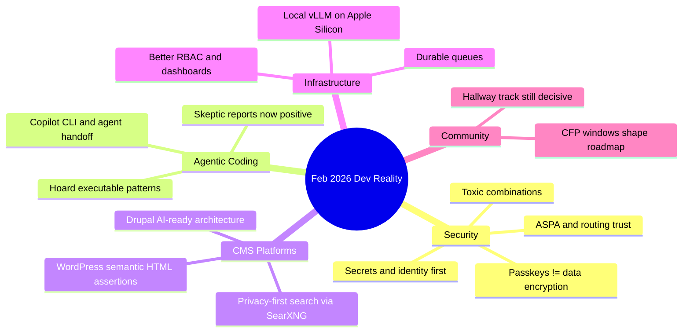

February 2026 was a good month for separating **engineering signal** from marketing noise: security teams warned about dangerous auth patterns, coding agents got meaningfully more usable, Drupal/WordPress shipped practical improvements, and infra vendors kept racing to productize everything.
<!-- truncate -->

## Please, please, please stop using passkeys for encrypting user data
Tim Cappalli’s warning is blunt and correct: **passkeys are authentication credentials, not durable user-controlled encryption keys**. Users lose devices, delete credentials, switch ecosystems, and then your “clever” encryption scheme becomes permanent data loss.

:::caution[Do not conflate auth and recovery]
If a user can lose the credential, they can lose the data. Build recovery paths first, crypto second.
:::

Why it matters:
- You’re coupling account recovery risk to data availability.
- Many users do not understand irreversible encryption side effects.
- Support teams inherit an unfixable incident.

```bash
# safer pattern sketch
# 1) authenticate with passkey
# 2) derive session trust
# 3) encrypt data with recoverable app-managed key hierarchy
```

## An AI agent coding skeptic tries AI agent coding, in excessive detail
Max Woolf’s long-form experiment is valuable because it tracks progression from trivial scripts to real projects. The useful takeaway: **agents are now operationally viable** when the human keeps scope, checkpoints, and eval loops tight.

Why it matters:
- The “agents are toys” argument is now outdated for many workflows.
- Reliability comes from process design, not model worship.
- Small project scaffolds compound into larger wins.

## Free Claude Max for open source maintainers
Anthropic’s offer (large-repo criteria, six months) is practical but selective. This is less “supporting OSS broadly” and more “subsidizing high-visibility maintainers.”

Why it matters:
- If you qualify, this is meaningful compute budget relief.
- If you don’t, nothing changed. Plan for tool cost anyway.

## Unicode Explorer via HTTP range-request binary search
Simon Willison’s prototype is a nice reminder that **protocol fluency beats framework churn**. Using `fetch()` + range requests to binary-search data is old-school systems thinking applied in modern tooling.

Why it matters:
- Better performance with less data transfer.
- Great pattern for curiosity-driven prototyping that can become production technique.

## From idea to PR with GitHub Copilot CLI
The GitHub guide documents a practical path: intent -> local CLI loop -> reviewable diff -> IDE/GitHub handoff. This is the best shape for agent-assisted work today.

:::tip[CLI-first agent loop]
Use short prompt cycles, commit often, and force self-review before opening PRs.
:::

```bash
# practical loop
gh copilot suggest "add retry with exponential backoff for API client"
npm test
git add -A
git commit -m "Add backoff retry to API client"
```

## SearXNG module for privacy-first Drupal AI assistants
This is one of the few AI integration stories that actually respects user privacy constraints: current web retrieval without defaulting to surveillance-heavy search pipelines.

Why it matters:
- Better compliance posture for orgs that can’t leak query intent.
- Makes “AI assistant with live web context” more defensible in regulated environments.

## Dan Frost on AI-ready Drupal architecture and controlled AI
Both pieces point to the same core idea: **AI readiness is architecture readiness**. Structured content, maintainable systems, observability, and governance beat “add chatbot” theater.

Why it matters:
- You can’t bolt trust onto chaotic systems.
- “Controlled AI” requires guardrails and runtime visibility.

## Keeping community human while scaling with agents
Vercel’s note gets one thing right: automation should reduce routing overhead, not replace real developer-to-developer support.

Why it matters:
- Human escalation is still the product for hard problems.
- Agent systems should optimize triage quality, not ticket volume optics.

## Vercel Queues public beta
Queues + workflows is the right pairing: durable events for reliability, orchestration for multi-step jobs. This is useful infrastructure, not fluff.

Why it matters:
- Functions crash. Deployments roll. Queues absorb that reality.
- Async work stops being “best effort.”

## Chat SDK adds Telegram adapter
Single-codebase bot logic across Slack/Discord/GitHub/Teams/Telegram is operationally attractive. Adapter maturity will decide whether this saves time or creates edge-case debt.

Why it matters:
- Faster channel expansion if your interaction model is stable.
- Watch attachment and interaction parity gaps.

## New Drupal contrib code search for Drupal 10+
Search + branch requirements + install counts + security coverage is exactly the metadata teams need for dependency triage.

Why it matters:
- Better module selection decisions.
- Easier automation for deprecated API hunts.

## GraphQL for Drupal 5.0.0-beta2
Cacheability fixes and node preview support are real-world quality-of-life changes, especially for decoupled builds.

Why it matters:
- Fewer cache correctness surprises.
- Cleaner editorial preview flows.

## Views Code Data module
Programmatically executing Views into structured formats (JSON/JSONL/delimited output) is useful for integration pipelines. Security policy caveat remains important.

Why it matters:
- Bridges Drupal data to external consumers quickly.
- Requires explicit risk acceptance.

## LocalGov Drupal demo theme refresh
Theme redesigns aren’t “just visual.” They are documentation-by-example for implementers under deadline.

Why it matters:
- Better defaults reduce downstream inconsistency.
- Shared design language lowers adoption friction.

## Dries Buytaert launches Drupal Digests
AI-generated summaries over core/cms/canvas/AI initiative activity can reduce maintainer cognitive load, if summaries stay accurate and linkable.

Why it matters:
- Faster situational awareness.
- Needs traceability back to source issues/commits.

## Automated tool found cache-tag issue causing 4.2s pages
Classic example of performance pain from missing cache metadata. The lesson: observability plus automated diagnosis beats intuition-driven debugging.

Why it matters:
- Small cache mistakes become systemic latency tax.
- Tooling can isolate root causes faster than manual guesswork.

## Claude Code Security and “toxic combinations”
Security discourse is finally shifting where it should: from isolated code smells to **identity + secrets + chained weak signals**.

Why it matters:
- AI-generated code risk is often secondary to credential sprawl.
- Incident precursors are additive, not singular.

## JavaScript streams API criticism
The complaint is fair: widespread API, dated ergonomics. Runtime ubiquity does not equal developer happiness.

Why it matters:
- Stream-heavy apps still pay complexity tax.
- Better abstractions here would unlock simpler infra code.

## Cloudflare Turnstile redesign + Radar transparency (PQC, KT, ASPA)
Two strong signals: UX/accessibility investment at Internet scale, and better visibility into cryptographic/routing migration.

Why it matters:
- Security UX is product UX.
- Measurement tools are prerequisites for meaningful migration planning.

## ASPA adoption tracking
Route leak prevention is not glamorous, but this is foundational Internet plumbing that directly affects reliability and trust.

Why it matters:
- BGP integrity improvements are long-overdue.
- Adoption telemetry helps separate policy from deployment reality.

## Allocating on the stack
Runtime-level allocation improvements matter because they lower latency and GC pressure without requiring app-level rewrites.

Why it matters:
- Quiet performance wins are still wins.
- Measure before/after; don’t cargo-cult allocation patterns.

## What’s new with GitHub Copilot coding agent
Model picker, self-review, security scanning, custom agents, CLI handoff: this is product maturity, not just feature stuffing.

Why it matters:
- Better control surfaces for teams with different risk profiles.
- Review quality can improve when self-check is mandatory.

## “Hoard things you know how to do” + Karpathy’s December inflection quote
These two fit together: if agents now execute better, your leverage comes from knowing what’s possible and composing proven patterns rapidly.

Why it matters:
- Experience still compounds.
- Prompting is cheaper when architecture instincts are strong.

## AI-assisted Drupal summarizer tooltip prototype
Useful case study in AI-assisted implementation: fast prototype velocity, but quality boundaries are still human-owned.

Why it matters:
- Good for exploration and UX validation.
- Production hardening remains manual and boring (as it should).

## Why Drupal must move beyond the bubble
Harsh but fair: ecosystem storytelling that only works inside the ecosystem is not strategy. “Sovereign, AI-ready solutions” is a better external framing.

Why it matters:
- Positioning affects adoption as much as technical merit.
- Enterprise buyers need outcomes, not CMS tribal language.

## WordPress: `assertEqualHTML()` and 7.0 Beta 2
`assertEqualHTML()` in WP 6.9 is a practical testing improvement: semantic comparison reduces brittle tests. WP 7.0 Beta 2 signals the next major cycle; test on non-prod only.

Why it matters:
- Better test ergonomics improve contributor throughput.
- Beta discipline prevents painful upgrade surprises.

```php
<?php
// WordPress semantic HTML assertion example
$this->assertEqualHTML(
    '<a class="btn" href="/docs">Docs</a>',
    $rendered_html
);
```

## DrupalCon + camp updates (Chicago, Rotterdam, Delhi, Hallway Track, Gala)
Event logistics matter because they shape contribution pipelines: CFP deadlines, speaker notifications, and networking windows are where roadmap influence actually happens.

Why it matters:
- Community decisions are made in both talks and hallway conversations.
- Note date context: the 25th anniversary Chicago gala was March 25, 2025 (already past), while Rotterdam/Delhi updates are 2026 planning signals.

## Wordfence weekly vulnerability report
Routine vulnerability cadence remains relentless. Weekly digest discipline is still one of the highest-ROI habits for WordPress ops teams.

Why it matters:
- Patch windows are short.
- Exposure accumulates fast when triage slips.

## Docker Model Runner brings vLLM to Apple Silicon
Local inference on macOS via `vllm-metal` is practical for developer loops and smaller internal tooling experiments.

Why it matters:
- Easier local testing of inference-heavy workflows.
- Lets teams validate ideas before committing cloud spend.

## Vercel roles/dashboard updates + AI Gateway Nano Banana 2
Granular roles for Pro teams and default dashboard redesign are sensible platform hardening. Nano Banana 2 on AI Gateway is another “faster/better image model” increment; useful if grounded retrieval quality actually improves your task.

Why it matters:
- Access control and UX changes affect daily team operations.
- Model upgrades should be benchmarked, not assumed.

## The Bigger Picture
| Signal | Real takeaway | Practical move |
|---|---|---|
| Passkey misuse warnings | Auth is not backup/recovery | Decouple auth from encryption key recovery |
| Agent coding improvements | Agents are useful with guardrails | Enforce test gates + self-review in CI |
| Drupal AI ecosystem growth | Architecture quality drives AI outcomes | Invest in structured content + observability |
| WordPress testing upgrades | Better primitives reduce flaky tests | Migrate brittle HTML assertions |
| Infra queue/role/security updates | Reliability and governance are converging | Treat async, RBAC, and secrets as one system |



## Conclusion
The pattern is clear: shipping teams that win in 2026 are not the loudest about AI, they’re the ones tightening **recovery**, **security**, **observability**, and **workflow discipline** while using agents as force multipliers.

:::tip[Single highest-ROI action this week]
Audit every place your product treats an authentication credential as a data-recovery mechanism, and split those concerns immediately.
:::