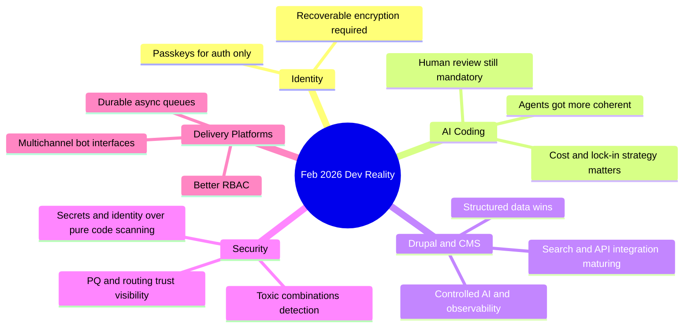

import Tabs from '@theme/Tabs';
import TabItem from '@theme/TabItem';

February 2026 was a great month for separating real engineering progress from marketing cosplay: **passkey misuse** got called out, **coding agents** crossed from toy to useful (with caveats), Drupal kept leaning into structured AI workflows, and security teams reminded everyone that identity + secrets are the real blast radius now.

<!-- truncate -->

## Stop Encrypting User Data with Passkeys

> "If losing a credential means permanent data loss, your architecture is broken, not 'secure by design.'"
>
> — Tim Cappalli

Tim Cappalli's warning is correct and overdue: using **passkeys** as direct encryption keys for user data is a product footgun.

- Users lose passkeys constantly.
- Recovery models are inconsistent across ecosystems.
- "Irreversible encryption" without explicit UX warning is operationally indistinguishable from data loss.

:::caution[Passkeys are for auth, not data escrow]
If losing a credential means permanent data loss, your architecture is broken, not "secure by design."
:::

Use passkeys for authentication, then protect data with recoverable key hierarchies:

```text title="Correct architecture"
passkey -> auth session -> server-side key wrapping / KMS / recovery policy
```

## AI Coding Agents: Yes, They Got Better. No, They Are Not Magic

> "Agent coherence improved fast. The leverage comes from operator judgment, not prompt poetry."
>
> — Simon Willison

Max Woolf's long-form experiment and Karpathy's December inflection comment match what many of us saw: **agent coherence** improved fast. Simon Willison's "hoard things you know how to do" is the right operating model.

<Tabs>
  <TabItem value="reality" label="The Reality">

| Claim | Actual Status |
|---|---|
| Agents finish non-trivial tasks | Yes, reliably now |
| Agents never fail | No — they fail silently on edge assumptions |
| Prompt engineering is the skill | No — operator judgment is the skill |
| Agents replace developers | No — they amplify developers |

  </TabItem>
  <TabItem value="workflow" label="Practical Workflow">

```bash title="Tight agent loop"
# highlight-next-line
git checkout -b spike/agent-task
npm test
npm run lint
git diff --stat
```

Keep agents inside a tight loop. Review everything. Trust nothing by default.

  </TabItem>
</Tabs>

## Copilot, Claude Max for OSS, and the New Pricing Politics

GitHub pushed more agent features (model picker, self-review, security scanning, CLI handoff). Anthropic offered free Claude Max (6 months) for qualified large OSS maintainers.

:::info[Read this as strategy, not generosity]
Vendor credits reduce adoption friction; they also shape where your workflow locks in. Subsidies target maintainers with existing distribution (5k+ stars / 1M+ npm downloads). Smaller teams still need cost discipline and fallback paths.
:::

## Drupal AI Story Is Getting Operational

The Drupal ecosystem had a noisy but useful month: SearXNG module for privacy-first search, GraphQL 5.0.0-beta2 fixes, Views Code Data structured output, Drupal Digests tracking core/CMS/canvas/AI activity, and multiple AI-ready architecture discussions.

| Signal | Why It Matters |
|---|---|
| Structured content model | Actual AI advantage for Drupal |
| Controlled AI with guardrails | Now mainstream architecture language |
| Tooling shift from demos to production | Cacheability, preview support, deprecation search |

## WordPress: Better Test Primitives, Beta Churn, and Security Reality

WordPress 7.0 Beta 2 landed, `assertEqualHTML()` is a quietly excellent testing improvement, and Wordfence weekly reports remain required reading if you run plugin-heavy installs.

```php title="WP_UnitTestCase semantic HTML comparison (WP 6.9+)"
<?php
// highlight-next-line
$this->assertEqualHTML(
  '<a class="btn" href="/docs">Docs</a>',
  $rendered_html
);
```

## Security Trend: Toxic Combinations, Secrets, Identity, and Routing Trust

GitGuardian's point is sharp: AI-generated code risk is increasingly downstream of **identity and secrets**. Add "toxic combinations" (small anomalies stacking into incidents), Cloudflare's post-quantum transparency tools, and ASPA routing validation.

| Pattern | Why It Matters |
|---|---|
| Single-signal alerting misses real incidents | Need compound signal detection |
| Supply chain trust includes route integrity | Protocol migration posture matters |
| Shift left without runtime observability | Incomplete security model |

## Quick Signal Table

| Area | What Changed | Why It Matters |
|---|---|---|
| Identity | Passkey-encrypted user data backlash | Prevent irreversible user data loss |
| AI coding | Agent reliability improved post-Dec | Higher ceiling, same need for review |
| OSS economics | Free Claude Max for large maintainers | Incentives concentrating on big repos |
| Drupal AI | Search/GraphQL/views/digests momentum | Structured CMS workflows are AI-ready now |
| WordPress | `assertEqualHTML()` + 7.0 beta + vuln reports | Better tests, faster regressions, constant patching |
| Security | Toxic combinations + secrets focus + ASPA/PQ telemetry | Detection must be multi-signal and infra-aware |
| Platform | Vercel Queues/RBAC/Telegram support | Operational maturity for agent-era apps |

## The Bigger Picture



## Platform Updates Worth Caring About

Vercel rolled out Queues public beta, made dashboard redesign default (Feb 26, 2026), added Developer role for Pro teams, and expanded Chat SDK with Telegram adapter.

| Feature | Why It Matters |
|---|---|
| Queues (async durability) | Table stakes for real workloads |
| Developer Role RBAC | Closes governance gap for Pro teams |
| Telegram adapter | Multichannel bot with strict workflow boundaries |

## Infra and Runtime Signals

<details>
<summary>Three threads to watch</summary>

- "We deserve a better streams API for JavaScript" highlights API ergonomics debt
- "Allocating on the Stack" style runtime work reminds us perf wins still come from memory model changes, not only model APIs
- Docker Model Runner now supporting `vllm-metal` on Apple Silicon lowers local inference friction

DevEx and runtime architecture are finally being discussed in the same room. Local inference keeps getting less painful, which changes prototyping economics.

</details>

## Community and Event Logistics

- DrupalCon Rotterdam 2026 CFP closes **April 13, 2026**
- Drupal Camp Delhi 2026 CFP deadline was extended to **February 28, 2026**
- DrupalCon gala/event posts are active; check publication year because mixed feeds include older items

:::tip[Operating model that survives hype cycles]
Treat agents as force multipliers inside a strict loop: `plan -> generate -> test -> scan -> review -> ship`.
:::

## The Bottom Line

The winners this month are teams that pair **automation** with **recoverability**, **observability**, and boring release discipline. Everything else is just a demo.

:::caution[Single most actionable item]
Audit one production flow this week where credential loss, secret leakage, or missing cache metadata could cause irreversible damage, then add a tested recovery/control path.
:::
