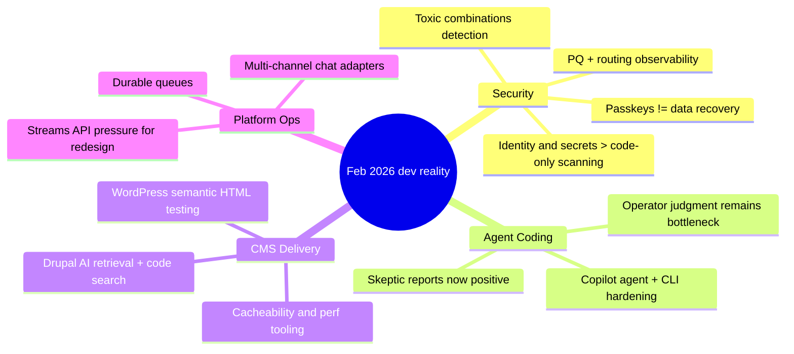

import Tabs from '@theme/Tabs';
import TabItem from '@theme/TabItem';
import TOCInline from '@theme/TOCInline';

February 2026 was a good month for killing bad assumptions. The useful signal: security teams are shifting from “scan code and pray” to identity/secrets discipline, and coding agents finally crossed from demo theater into repeatable workflow. CMS ecosystems also got more operational: better search, better testing primitives, better observability.

<!-- truncate -->

<TOCInline toc={toc} minHeadingLevel={2} maxHeadingLevel={2} />

## Passkeys, Security Theater, and Real Failure Modes

**Passkeys** are for authentication, not encrypted user-data custody. Teams still shipping “encrypt with passkey and call it done” are building unrecoverable-data incidents.

> "please stop promoting and using passkeys to encrypt user data"
>
> — Tim Cappalli, [Please, please, please stop using passkeys for encrypting user data](https://blog.timcappalli.me/p/passkeys-prf-warning/)

:::warning[Data recovery is a product requirement]
If encryption key loss equals permanent user-data loss, that is not “strong security”; it is an outage disguised as cryptography. Ship explicit recovery models: escrow, org-level recovery keys, or user-acknowledged irrecoverability with hard UX warnings.
:::

Security signal stack this month was consistent:
- Claude Code security discourse moved attention toward **identity and secrets**, not only vulnerable code paths.
- Cloudflare’s “toxic combinations” framing is correct: incidents are often multiple minor misses compounding.
- Weekly WordPress vulnerability reports remain a reminder that patch cadence beats perfect architecture slides.

```diff
- "Passkeys can also manage encrypted user data safely by default."
+ "Passkeys are auth credentials; data-key lifecycle needs separate recovery design."
```

## Agent Coding: Hype Finally Collided with Useful

The best “skeptic tries agents” write-up this month was Max Woolf’s long-form field report, and it lines up with what shipped from GitHub and what practitioners observed since late 2025.

> "coding agents basically didn’t work before December and basically work since"
>
> — Andrej Karpathy, [X post](https://twitter.com/karpathy/status/2026731645169185220)

### Tooling delta that actually matters

| Change | Why it matters in practice | Operational move |
|---|---|---|
| Copilot coding agent model picker + self-review + security scan | Better task-model fit, less blind patch generation | Require self-review output in PR template |
| Copilot CLI “idea to PR” workflow | Faster intent-to-diff loop for seniors | Keep CLI for scaffolding, IDE for hard refactors |
| “Hoard things you know how to do” pattern | Agent productivity is bounded by operator judgment | Maintain internal snippets/prompts/playbooks repo |
| Skeptic-style project escalation (small to complex) | Exposes failure modes early | Gate larger tasks on small-task pass rate |

<Tabs>
  <TabItem value="copilot-cli" label="Copilot CLI" default>
  Best for quick repo-local edits, script generation, and PR bootstrap when constraints are explicit. Weakest when requirements are fuzzy or architecture debt is deep.
  </TabItem>
  <TabItem value="ide-agent" label="IDE Agent">
  Better for iterative context retention, review loops, and targeted refactors across multiple files. Still needs hard acceptance tests.
  </TabItem>
  <TabItem value="manual" label="Manual Coding">
  Still faster for unfamiliar domains, security-critical paths, and large migrations where failure cost is high.
  </TabItem>
</Tabs>

:::caution[Agent output is not design]
Agents write code; they do not own blast radius. ~~“It compiled so ship it”~~ remains the shortest path to incident review.
:::

## Drupal and WordPress: Less Talk, More Useful Plumbing

The Drupal stream had several practical releases: SearXNG integration for privacy-first retrieval, new contrib code search for Drupal 10+, GraphQL 5.0.0-beta2 cacheability/preview fixes, Views Code Data for non-markup outputs, and performance diagnostics proving missing cache tags can still destroy response times.

WordPress side: `assertEqualHTML()` in 6.9 is a quiet but important test reliability upgrade, while WordPress 7.0 Beta 2 signals the usual “test now, not on launch day” window.

```php title="tests/phpunit/test-rendered-html.php"
public function test_card_markup_is_semantically_equal() {
    $actual = $this->render_card();
    $expected = '<div class="card"><a href="/x">Read</a></div>';

    // highlight-next-line
    $this->assertEqualHTML( $expected, $actual );
}
```

```yaml title="security/recovery-policy.yaml" showLineNumbers
version: 1
controls:
  auth:
    method: passkeys
    scope: login_only
  encryption:
    data_keys: envelope
    recovery:
      enabled: true
      owners:
        - security_team
        - org_admin
      # highlight-next-line
      user_warning_required: true
  incident_signals:
    - anomalous_request_chain
    - secret_exposure
    - cache_tag_miss
  quality_gates:
    - static_scan
    - secret_scan
    - integration_tests
```

<details>
<summary>Full changelog rollup (grouped)</summary>

- Identity/security: passkeys warning; toxic combinations; Claude Code security identity/secrets framing; Wordfence weekly report; Cloudflare Turnstile redesign; Cloudflare Radar transparency (PQ, KT logs, ASPA); ASPA routing security.
- Agent coding: Max Woolf’s skeptic report; Karpathy observation; Copilot CLI practical guide; Copilot coding agent updates; Simon Willison’s “hoard things you know how to do”.
- Drupal ecosystem: DrupalCon Gala + Hallway Track notes; SearXNG module; Dan Frost AI-ready architecture interview (listed twice in sources); contrib code search tool; GraphQL 5.0.0-beta2; Views Code Data; LocalGov Drupal demo theme; Drupal Digests; automated cache-tag diagnosis case; AI-assisted document summarizer tooltip; “move beyond the bubble” positioning.
- WordPress ecosystem: `assertEqualHTML()` improvement; WordPress 7.0 Beta 2.
- Platform/runtime: Vercel Queues beta; Chat SDK Telegram adapter; JS streams API critique; stack allocation update.
- OSS economics: Claude Max for qualifying large OSS maintainers.
</details>

## The Bigger Picture



## Bottom Line

Shipping teams that win this year are boring in the right places: explicit recovery models, strict secrets discipline, and agent workflows tied to test gates, not vibes.

:::tip[One move to make this week]
Add a mandatory “recovery + secrets + cacheability” checklist to every AI-assisted PR. If any box is unknown, the PR is not ready.
:::
