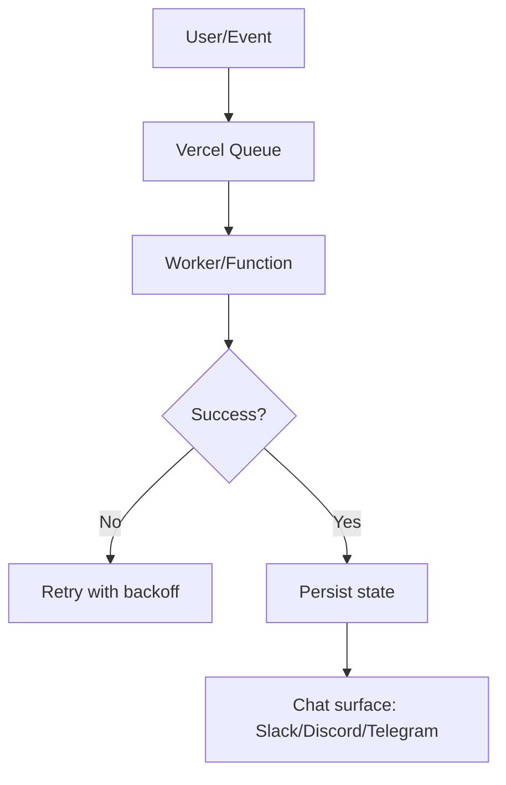
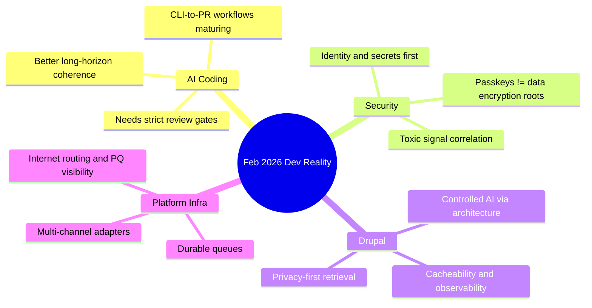

import Tabs from '@theme/Tabs';
import TabItem from '@theme/TabItem';

February was a clean split between signal and noise: **AI coding** got materially better, while security and platform work got less forgiving of sloppy decisions. The useful updates were about reliability, observability, and operational control, not marketing claims. The useless updates were still loud.

<!-- truncate -->

import TOCInline from '@theme/TOCInline';
<TOCInline toc={toc} minHeadingLevel={2} maxHeadingLevel={2} />

## Passkeys Are Not a Data Encryption Strategy
Tim Cappalli said the quiet part out loud: teams are abusing passkeys as if they were durable encryption roots. They are not. Users lose passkeys constantly, device sync breaks, and recovery stories are weaker than teams admit.

> "please stop promoting and using passkeys to encrypt user data."
>
> — Tim Cappalli, [Please, please, please stop using passkeys for encrypting user data](https://blog.timcappalli.me/p/passkeys-prf-warning/)

:::warning[Irreversible Data Loss Pattern]
If passkey material is the only key-encryption path for user data, account recovery becomes fake. Real fix: use passkeys for authentication, then wrap data keys under a recoverable KMS/HSM policy with audited recovery controls.
:::

```yaml title="security/key-hierarchy.yaml" showLineNumbers
version: 1
model: envelope-encryption
auth:
  primary: passkey
  fallback: oauth-recovery + risk-check
keys:
  dek:
    source: random-256-bit
    rotate_days: 90
  kek:
    provider: cloud-kms
    alias: app/user-data
    # highlight-next-line
    recovery: enabled_with_mfa_and_audit
recovery:
  contacts_required: 2
  delay_hours: 24
  notify_channels: [email, push]
```

## Agent Coding Crossed the "Useful" Threshold
Max Woolf’s detailed field report matches what many teams saw post-December: longer-horizon tasks are now feasible if specs are explicit and review remains strict. Karpathy’s take points the same direction, and GitHub/Anthropic both pushed operational improvements (model picker, self-review, security scanning, CLI handoff, OSS access to larger plans).

> "coding agents basically didn’t work before December and basically work since"
>
> — Andrej Karpathy, [X post](https://twitter.com/karpathy/status/2026731645169185220)

| Tooling update | What changed | Why it matters |
|---|---|---|
| GitHub Copilot coding agent | Model picker, self-review, built-in scanning, custom agents | Better control loop before human review |
| GitHub Copilot CLI flow | Idea-to-PR workflow got clearer | Faster path from intent to reviewable diff |
| Claude Max for OSS | Free six months for large maintainers | More serious experimentation budget |
| Skeptic long-form trials | Public, detailed failures and wins | Better priors than vendor demos |

<Tabs>
  <TabItem value="copilot" label="Copilot Agent" default>
Security scan + self-review in the loop is practical for orgs that already gate merges. Good fit for teams with strict PR discipline.
  </TabItem>
  <TabItem value="claude" label="Claude Max OSS">
Strong option for maintainers who qualify. Cost barrier drops, but review burden does not.
  </TabItem>
  <TabItem value="pattern" label="Operator Pattern">
Best results still come from scoped tasks, explicit constraints, and short verification cycles. ~~Prompt harder~~ Specify better.
  </TabItem>
</Tabs>

:::caution[Agent Throughput Can Hide Regression Risk]
When velocity spikes, unreviewed edge cases and secret handling mistakes spike too. Enforce diff limits, mandatory tests, and secret scanning on every generated PR.
:::

## Drupal AI Work Is Finally Infrastructure-Shaped
The strongest Drupal updates were not “AI magic.” They were boring, good infrastructure: privacy-first retrieval (SearXNG module), structured execution surfaces (Views Code Data), search/indexing for contrib code, and cacheability fixes in GraphQL 5.0.0-beta2. Dries’ Drupal Digests and Dan Frost’s maintenance-first stance both point to the same reality: controlled AI depends on architecture quality.

```diff
- $build['#cache']['max-age'] = 0;
+ $build['#cache']['contexts'][] = 'route';
+ $build['#cache']['tags'][] = 'node:' . $node->id();
+ $build['#cache']['max-age'] = Cache::PERMANENT;
```

The cache-tag incident that caused 4.2-second page loads is exactly the kind of failure AI-assisted tooling can detect quickly when observability exists.

<details>
<summary>Drupal items worth tracking closely</summary>

- SearXNG module for privacy-first web retrieval in Drupal assistants.
- GraphQL for Drupal 5.0.0-beta2: cacheability metadata fix + node preview support.
- New contrib code search index for Drupal 10+ projects and API querying.
- Views Code Data module for structured non-markup outputs.
- Document summarizer tooltip prototype built with AI-assisted coding.
- Dan Frost interview theme: guardrails + observability over AI theater.
- “Move beyond the bubble” argument: positioning Drupal as sovereign AI-ready platform.
- Community ops still matter: DrupalCon Gala and LocalGov demo theme work keep ecosystem glue alive.

</details>

:::info[Maintenance-First AI Is the Only Sustainable Track]
If content models, cache metadata, and module boundaries are weak, AI features become a support burden. Stabilize the platform first, then add assistant behavior.
:::

## Platform and Internet Security: Real Work, Not Slogans
Vercel Queues in public beta, Telegram adapter support in Chat SDK, Cloudflare’s Turnstile/Challenge redesign at 7.6B challenges daily, and Radar visibility into PQ/ASPA/KT trends all point to one thing: reliability + trust layers are where production systems win or fail.



| Signal | Operational move |
|---|---|
| Toxic combinations in security telemetry | Correlate “minor” anomalies before incident threshold |
| Turnstile redesign at massive scale | Treat UX + accessibility as anti-abuse control plane |
| PQ/ASPA tracking visibility | Add migration dashboards now, not after mandate deadlines |
| Streams API criticism | Audit runtime stream abstractions before lock-in |

:::danger[Identity and Secrets Are the New Blast Radius]
Claude Code security discussion got one thing right: code flaws are only half the story. Broken identity boundaries and leaked secrets are faster paths to compromise in agent-heavy pipelines.
:::

## The Bigger Picture


## Bottom Line
The pattern is simple: teams shipping durable software are choosing explicit recovery paths, strict review loops, and measurable runtime behavior. Everyone else is shipping demos and calling it strategy.

:::tip[One Action to Take Monday]
Run an audit for any feature where passkeys are used beyond authentication. If passkeys are in your data-encryption recovery chain, redesign that path immediately with KMS-backed recoverability and audited break-glass controls.
:::
