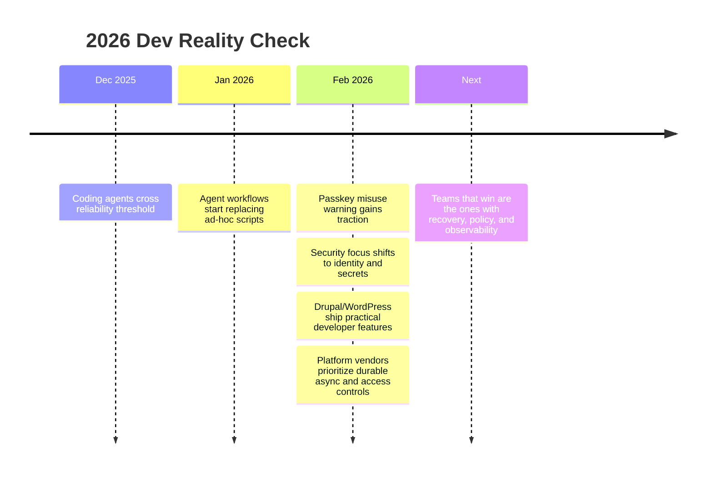

import Tabs from '@theme/Tabs';
import TabItem from '@theme/TabItem';
import TOCInline from '@theme/TOCInline';

February 2026 felt like a cleanup month: fewer magic demos, more operational lessons. The useful signal was consistent across ecosystems: recovery paths, guardrails, and boring reliability beat clever abstractions. ~~“AI everywhere”~~ is not a strategy; shipping systems that survive failure is.

<!-- truncate -->

<TOCInline toc={toc} minHeadingLevel={2} maxHeadingLevel={2} />

## Passkeys are authentication, not data recovery

Tim Cappalli’s warning is dead-on: teams keep using passkeys to encrypt user data, then discover users lose passkeys and data becomes unrecoverable. That is not “zero trust,” that is self-inflicted data loss with better branding.

> "please stop promoting and using passkeys to encrypt user data. I’m begging you."
>
> — Tim Cappalli, [Please, please, please stop using passkeys for encrypting user data](https://blog.timcappalli.me/p/passkeys-prf-warning/)

| Mechanism | Primary use | Recovery model | Use for user data at rest |
|---|---|---|---|
| Passkey/WebAuthn credential | Authentication | Weak for consumer churn | No |
| Server-managed KMS key | Encryption | Strong with policy controls | Yes |
| User passphrase (optional) | Extra client-side protection | User-dependent, explicit tradeoff | Only with explicit recovery UX |

:::warning[Stop binding irreversible encryption to fragile user credentials]
Use passkeys for login, then encrypt data with server-managed keys in KMS/HSM and audited rotation. If client-side encryption is mandatory, ship explicit key backup/export UX and a forced acknowledgment of irrecoverability. Silent failure modes here become support tickets first and legal risk later.
:::

## Coding agents got better, but the workflow matters more than the model

Max Woolf’s “skeptic tries agent coding” and Karpathy’s December inflection point can both be true: quality jumped, and teams still fail when process is sloppy. Copilot CLI, coding agents, and Claude Max-for-OSS are not substitutes for review discipline, scoped tasks, and security checks.

> "coding agents basically didn’t work before December and basically work since"
>
> — Andrej Karpathy, [X post](https://twitter.com/karpathy/status/2026731645169185220)

<Tabs>
  <TabItem value="copilot-cli" label="Copilot CLI" default>
  Good for intent-to-PR loops with explicit commands and review checkpoints. Best when tasks are bounded and the repo has clean tests.
  </TabItem>
  <TabItem value="coding-agent" label="Copilot Coding Agent">
  Useful for longer task persistence: model picker, self-review, security scanning, and CLI handoff reduce context thrash. Still requires human ownership of acceptance criteria.
  </TabItem>
  <TabItem value="claude-max-oss" label="Claude Max for OSS">
  Cost relief for maintainers is real, but eligibility gates (5k stars or 1M+ npm downloads) mean this is infrastructure for large projects, not a universal fix.
  </TabItem>
</Tabs>

:::info[The practical pattern]
Agent productivity correlates with repository hygiene and test quality more than prompt cleverness. Simon Willison’s “hoard things you know how to do” applies here: reusable scripts, repeatable QA, and known-safe rollout patterns compound faster than model-switching.
:::

## Security moved from “find bugs” to “contain blast radius”

GitGuardian’s Claude Code security take and Datadog’s “toxic combinations” frame the same shift: minor misconfigs now chain faster in agent-assisted environments. Identity, secret sprawl, and permission boundaries are the center of risk.

```yaml title=".github/workflows/ci-security.yml" showLineNumbers
name: ci-security
on:
  pull_request:
  push:
    branches: [main]

jobs:
  verify:
    runs-on: ubuntu-latest
    steps:
      - uses: actions/checkout@v4
      # highlight-next-line
      - uses: actions/setup-node@v4
        with:
          node-version: 22
      - run: npm ci
      - run: npm test
      # highlight-start
      - name: Secret scan (required)
        run: ggshield secret scan repo .
      # highlight-end
      - name: Policy check
        run: ./scripts/check-permissions.sh
```

:::danger[Agent + broad token + silent retries = incident chain]
Block long-lived tokens in CI, enforce least-privilege scopes, and require secret scanning on every PR. Add policy checks for outbound network calls in automation jobs; “it passed tests” means nothing if credentials leaked during generation or review.
:::

## Drupal and WordPress shipped practical improvements, not headline bait

The strongest CMS updates were concrete: Drupal GraphQL 5.0.0-beta2 fixed cacheability and node preview support; new contrib indexing improved discoverability; Views Code Data enabled structured output without rendering markup; WordPress 6.9 introduced `assertEqualHTML()` to stop brittle HTML-order test failures; WordPress 7.0 Beta 2 opened testing runway.

```diff title="tests/test-render.php"
- $this->assertSame( $expected_html, $actual_html );
+ $this->assertEqualHTML( $expected_html, $actual_html );
```

:::caution[Check security coverage before adopting contrib modules]
Some new Drupal developer modules explicitly state they are not covered by the Drupal Security Advisory Policy. Treat those as internal dependencies: pin versions, audit code, and isolate blast radius before production use.
:::

<details>
<summary>February CMS changelog highlights</summary>

- Drupal GraphQL `5.0.0-beta2`: cacheability metadata fix, node preview URLs, entity reference revisions, Drupal 10.4/11 compatibility.
- New Drupal contrib code search: indexes Drupal 10+ projects, branch requirements, install counts, security coverage, API support.
- Views Code Data module: executes Views displays as arrays/JSON/JSONL/delimited text without HTML rendering.
- Dries’ Drupal Digests: AI summaries across core/CMS/canvas/AI initiative activity.
- WordPress 6.9: `assertEqualHTML()` in `WP_UnitTestCase`.
- WordPress 7.0 Beta 2: testing phase active; non-production only.
- Wordfence weekly report (Feb 16–22, 2026): fresh disclosure cycle reinforces patch cadence discipline.

</details>

## Platform plumbing is catching up to real workloads

Vercel Queues public beta, Workflow orchestration, Telegram support in Chat SDK, role granularity for Pro teams, and dashboard default rollout are all “less shiny, more useful.” Docker Model Runner bringing `vllm-metal` to Apple Silicon is similarly practical: local inference got easier on actual developer hardware.

| Platform update | Why it matters operationally | Immediate action |
|---|---|---|
| Vercel Queues (beta) | Durable async processing with retries across deploys/crashes | Move expensive post-response jobs off request path |
| Chat SDK Telegram adapter | Single bot codebase across Slack/Discord/GitHub/Teams/Telegram | Standardize bot interaction layer |
| Pro-team Developer role | Safer deploy delegation without full config visibility | Split deploy vs owner privileges now |
| Dashboard redesign default | Navigation changes affect support/playbooks | Update internal runbooks/screenshots |
| Docker Model Runner + `vllm-metal` | Better local LLM throughput on Apple Silicon | Re-test local eval loops, reduce cloud burn |

## The Bigger Picture



## Bottom Line

The consistent signal this month: reliability architecture is now a product feature, not back-office hygiene.

:::tip[Single highest-ROI move this week]
Audit every place where credentials, passkeys, or agent tokens can create irreversible failure. Replace implicit assumptions with explicit recovery flows, mandatory secret scanning, and permission boundaries before adding another model or tool.
:::
