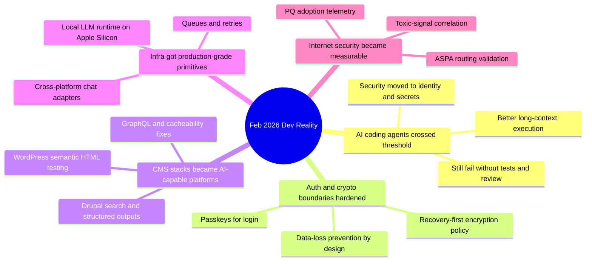

import Tabs from '@theme/Tabs';
import TabItem from '@theme/TabItem';
import TOCInline from '@theme/TOCInline';

February 2026 was the month where hype met consequences. **AI coding agents** got materially better, but security, observability, and rollback discipline became mandatory. On the CMS side, **Drupal** and **WordPress** kept shifting from “content systems” to programmable AI-aware runtimes.

<!-- truncate -->

<TOCInline toc={toc} minHeadingLevel={2} maxHeadingLevel={2} />

## Passkeys are auth, not data-recovery infrastructure

Tim Cappalli’s warning is correct: teams are using passkeys as encryption anchors, then discovering users lose passkeys constantly. That turns normal account recovery into irreversible data loss.

> "please stop promoting and using passkeys to encrypt user data."
>
> — Tim Cappalli, [Please, please, please stop using passkeys for encrypting user data](https://blog.timcappalli.me/p/passkeys-prf-warning/)

:::warning[Do Not Tie Decryption to a Single Passkey]
Ship recovery-first crypto policy. If decryption depends on one passkey and that credential is deleted, synced wrong, or rotated without escrow, user data is gone permanently.  
Require at least two independent recovery paths before enabling client-side encryption in production.
:::

```ts title="src/security/recovery-guard.ts" showLineNumbers
type RecoveryMethod = 'passkey' | 'backup_code' | 'hardware_key' | 'admin_escrow';

interface AccountSecurityState {
  methods: RecoveryMethod[];
  encryptedDataEnabled: boolean;
}

export function assertRecoveryReadiness(state: AccountSecurityState) {
  const unique = new Set(state.methods);
  const hasIndependentRecovery = unique.has('backup_code') || unique.has('admin_escrow');
  const hasPrimaryStrongAuth = unique.has('passkey') || unique.has('hardware_key');

  // highlight-next-line
  if (!hasPrimaryStrongAuth || !hasIndependentRecovery) {
    throw new Error('BLOCK_ENCRYPTION_ENABLEMENT_UNTIL_RECOVERY_IS_VERIFIED');
  }

  return state.encryptedDataEnabled;
}
```

## Agentic coding got real, but quality gates decide outcomes

Max Woolf’s detailed field report and Karpathy’s “it changed fast” observation line up with what most teams saw after December 2025: better long-context persistence, fewer dead-end loops, more usable diffs. ~~Agents replace engineers~~ Agents raise output only when review, tests, and secret controls are strict.

> "coding agents basically didn’t work before December and basically work since"
>
> — Andrej Karpathy, [X post](https://twitter.com/karpathy/status/2026731645169185220)

<Tabs>
  <TabItem value="copilot" label="Copilot Agent" default>
  Strongest value: IDE+PR handoff, self-review, security scan integration, CLI-driven flow from idea to PR.  
  Use it when the repo already has tests, linting, and clear ownership boundaries.
  </TabItem>
  <TabItem value="claude" label="Claude Max for OSS">
  Strongest value: bigger monthly budget for maintainers of large projects (5k+ stars or 1M+ npm downloads, six-month window).  
  Use it when backlog volume is high and maintainers need sustained iteration, not one-off prompts.
  </TabItem>
  <TabItem value="skeptic" label="Skeptic Pattern">
  Best practice from skeptical trials: start with narrow deliverables, then scale scope only after the agent proves it can preserve intent across refactors.  
  This avoids spending hours reviewing confident nonsense.
  </TabItem>
</Tabs>

:::danger[The Real Security Shift Is Identity and Secrets]
GitGuardian’s point is operationally correct: risk is no longer just code defects, it is token sprawl, over-privileged automation, and prompt-time secret exposure.  
Treat agent credentials as production credentials. Rotate aggressively, scope minimally, and block merges on secret scanning.
:::

```diff title=".github/workflows/pr-guardrails.yml"
-      - run: npm test
+      - run: npm run lint
+      - run: npm run test
+      - run: npm run secret-scan
+      - run: npm run sast
```

## Drupal and WordPress are now shipping AI-era primitives

This month’s CMS signal was not “AI plugin noise.” It was architecture hardening: structured retrieval, typed output paths, cacheability fixes, search/index improvements, and test semantics upgrades.

| Item | Why it matters in production |
|---|---|
| SearXNG Drupal module for assistants | Privacy-first live web retrieval without tracking users |
| Drupal GraphQL 5.0.0-beta2 | Cacheability fix + node preview support reduces headless regressions |
| Views Code Data module | Programmatic structured output from Views without rendering overhead |
| Drupal contrib code search (10+ compatible) | Faster dependency/risk triage across ecosystem |
| Drupal Digests (Dries) | Continuous AI summaries of core/CMS/Canvas/AI initiative activity |
| WP 6.9 `assertEqualHTML()` | Stops brittle HTML-order test failures |
| WP 7.0 Beta 2 | Signals next compatibility/testing cycle for plugin teams |

:::info[Maintenance-First Architecture Beats Demo-First AI]
Dan Frost’s “controlled AI” framing is the right model: guardrails, observability, and maintainable structure beat flashy prototypes.  
If AI behavior cannot be monitored, replayed, and constrained, it does not belong in production CMS workflows.
:::

```php title="tests/phpunit/test-render-output.php"
<?php
class RenderOutputTest extends WP_UnitTestCase {
  public function test_block_markup_is_semantically_equal() {
    $actual = '<a class="btn" href="/x">Open</a>';
    $expected = '<a href="/x" class="btn">Open</a>';

    // highlight-next-line
    $this->assertEqualHTML($expected, $actual);
  }

  public function test_real_difference_fails() {
    $actual = '<a class="btn" href="/x">Open now</a>';
    $expected = '<a href="/x" class="btn">Open</a>';
    $this->assertNotEquals($expected, $actual);
  }
}
```

## Platform updates: queues, chat surfaces, and local model runtime

Vercel shipped practical primitives: Queues public beta, Telegram adapter support in Chat SDK, Pro-team Developer role, and dashboard redesign as default (rolled out on February 26, 2026). Docker Model Runner brought `vllm-metal` to Apple Silicon, which matters for local inference throughput on macOS.

:::caution[Asynchronous Work Needs Idempotency, Not Hope]
A queue with retries will duplicate work unless handlers are idempotent.  
Persist dedupe keys, enforce retry budgets, and make failure state queryable from logs and metrics.
:::

```ts title="src/queues/processOrder.ts" showLineNumbers
import { db } from './db';
import { publishResult } from './events';

export async function processOrder(message: { id: string; orderId: string }) {
  const existing = await db.jobs.findUnique({ where: { id: message.id } });
  if (existing?.status === 'done') return;

  await db.jobs.upsert({
    where: { id: message.id },
    update: { attempts: { increment: 1 } },
    create: { id: message.id, status: 'running', attempts: 1 },
  });

  // highlight-start
  const result = await chargeAndFulfill(message.orderId);
  await publishResult({ orderId: message.orderId, status: 'ok', resultId: result.id });
  // highlight-end

  await db.jobs.update({ where: { id: message.id }, data: { status: 'done' } });
}
```

## Security and Internet plumbing became observable work

Cloudflare’s additions for post-quantum visibility, key transparency logs, and ASPA routing telemetry are useful because they move security from claims to measurable adoption. Pair that with “toxic combinations” analysis: incidents emerge from multiple “minor” signals interacting.

| Signal | Old posture | Required posture now |
|---|---|---|
| PQ migration | “roadmap item” | Track adoption metrics continuously |
| Routing security (ASPA) | BGP trust assumptions | Cryptographic path validation |
| Bot/challenge UX | Security-only focus | Security + accessibility + conversion |
| Agent code security | Static scan at end | Shift-left with identity/secret controls |

## Community and ecosystem moves worth acting on immediately

DrupalCon and community channels are shipping actionable opportunities, not just conference marketing. Mike Herchel’s gala push, Hallway Track reminder, and Rotterdam CFP dates create concrete windows for networking and influence. Note the historical correction: the Drupal 25th anniversary gala was during DrupalCon Chicago on **March 25, 2025** (past event), while Rotterdam CFP closes **April 13, 2026**.

<details>
<summary>Full February source ledger (compiled)</summary>

- Tim Cappalli on passkeys + encryption misuse  
- Max Woolf’s AI agent coding deep dive  
- Mike Herchel: DrupalCon Gala tickets  
- Anthropic: Claude Max for qualifying OSS maintainers  
- Simon Willison: Unicode Explorer via HTTP range binary search  
- GitHub: Copilot CLI idea-to-PR guide  
- Drupal SearXNG integration for privacy-first assistant search  
- Dan Frost interview on AI-ready Drupal and controlled AI  
- Vercel: keeping community human while scaling with agents  
- Vercel Queues public beta  
- Chat SDK Telegram adapter  
- Drupal contrib code search for D10+ projects  
- GraphQL for Drupal 5.0.0-beta2  
- Views Code Data module  
- Mark Conroy: LocalGov Drupal demo theme  
- Dries Buytaert: Drupal Digests  
- Automated tool finding cache-tag performance defect  
- Claude Code security discussion (identity/secrets emphasis)  
- Toxic combinations security model  
- Better JavaScript streams API critique  
- Cloudflare challenge page redesign at scale  
- Cloudflare Radar transparency updates: PQ, KT, ASPA  
- ASPA routing security explainer  
- Allocating on the stack update  
- GitHub Copilot coding agent updates  
- Simon Willison: “Hoard things you know how to do”  
- Andrej Karpathy quote on December inflection  
- Drupal AI document summarizer tooltip prototype  
- “Drupal beyond the bubble” AI-era positioning argument  
- WordPress `assertEqualHTML()` for robust HTML tests  
- WordPress 7.0 Beta 2  
- DrupalCon “Hallway Track” update  
- Wordfence weekly vulnerability report (Feb 16-22, 2026)  
- DrupalCon Rotterdam 2026 Call for Speakers  
- Docker Model Runner with vllm-metal on Apple Silicon  
- GitGuardian MCP shift-left for AI-generated code security  
- Vercel Pro teams Developer role  
- Vercel dashboard redesign default rollout  
- AI Gateway: Nano Banana 2  
- Drupal 25th anniversary gala reference (March 25, 2025)
</details>

## The Bigger Picture



## Bottom Line

The practical pattern is clear: keep agents, keep speed, remove magical thinking. Reliability comes from recovery paths, enforceable policy, and observable systems.

:::tip[Single action that pays off this week]
Add one mandatory PR gate that blocks merges when tests fail, secrets are detected, or recovery requirements are unmet for new encryption features.  
That one gate prevents the three costliest failures in this devlog: silent regressions, credential leaks, and irreversible user-data lockout.
:::
