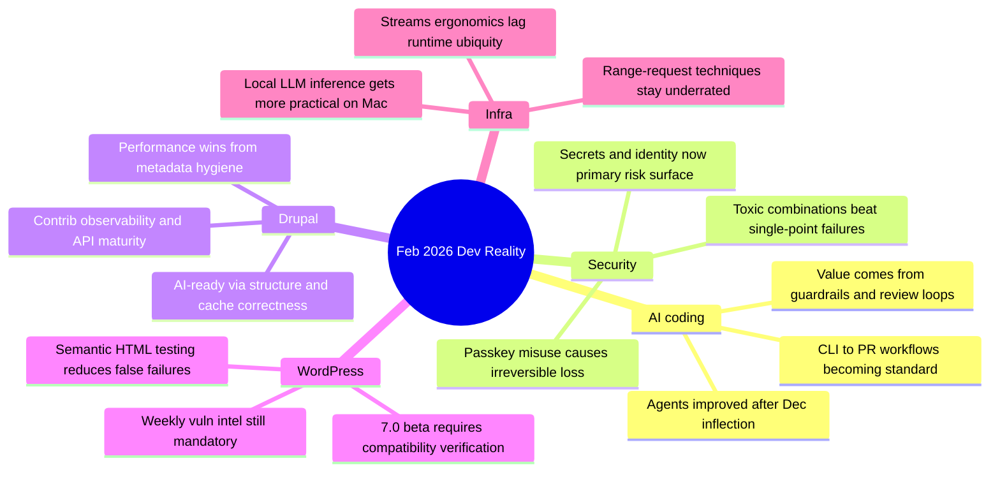

import Tabs from '@theme/Tabs';
import TabItem from '@theme/TabItem';
import TOCInline from '@theme/TOCInline';

February 2026 was less about shiny launches and more about operational reality: recoverability, guardrails, observability, and boring reliability work that actually keeps systems alive. The strongest pattern across AI, Drupal, WordPress, and infra is simple: tools improved, but risk moved up-stack into identity, secrets, and process discipline. Marketing says “autonomous”; production says “audit trail or outage.”

<!-- truncate -->

<TOCInline toc={toc} minHeadingLevel={2} maxHeadingLevel={2} />

## Identity and Security: Recoverability Beats Clever Crypto

Tim Cappalli’s passkey warning is the correct hill to die on.

> “please stop promoting and using passkeys to encrypt user data.”
>
> — Tim Cappalli, [Please, please, please stop using passkeys for encrypting user data](https://blog.timcappalli.me/p/passkeys-prf-warning/)

Using passkeys as a data-encryption root means routine credential loss becomes permanent data loss. That is not “zero trust.” That is an undeclared retention policy of “hope.”

:::warning[Passkey Encryption Is a Data-Loss Trap]
Do not bind user-data decryptability directly to passkey possession. Keep a server-side recoverable key hierarchy with explicit recovery paths, audited key rotation, and user-visible recovery UX. If recovery is impossible by design, that must be explicit in product copy, onboarding, and legal terms.
:::

Cloudflare’s updates (Turnstile redesign, PQ/routing transparency, ASPA tracking) and “toxic combinations” guidance all point to the same thing: incidents come from weak composition, not one dramatic bug.

| Signal | Why it matters | Action to take this week |
|---|---|---|
| Small auth anomalies + config drift | “Toxic combinations” create compound failure | Correlate low-severity alerts across identity, network, and app layers |
| More PQ + ASPA telemetry | Security posture is now externally measurable | Add Radar-style metrics to monthly security review |
| Bot challenge UX redesign at internet scale | Security controls fail if humans cannot pass them | Run accessibility + completion-rate tests on auth friction flows |

## AI Coding: Better Agents, Same Accountability

Max Woolf’s long-form skeptic test, Karpathy’s “December inflection” comment, and GitHub’s Copilot agent updates all align: baseline capability improved fast, but reliability still depends on operator discipline.

> “coding agents basically didn’t work before December and basically work since”
>
> — Andrej Karpathy, [post](https://twitter.com/karpathy/status/2026731645169185220)

The practical shift is not “AI writes software now.” It is: agent loops are finally useful enough that orchestration quality (prompts, tests, constraints, review) dominates outcomes.

<Tabs>
  <TabItem value="copilot" label="Copilot Agent" default>
GitHub’s model picker, self-review, security scanning, and CLI handoff reduce friction from idea to PR. Good for teams already anchored in GitHub workflow and branch policy.
  </TabItem>
  <TabItem value="claude-max" label="Claude Max OSS">
Anthropic’s free six-month offer for large OSS maintainers is economically meaningful. Eligibility thresholds (stars/downloads) mean this is a scaling subsidy, not broad access.
  </TabItem>
  <TabItem value="operator" label="Operator Discipline">
The winning pattern from skeptic writeups and agentic engineering advice: hoard repeatable tasks, encode them as scripts/checks, and force agents through those guardrails.
  </TabItem>
</Tabs>

:::danger[The Real Risk Is Identity and Secrets, Not Just Code]
Treat every agent as a privileged automation boundary. Rotate credentials aggressively, scope tokens tightly, and log every tool call that can touch production systems. “Passed tests” without secrets hygiene is a delayed breach report.
:::

## Drupal: AI-Ready Means Structured, Observable, and Boring

Drupal’s strongest February signal is architectural maturity, not novelty: AI integration through structure and guardrails, plus tooling that helps maintainers reason about contrib risk and compatibility.

Key moves:
- SearXNG module adds privacy-first web retrieval for assistants.
- New contrib code search indexes Drupal 10+ ecosystem metadata and deprecated usage.
- GraphQL 5.0.0-beta2 fixes cacheability metadata and improves preview/revisions support.
- Views Code Data exposes non-markup data execution paths.
- Performance case studies keep proving cache metadata hygiene is the cheapest speed win.
- Dries’ Drupal Digests indicates AI-assisted project observability is now expected workflow.

```diff title="modules/custom/catalog_block/src/Plugin/Block/ProductBlock.php"
- $build['content'] = $this->renderer->render($view);
+ $build['content'] = $this->renderer->render($view);
+ $build['#cache']['tags'][] = 'node:' . $product->id();
+ $build['#cache']['contexts'][] = 'url.path';
+ $build['#cache']['max-age'] = Cache::PERMANENT;
```

:::info[Why this keeps repeating]
“AI-ready architecture” in Drupal is mostly about strict content modeling, cacheability metadata, and predictable extension boundaries. LLM integration amplifies architecture quality; it does not replace it.
:::

## WordPress: Test Semantics, Not String Noise

WordPress 6.9 adding `assertEqualHTML()` is one of the most useful low-drama testing improvements: HTML tests stop failing because of irrelevant serialization differences. WordPress 7.0 Beta 2 is available, but this is test-lab territory only. Wordfence’s weekly report remains mandatory reading for ops teams shipping plugin-heavy sites.

```php title="tests/phpunit/test-render-output.php" showLineNumbers
<?php
class Test_Render_Output extends WP_UnitTestCase {

    public function test_card_markup_is_semantically_equal() {
        $actual = '<a class="btn" href="/docs" target="_blank">Docs</a>';
        $expected = '<a target="_blank" href="/docs" class="btn">Docs</a>';

        // highlight-next-line
        $this->assertEqualHTML($expected, $actual);
    }

    public function test_real_regression_still_fails() {
        $actual = '<a class="btn" href="/docs">Read</a>';
        $expected = '<a class="btn" href="/docs">Docs</a>';

        // highlight-next-line
        $this->assertNotEqual($expected, $actual);
    }
}
```

:::caution[Beta channels are for compatibility work, not feature confidence]
Run WordPress 7.0 Beta 2 against plugin/theme test suites and capture deprecation notices now. Do not infer release readiness from beta install success on a clean site.
:::

## Platform and Runtime Notes: Useful, But Keep the Hype Filter On

Simon Willison’s Unicode explorer via HTTP range-request binary search is a sharp demo of protocol-level creativity. The streams API critique is valid: ubiquity does not equal ergonomic design. Docker Model Runner bringing `vllm-metal` to Apple Silicon matters for local inference ergonomics, while low-level runtime work like stack allocation improvements reminds everyone performance still starts below the framework layer.

```yaml title="devlog-actions.yaml" showLineNumbers
month: 2026-02
actions:
  - track:
      - passkey_recovery_rate
      - secrets_exposure_paths
      - cache_metadata_misses
  - upgrade:
      - wordpress_test_helpers
      - drupal_graphql_beta_validation
      - copilot_cli_workflows
  - enforce:
      # highlight-start
      - no_agent_merge_without_security_scan
      - no_new_ai_feature_without_observability_budget
      # highlight-end
  - review:
      - cloudflare_radar_pq_aspa
      - weekly_wordfence_report
```

## The Bigger Picture



<details>
<summary>Full changelog coverage (all verified items compiled)</summary>

- Tim Cappalli passkey PRF warning.
- Max Woolf AI coding skeptic deep dive.
- DrupalCon Gala tickets announcement.
- Anthropic Claude Max for large OSS maintainers.
- Simon Willison Unicode explorer via HTTP range binary search.
- GitHub Copilot CLI practical guide from idea to PR.
- Drupal SearXNG privacy-first search module.
- Dan Frost interview on AI-ready Drupal / controlled AI / AI-mode SEO (duplicate syndication noted).
- Vercel community scaling with agents.
- Vercel Queues public beta.
- Chat SDK Telegram adapter support.
- Drupal 10+ contrib code search tool.
- GraphQL for Drupal 5.0.0-beta2 release details.
- Views Code Data module for structured output execution.
- LocalGov Drupal demo theme redesign.
- Dries Buytaert Drupal Digests launch.
- Automated cache-tag issue diagnosis case study.
- Claude Code security commentary (identity/secrets focus).
- Toxic combinations security analysis.
- JavaScript streams API critique.
- Cloudflare Turnstile/challenge page redesign.
- Cloudflare Radar transparency: PQ, KT logs, ASPA.
- ASPA routing security deep dive.
- Allocating on the stack update.
- GitHub Copilot coding agent updates.
- Simon Willison “Hoard things you know how to do.”
- Karpathy December agent capability quote.
- AI-assisted Drupal document summarizer tooltip prototype.
- “Drupal beyond the bubble” AI-era positioning argument.
- WordPress `assertEqualHTML()` testing improvement.
- WordPress 7.0 Beta 2 testing announcement.
- DrupalCon “Hallway Track” update.
- Wordfence weekly vulnerability report (Feb 16–22, 2026).
- DrupalCon Rotterdam CFP timeline (closes 13 April 2026).
- Docker Model Runner adds `vllm-metal` on Apple Silicon.
</details>

## Bottom Line

Most February updates collapse into one rule: ship fewer miracles, ship more recoverability and observability. ~~“AI-native”~~ is not a strategy; reliable systems are.

:::tip[Single highest-ROI move]
Adopt a release gate that blocks merge unless three checks pass: semantic tests (`assertEqualHTML`-style where relevant), security scan with secret exposure checks, and cache/metadata validation for dynamic content paths.
:::
