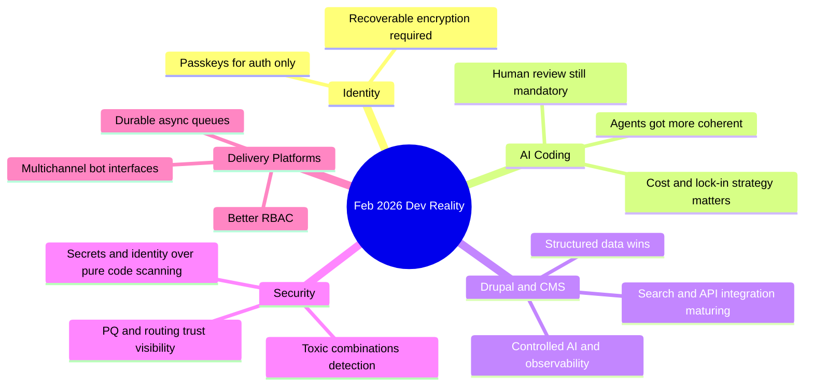

February 2026 was a great month for separating real engineering progress from marketing cosplay: **passkey misuse** got called out, **coding agents** crossed from toy to useful (with caveats), Drupal kept leaning into structured AI workflows, and security teams reminded everyone that identity + secrets are the real blast radius now.  
<!-- truncate -->

## Stop encrypting user data with passkeys
Tim Cappalli’s warning is correct and overdue: using **passkeys** as direct encryption keys for user data is a product footgun.

Why it matters:
- Users lose passkeys constantly.
- Recovery models are inconsistent across ecosystems.
- “Irreversible encryption” without explicit UX warning is operationally indistinguishable from data loss.

:::caution[Passkeys are for auth, not data escrow]
If losing a credential means permanent data loss, your architecture is broken, not “secure by design.”
:::

Use passkeys for authentication, then protect data with recoverable key hierarchies:
```text
passkey -> auth session -> server-side key wrapping / KMS / recovery policy
```

## AI coding agents: yes, they got better, no, they are not magic
Max Woolf’s long-form experiment and Karpathy’s December inflection comment match what many of us saw: **agent coherence** improved fast. Simon Willison’s “hoard things you know how to do” is the right operating model.

Why it matters:
- Agents now finish non-trivial tasks.
- They still fail silently on edge assumptions.
- The leverage comes from operator judgment, not prompt poetry.

Practical workflow:
```bash
# Keep agents inside a tight loop
git checkout -b spike/agent-task
npm test
npm run lint
git diff --stat
```

## Copilot, Claude Max for OSS, and the new pricing politics
GitHub pushed more agent features (model picker, self-review, security scanning, CLI handoff). Anthropic offered free Claude Max (6 months) for qualified large OSS maintainers.

Why it matters:
- Tooling is converging around “agent + review + security scan.”
- Subsidies target maintainers with existing distribution (5k+ stars / 1M+ npm downloads).
- Smaller teams still need cost discipline and fallback paths.

:::info[Read this as strategy, not generosity]
Vendor credits reduce adoption friction; they also shape where your workflow locks in.
:::

## Drupal’s AI story is getting operational
The Drupal ecosystem had a noisy but useful month: SearXNG module for privacy-first search, GraphQL 5.0.0-beta2 fixes, Views Code Data structured output, Drupal Digests tracking core/cms/canvas/AI activity, and multiple “AI-ready architecture” discussions (Dan Frost, community interviews, camp talks).

Why it matters:
- Drupal’s **structured content model** is an actual AI advantage.
- “Controlled AI” with guardrails and observability is now mainstream architecture language.
- Tooling is shifting from demos to production hygiene (cacheability, preview support, deprecation search).

## WordPress: better test primitives, beta churn, and security reality
WordPress 7.0 Beta 2 landed, `assertEqualHTML()` is a quietly excellent testing improvement, and Wordfence weekly reports remain required reading if you run plugin-heavy installs.

Why it matters:
- Semantic HTML assertions reduce brittle test failures.
- Beta cycles are useful only if you test on staging like an adult.
- Vulnerability cadence is constant; patch discipline beats wishful thinking.

Example:
```php
<?php
// WP_UnitTestCase semantic HTML comparison (WP 6.9+)
$this->assertEqualHTML(
  '<a class="btn" href="/docs">Docs</a>',
  $rendered_html
);
```

## Security trend: toxic combinations, secrets, identity, and routing trust
GitGuardian’s point is sharp: AI-generated code risk is increasingly downstream of **identity and secrets**. Add “toxic combinations” (small anomalies stacking into incidents), Cloudflare’s post-quantum transparency tools, and ASPA routing validation: security is moving from static scan to system-level verification.

Why it matters:
- Single-signal alerting misses real incidents.
- Supply chain trust now includes route integrity and protocol migration posture.
- “Shift left” without runtime observability is incomplete.

## Platform updates worth caring about (Vercel + ecosystem)
Vercel rolled out Queues public beta, made dashboard redesign default (Feb 26, 2026), added Developer role for Pro teams, and expanded Chat SDK with Telegram adapter. They also published a clear stance on keeping community interactions human while scaling with agents.

Why it matters:
- Async durability (`Queues`) is table stakes for real workloads.
- RBAC granularity for Pro teams closes a long-standing governance gap.
- Multichannel bot adapters are useful if you enforce strict workflow boundaries.

## Infra and runtime signals: streams, stack allocation, local inference
Three threads to watch:
- “We deserve a better streams API for JavaScript” highlights API ergonomics debt.
- “Allocating on the Stack” style runtime work reminds us perf wins still come from memory model changes, not only model APIs.
- Docker Model Runner now supporting `vllm-metal` on Apple Silicon lowers local inference friction.

Why it matters:
- DevEx and runtime architecture are finally being discussed in the same room.
- Local inference keeps getting less painful, which changes prototyping economics.

## Community and event logistics that affect planning
Some “news” is tactical but useful:
- DrupalCon Rotterdam 2026 CFP closes **April 13, 2026**.
- Drupal Camp Delhi 2026 CFP deadline was extended to **February 28, 2026**.
- DrupalCon gala/event posts are active; check publication year because mixed feeds include older items (e.g., Chicago 2025 anniversary gala).

## Quick signal table

| Area | What changed | Why you should care |
|---|---|---|
| Identity | Passkey-encrypted user data backlash | Prevent irreversible user data loss |
| AI coding | Agent reliability improved post-Dec | Higher ceiling, same need for review |
| OSS economics | Free Claude Max for large maintainers | Incentives are concentrating on big repos |
| Drupal AI | Search/GraphQL/views/digests momentum | Structured CMS workflows are AI-ready now |
| WordPress | `assertEqualHTML()` + 7.0 beta + vuln reports | Better tests, faster regressions, constant patching |
| Security | Toxic combinations + secrets focus + ASPA/PQ telemetry | Detection must be multi-signal and infra-aware |
| Platform | Vercel Queues/RBAC/Telegram support | Operational maturity for agent-era apps |

## The Bigger Picture



:::tip[Operating model that survives hype cycles]
Treat agents as force multipliers inside a strict loop: `plan -> generate -> test -> scan -> review -> ship`.
:::

## Conclusion
The main takeaway: the winners are teams that pair **automation** with **recoverability**, **observability**, and boring release discipline. Everything else is just a demo.

:::caution[Single most actionable item]
Audit one production flow this week where credential loss, secret leakage, or missing cache metadata could cause irreversible damage, then add a tested recovery/control path.
:::
