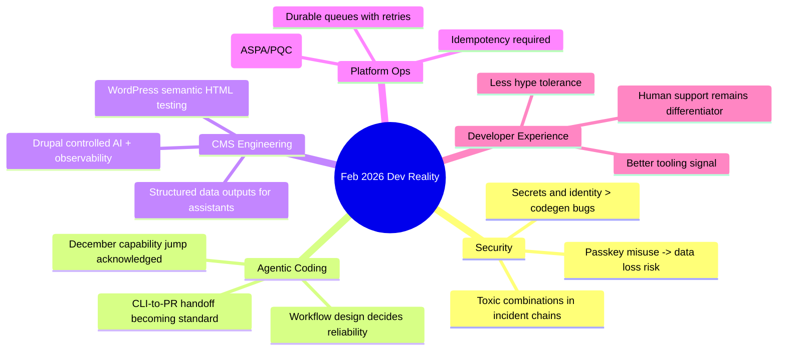

import Tabs from '@theme/Tabs';
import TabItem from '@theme/TabItem';
import TOCInline from '@theme/TOCInline';

February 2026 was a cleanup month for developer reality: fewer fairy tales, more operational consequences. The strongest pattern across AI, Drupal, WordPress, and platform infra is simple: teams shipping with guardrails are winning; teams shipping vibes are creating incident reports for future selves. Marketing kept shouting, but the useful signal was still there for anyone reading changelogs instead of taglines.

<!-- truncate -->

<TOCInline toc={toc} minHeadingLevel={2} maxHeadingLevel={2} />

## Passkeys Are Not Your Data-Encryption Recovery Plan

Tim Cappalli’s warning is correct, and teams ignoring it are gambling with irreversible data loss.

> "Please stop promoting and using passkeys to encrypt user data."
>
> — Tim Cappalli, [Please, please, please stop using passkeys for encrypting user data](https://blog.timcappalli.me/p/passkeys-prf-warning/)

Using passkeys directly to lock user content sounds elegant until a user loses the credential and support can do nothing. ~~Passkeys solve account security, therefore they solve data recovery~~ is the misconception. They solve authentication well; recovery semantics are a different system.

:::warning[Irreversible Loss Is a Product Bug]
If passkey loss means permanent ciphertext, the product must communicate that *before* encryption and provide an explicit backup path (`recovery key`, `trusted contact`, or enterprise escrow). If that path does not exist, do not ship passkey-bound encryption for user-owned data.
:::

```diff
- Derive data key directly from passkey PRF output
- Store only ciphertext
+ Generate random DEK per user dataset
+ Wrap DEK with recoverable KEK strategy (hardware-backed + policy escrow)
+ Add explicit recovery flow and key-rotation endpoint
```

## Coding Agents: December Was the Inflection, 2026 Is the Integration Phase

Max Woolf’s long-form experiment and Karpathy’s observation point to the same thing: baseline capability changed fast, but reliability still depends on workflow design.

> "coding agents basically didn’t work before December and basically work since"
>
> — Andrej Karpathy, [quoted source](https://twitter.com/karpathy/status/2026731645169185220)

<Tabs>
  <TabItem value="copilot-cli" label="Copilot CLI" default>
  Strong for intent-to-PR flow when terminal-native review discipline is already in place. GitHub’s latest updates (model picker, self-review, security scanning, custom agents, CLI handoff) reduce context switching, but they do not replace code ownership.
  </TabItem>
  <TabItem value="claude-max-oss" label="Claude Max for OSS">
  Free six-month access for large maintainers (5k+ stars or 1M+ npm downloads) is useful, but this is a capacity grant, not an architecture strategy. Teams still need policy around secrets, review, and merge controls.
  </TabItem>
  <TabItem value="skeptic-trials" label="Skeptic Trials">
  Skeptical test-driving with increasing project complexity remains the best calibration method. Keep logs, keep diffs small, and measure regressions directly instead of debating “agent IQ.”
  </TabItem>
</Tabs>

| Signal | What Actually Matters | Action |
|---|---|---|
| Agent can finish tasks end-to-end | Quality degrades without review constraints | Require self-review + CI gates before merge |
| Longer context windows | Hidden drift across files still happens | Enforce small PR slices and explicit acceptance checks |
| Faster prototype loops | Security debt accumulates faster too | Add secret scanning and auth threat-model checks |

:::danger[Claude Code Security Discourse Misses the Bigger Risk]
The GitGuardian take is right: the bigger blast radius is identity and secrets handling, not just insecure generated code. Put `secret detection`, `token scope minimization`, and `rotation playbooks` in the same sprint as agent rollout.
:::

## Drupal: AI-Ready Architecture Is About Governance, Not Plugin Count

The Drupal signal this month was unusually practical: search tooling, GraphQL fixes, structured Views output, digest-style tracking, and production performance debugging all converged on one idea: **controlled AI** beats “AI everywhere.”

- `GraphQL 5.0.0-beta2` added cacheability and preview-related fixes for Drupal 10.4/11 compatibility.
- New contrib code search indexes Drupal 10+ projects with branch/security metadata.
- `Views Code Data` enables programmatic structured outputs (JSON/JSONL/etc.), useful for AI pipelines but outside Drupal SA coverage.
- SearXNG module gives privacy-first web retrieval for Drupal assistants.
- Dan Frost’s framing on guardrails/observability is the right center of gravity.

:::info[Why This Matters for Real Teams]
AI readiness in Drupal is mostly a content architecture and operations problem: stable schemas, cache metadata discipline, retrieval boundaries, and observability. Teams skipping those and adding chat UI first are rebuilding fundamentals later at higher cost.
:::

<details>
<summary>Drupal ecosystem updates tracked (February 2026)</summary>

- DrupalCon Gala announcement (Mike Herchel, Feb 27, 2026).
- SearXNG module for privacy-first AI assistant retrieval.
- Dan Frost interview coverage on AI-ready architecture and controlled AI (duplicate source consolidated).
- New Drupal contrib code search for Drupal 10+ compatible projects.
- GraphQL for Drupal 5.0.0-beta2 release notes.
- Views Code Data module launch.
- Dries Buytaert’s Drupal Digests launch.
- Automated cache-tag diagnostic case resolving 4.2s page loads.
- AI-assisted Drupal tooltip summarizer prototype write-up.
- “Move beyond the bubble” positioning argument for AI-era Drupal messaging.

</details>

## Platform Infra: Queues, Routing Crypto, and Stream APIs Are Getting Serious

Vercel Queues public beta, Cloudflare Radar additions (PQC/KT/ASPA visibility), and renewed criticism of JavaScript Streams API all point to the same operational trend: async and transport layers are now product-critical, not background plumbing.

```yaml title="ops/queue-policy.yaml" showLineNumbers
service: event-pipeline
retry:
  maxAttempts: 8
  backoff: exponential
  minDelayMs: 500
  maxDelayMs: 120000
dlq:
  enabled: true
  alertChannel: pagerduty
security:
  messageSigning: required
  piiInPayload: forbidden
routing:
  aspaMonitoring: enabled
  pqcTelemetry: enabled
```

:::caution[Durability Without Idempotency Still Duplicates Work]
Queue retries protect completion, not correctness. Every consumer needs idempotency keys and side-effect guards, or “reliable retries” just become reliable duplication.
:::

## WordPress: Better HTML Testing and 7.0 Beta Reality

WordPress 6.9’s `assertEqualHTML()` is the kind of low-drama improvement that saves real engineering hours. It reduces false negatives from trivial formatting differences while keeping semantic differences visible. WordPress 7.0 Beta 2 (announced in February 2026) is for test environments only, and that warning should be treated literally.

```php title="tests/HtmlOutputTest.php" showLineNumbers
<?php

use WP_UnitTestCase;

class HtmlOutputTest extends WP_UnitTestCase {
    public function test_card_markup_is_semantically_equal() {
        $actual = render_card_component();
        $expected = '<div class="card" data-kind="promo"><p>Hi</p></div>';

        // highlight-next-line
        $this->assertEqualHTML($expected, $actual);
    }

    public function test_card_rejects_missing_required_attr() {
        $actual = '<div class="card"><p>Hi</p></div>';
        $expected = '<div class="card" data-kind="promo"><p>Hi</p></div>';

        // highlight-start
        $this->assertNotEquals($expected, $actual);
        $this->assertStringNotContainsString('data-kind="promo"', $actual);
        // highlight-end
    }
}
```

## Community and Product Surface: Human Support Still Matters

Vercel’s note on keeping community human while scaling with agents is one of the few honest takes in this cycle. Routing and triage can be automated; trust-building cannot. Same for Chat SDK’s Telegram adapter: useful integration, but operational quality comes from message design, escalation logic, and moderation boundaries, not adapter count.

## The Bigger Picture



## Bottom Line

The February pattern is blunt: secure defaults, observable systems, and constrained automation are compounding advantages; hype-driven rollout is compounding risk.

:::tip[Single Most Useful Action This Week]
Run an “irreversible loss audit” across auth, encryption, queues, and agent workflows: identify every path where a lost credential, duplicate event, or leaked token causes non-recoverable damage, then add one concrete recovery or containment control per path before shipping another feature.
:::
