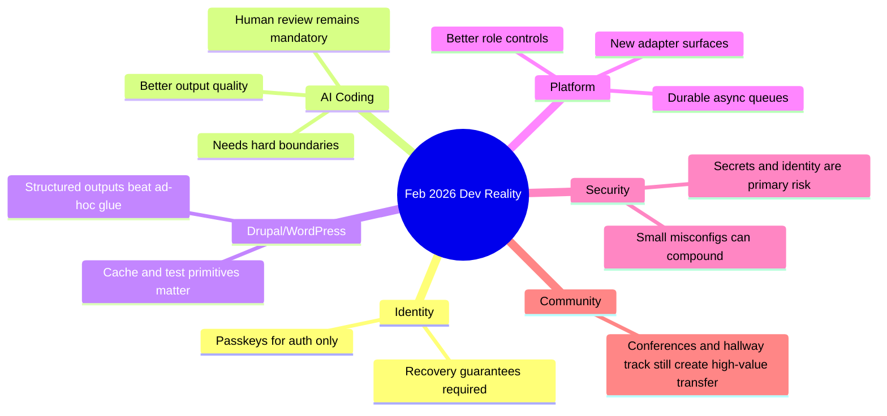

import Tabs from '@theme/Tabs';
import TabItem from '@theme/TabItem';
import TOCInline from '@theme/TOCInline';

February had a clear pattern: practical engineering finally beat a lot of AI theater, but only when teams kept operational discipline. The useful updates were about guardrails, testability, observability, and shipping workflows that survive contact with production. The noisy updates were still noisy.

<!-- truncate -->

<TOCInline toc={toc} minHeadingLevel={2} maxHeadingLevel={2} />

## Passkeys Are Not a Data Recovery Strategy
Using **passkeys** directly for user data encryption is a design bug, not a feature. If a user loses the passkey, their data can become unrecoverable, and most products do a terrible job explaining that risk up front.

> "please stop promoting and using passkeys to encrypt user data"
>
> — Tim Cappalli, [Please, please, please stop using passkeys for encrypting user data](https://blog.timcappalli.me/p/passkeys-prf-warning/)

:::warning[Do this instead]
Use passkeys for authentication, then encrypt user data with a server-managed key hierarchy (KMS/HSM), with explicit recovery paths and auditable key rotation. If product requirements demand client-side encryption, require multi-device key escrow or recovery contacts before storing irreversible data.
:::

```diff
- Derive data key directly from passkey PRF output
- Store ciphertext only
+ Use passkey for login proof only
+ Mint per-user data encryption keys in KMS
+ Store encrypted data key + recovery metadata
+ Document recovery guarantees in UX before first write
```

## Coding Agents: Better, Still Not Autonomous Adults
The strongest evidence this month came from practitioners who logged real work, not polished demos. Max Woolf’s deep run and Karpathy’s blunt timeline both point to the same thing: agents crossed a usability threshold around late 2025, but they still need sharp constraints.

> "coding agents basically didn’t work before December and basically work since"
>
> — Andrej Karpathy, [post](https://twitter.com/karpathy/status/2026731645169185220)

**Agent Workflow**

Use agents for scoped implementation, repetitive refactors, and draft test generation. Block them from architecture decisions without human review, credential handling, and silent dependency upgrades.

**Copilot CLI Flow**

GitHub’s CLI-centered flow is useful when intent-to-PR speed matters: prompt in terminal, patch files, review in IDE, then ship through normal PR gates. It’s solid because it fits existing review discipline instead of replacing it.

:::caution[Common failure mode]
~~“Agent wrote code, so velocity increased”~~ is fake accounting. Velocity only improved if review time, rollback frequency, and incident rate did not get worse.
:::

## Drupal: AI-Ready Means Maintainable, Not Magical
The credible Drupal signal was consistent: architecture quality, cache correctness, and explicit control planes matter more than model branding. Dan Frost’s “controlled AI” framing and recent module/tool releases reinforce that this is an operations problem first.

| Item | Why it matters | Practical read |
|---|---|---|
| SearXNG module for Drupal assistants | Privacy-first retrieval | Current web context without default surveillance |
| GraphQL 5.0.0-beta2 | Cacheability + preview support | Better editorial preview and fewer stale data bugs |
| Views Code Data | Structured output from Views | Useful bridge for AI/tool pipelines |
| Drupal Digests | AI summaries over active development streams | Faster situational awareness, not replacement for issue triage |
| Cache-tag incident case (4.2s pages) | Missing metadata caused rebuild loops | Performance wins still come from fundamentals |

:::info[Maintenance-first AI]
“AI-ready architecture” means strict boundaries: typed data structures, cache metadata discipline, predictable APIs, and observability around generation paths.
:::

<details>
<summary>Drupal community and release notes worth tracking</summary>

- DrupalCon Rotterdam 2026 CFP closes **April 13, 2026**.
- Drupal Camp Delhi 2026 CFP extension closed **February 28, 2026**.
- DrupalCon Gala/community updates show ongoing investment in contributor in-person bandwidth.
- LocalGov Drupal demo theme refresh is a practical signal: design systems still matter in public-sector delivery.

</details>

## WordPress: Better Testing Primitives, Same Security Pressure
WordPress 6.9’s `assertEqualHTML()` is one of those small changes that quietly saves teams hours of brittle test maintenance. WordPress 7.0 Beta 2 and weekly vulnerability reporting are the reminder that release cadence and attack surface keep moving.

```php title="tests/ExampleMarkupTest.php" showLineNumbers
<?php
class ExampleMarkupTest extends WP_UnitTestCase {
    public function test_card_markup_semantics() {
        $actual = '<div class="card" data-id="7"><p>Hello</p></div>';
        $expected = '<div data-id="7" class="card"><p>Hello</p></div>';

        // highlight-next-line
        $this->assertEqualHTML($expected, $actual);

        $broken = '<div class="card"><p>Hello</div>';
        // highlight-start
        $this->assertNotEquals($expected, $broken);
        $this->assertStringContainsString('</div>', $actual);
        // highlight-end
    }
}
```

:::danger[Security baseline]
Treat weekly vulnerability feeds as triage input, not reading material. Patch windows, plugin inventory, and exploitability scoring need automation or they will fail under load.
:::

## Platform Updates That Actually Change Ops
Vercel Queues entering public beta, dashboard role/navigation updates, Telegram support in Chat SDK, and Docker Model Runner on Apple Silicon all reduce glue-code pain. Cloudflare’s PQ/ASPA transparency additions are less flashy but strategically important.

```yaml title="ops/agent-platform-checklist.yaml" showLineNumbers
checks:
  - id: queue_retries
    owner: backend
    status: required
  - id: role_separation
    owner: platform
    status: required
  - id: ai_bot_channel_adapters
    owner: integrations
    status: optional
  - id: pq_visibility
    owner: secops
    status: required
  - id: routing_aspa_tracking
    owner: netops
    status: required
notes:
  - "Use durable queues for crash/deploy-safe async jobs"
  - "Track cryptographic migration with external telemetry, not assumptions"
```

## Security in the AI Era: Identity and Secret Hygiene Wins
The strongest security take this month was simple: AI-generated code quality is not the main risk center. Identity drift, secret sprawl, and small configuration anomalies combining into incidents (“toxic combinations”) are the real operational threat model.

**Bad Defaults**

- Long-lived tokens in CI and local env files  
- Broad IAM roles for agent tooling  
- No secret scanning on generated diffs  
- Blind trust in “security scan passed” banners  

**Better Defaults**

- Ephemeral credentials + scoped roles  
- Secret scanning in pre-commit and CI  
- MCP/tool access policies with deny-by-default  
- Incident playbooks for multi-signal anomaly correlation

## The Bigger Picture


## Bottom Line
AI tooling got more useful; it did not remove engineering fundamentals. Teams winning right now are the ones shipping strict boundaries around identity, test semantics, cacheability, secret control, and review gates.

:::tip[Single highest-ROI action this month]
Write and enforce one policy: `agents can generate code, but cannot merge without human review + secret scan + scoped credential checks`. That one rule eliminates most expensive failures shown across this month’s reports.
:::
