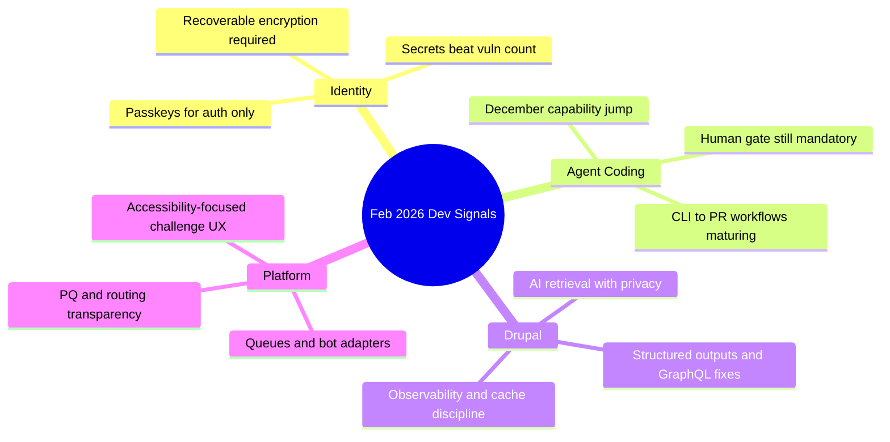

import Tabs from '@theme/Tabs';
import TabItem from '@theme/TabItem';
import TOCInline from '@theme/TOCInline';
import IdealImage from '@theme/IdealImage';

February 2026 had a clear pattern: teams shipping faster with agents, then rediscovering the old rules about recovery, observability, and security the hard way. The signal was not “AI replaces engineering”; the signal was that disciplined engineering now compounds faster. The hype layer is loud, but the operational lessons are concrete.

<!-- truncate -->

<TOCInline toc={toc} minHeadingLevel={2} maxHeadingLevel={2} />

<IdealImage img={require('@site/static/img/vs-social-card.png')} alt="Developer learning log for February 2026" />

## Passkeys and Data Encryption: Stop Doing This
Using **passkeys** as the only key material for user data encryption is a data-loss design, not a security design. People lose devices, rotate authenticators, and delete credentials. When that key is gone, ciphertext is gone too.

> "please stop promoting and using passkeys to encrypt user data"
>
> — Tim Cappalli, [Please, please, please stop using passkeys for encrypting user data](https://blog.timcappalli.me/p/passkeys-prf-warning/)

:::warning[Recovery Is Part of Security]
If encrypted user data depends on a single passkey-derived key, the system has no operational recovery path. Ship a recoverable envelope model: passkey for auth, server/HSM-managed KEK for data unwrap, and explicit account recovery controls. Add irreversible-loss copy in UX before any destructive key migration.
:::

```yaml title="security/recovery-policy.yaml" showLineNumbers
identity:
  passkeys_for_authentication: true
  passkeys_for_data_encryption: false

crypto:
  # highlight-next-line
  key_encryption_key_source: hsm_managed
  envelope_encryption: true
  per_user_data_keys: true
  key_rotation_days: 90

recovery:
  # highlight-start
  require_recoverable_kek: true
  dual_control_for_recovery: true
  tested_restore_drill_days: 30
  # highlight-end
  user_visible_recovery_status: true
```

## Agent Coding: Better Than 2025, Still Not Self-Managing
The Max Woolf deep dive, Karpathy’s December inflection comment, and Simon’s “hoard things you know how to do” all point to the same thing: model quality jumped, but output quality still depends on operator taste and process constraints.

> "coding agents basically didn’t work before December and basically work since"
>
> — Andrej Karpathy, [X post](https://twitter.com/karpathy/status/2026731645169185220)

~~Prompt harder~~ Define acceptance criteria, rollback, and security boundaries before the first agent run.

<Tabs>
  <TabItem value="copilot" label="GitHub Copilot Stack" default>
    Best for orgs already in GitHub flow: CLI-to-PR path, self-review, security scanning, model picker, custom agents.
  </TabItem>
  <TabItem value="claude-oss" label="Claude Max OSS">
    Free 6-month high-tier access is useful for qualified maintainers; treat it as temporary compute subsidy, not core platform strategy.
  </TabItem>
  <TabItem value="operator-pattern" label="Operator Pattern">
    Strongest pattern: narrow task specs, short execution windows, mandatory human checkpoint before merge.
  </TabItem>
</Tabs>

```diff title="docs/pr-checklist.md"
 ## Agent-generated changes
 - [ ] Builds locally
 - [ ] Tests pass
+- [ ] Human reviewer validated threat model deltas
+- [ ] Rollback command tested in staging
+- [ ] Secrets scan clean
+- [ ] Cache and performance impact measured
```

:::caution[“Agent Finished” Is Not “Task Finished”]
For coding-agent work, PR-ready means tests, rollback, and security review are complete. “It wrote code” is only the midpoint.
:::

## Drupal + AI: Real Tooling, Real Maintenance Burden
Drupal updates this month were practical: privacy-first search (SearXNG module), GraphQL beta fixes, machine-readable Views output, AI digests, and concrete performance debugging wins (cache-tag miss causing 4.2s product pages). The ecosystem is moving from demos to maintainable pipelines.

| Item | Why it matters | Direct action |
|---|---|---|
| SearXNG module for Drupal assistants | Web retrieval without user tracking | Default to private search providers for AI assistant features |
| GraphQL 5.0.0-beta2 | Cacheability + preview support | Re-test preview and cache headers before upgrading |
| Views Code Data module | Structured data execution without markup | Use for APIs and pipelines, not theme rendering |
| Drupal contrib code search index | Faster deprecation/security discovery | Add to upgrade triage workflow |
| Drupal Digests | Better visibility into core/contrib churn | Use as weekly input, not authoritative truth |
| Cache-tag case study | Shows how one metadata miss tanks perf | Add cache metadata assertions to CI |
| Dan Frost / AI-ready architecture | Reinforces controlled AI + observability | Treat AI features like production integrations, not add-ons |
| “Beyond the bubble” argument | Positioning problem is product problem | Sell outcomes, not CMS identity labels |

```php title="modules/custom/product_block/src/Plugin/Block/ProductBlock.php" showLineNumbers
<?php

namespace Drupal\product_block\Plugin\Block;

use Drupal\Core\Cache\Cache;
use Drupal\Core\Block\BlockBase;

final class ProductBlock extends BlockBase {
  public function build(): array {
    $build = [
      '#theme' => 'product_block',
      '#product' => $this->loadProduct(),
    ];

    // highlight-start
    $build['#cache']['tags'] = Cache::mergeTags(
      $build['#cache']['tags'] ?? [],
      ['node:' . $this->getProductNid(), 'config:product_block.settings']
    );
    // highlight-end

    return $build;
  }
}
```

<details>
<summary>Full Drupal learning log (deduped)</summary>

- Mike Herchel: DrupalCon Gala ticket push (community operations signal).
- SearXNG module: privacy-first retrieval for Drupal assistants.
- Dan Frost interview covered architecture, controlled AI, SEO mode shifts (duplicate item merged).
- New contrib code search for Drupal 10+ compatible projects.
- GraphQL for Drupal `5.0.0-beta2` with cacheability and node preview support.
- Views Code Data module for structured outputs (`array`, `JSON`, `JSONL`, delimited text).
- mark.ie: new LocalGov Drupal demo theme.
- Dries Buytaert: Drupal Digests for AI-generated activity summaries.
- Automated tool found missing cache tag behind 4.2-second page loads.
- AI-assisted Drupal document summarizer tooltip prototype.
- “Move beyond the bubble” positioning argument for Drupal in AI era.

</details>

## Platform and Security: Useful Releases, Zero Room for Complacency
Vercel Queues beta, Telegram adapter support in Chat SDK, Cloudflare’s Turnstile redesign and Radar transparency upgrades, and ASPA visibility all improve production ergonomics. The security posts are the bigger signal: agent-era risk is increasingly identity/secrets misuse and toxic signal combinations.

:::danger[Identity + Secrets Are the Blast Radius]
Code scanning alone misses the dominant failure mode: exposed tokens, over-broad credentials, and chained minor anomalies. Enforce short-lived credentials, workload identity, and mandatory secret scanning on push and deploy. Add alert correlation for low-severity anomalies that co-occur.
:::

```bash title="scripts/security-gates.sh" showLineNumbers
#!/usr/bin/env bash
set -euo pipefail

# highlight-next-line
gitleaks detect --source . --redact
npm run lint
npm test

# Correlate "small" alerts before deploy approval
jq -s '
  group_by(.principal)[] |
  select(length >= 3) |
  {principal: .[0].principal, events: length}
' logs/security-signals/*.json

echo "release gate passed"
```

## The Bigger Picture


## Bottom Line
Shipping speed increased. Failure speed increased too. Teams that separate authentication from encryption, treat agents as force multipliers with hard guardrails, and keep cache/security observability tight are pulling ahead.

:::tip[One move that pays immediately]
Publish a single “AI change acceptance” policy this week: recovery-safe crypto rules, mandatory rollback proof, secrets scan gates, and cache metadata checks. One page, enforced in CI, no exceptions.
:::
