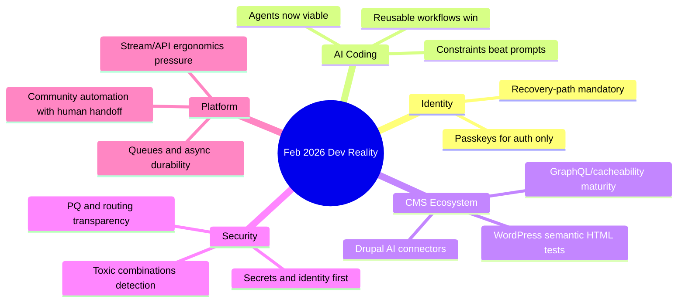

import Tabs from '@theme/Tabs';
import TabItem from '@theme/TabItem';
import TOCInline from '@theme/TOCInline';

February 2026 was a useful filter for separating signal from marketing noise. The common thread: teams are shipping faster with AI, but reliability now depends on identity design, observability, and boring operational guardrails. The hype layer got louder; the engineering layer got stricter.

<!-- truncate -->

<TOCInline toc={toc} minHeadingLevel={2} maxHeadingLevel={2} />

## Authentication is not encryption key management

Tim Cappalli’s warning is the right hill to die on: passkeys are great for login, terrible as the only key material for user data recovery.

> "To the wider identity industry: please stop promoting and using passkeys to encrypt user data. I’m begging you."
>
> — Tim Cappalli, [Please, please, please stop using passkeys for encrypting user data](https://blog.timcappalli.me/p/passkeys-prf-warning/)

~~Passkeys as universal crypto key vaults~~ is how teams accidentally build irrecoverable data loss.

:::warning[Stop shipping unrecoverable encryption flows]
If user data is encrypted with passkey-derived material and no recovery path exists, normal lifecycle events (device loss, account migration, platform key reset) become permanent data loss incidents. Require at least one independently recoverable key path: enterprise escrow, user recovery bundle, or admin-controlled envelope key rotation.
:::

```diff title="auth-architecture.diff"
- User data key = KDF(passkey PRF output)
- No recovery path if passkey is lost
+ User data key = random DEK per record
+ DEK encrypted by KEK in managed KMS
+ Passkey gates authentication and access policy only
+ Recovery uses audited rewrap flow with step-up auth
```

## Agent coding finally works, but only inside constraints

Max Woolf’s skeptical deep-dive, Karpathy’s December inflection point, and GitHub’s Copilot agent updates all point to the same conclusion: agentic coding is now production-usable, but only when scope and review boundaries are explicit.

> "coding agents basically didn’t work before December and basically work since"
>
> — Andrej Karpathy, quoted in [Simon Willison’s note](https://simonwillison.net/)

<Tabs>
  <TabItem value="copilot" label="GitHub Copilot Agent" default>
    Strong iteration loop with CLI handoff, self-review, model picker, and built-in security scanning. Useful for PR-shaped work where reviewability matters more than raw generation speed.
  </TabItem>
  <TabItem value="claude" label="Claude Max for OSS">
    Free 6-month Claude Max access for large maintainers lowers cost barriers, but eligibility is narrow (5k+ stars or 1M+ npm downloads). Good for high-volume triage and refactor sessions.
  </TabItem>
  <TabItem value="patterns" label="Operating Pattern">
    Simon Willison’s “hoard things you know how to do” is still the winning pattern: keep reusable prompts, tests, and fix recipes. Agent speed without reusable constraints turns into expensive randomness.
  </TabItem>
</Tabs>

:::caution[Agent speed multiplies bad architecture]
If boundaries are weak, agents optimize for local wins and global mess. Gate every agent PR with secrets scanning, cacheability checks, and deterministic tests before merge.
:::

## Drupal and WordPress: less ideology, more practical AI plumbing

The ecosystem updates were concrete: search connectors, AI summaries, code-search indexing, GraphQL fixes, cache-tag debugging wins, and test tooling improvements (`assertEqualHTML()` in WordPress 6.9, WordPress 7.0 Beta 2 pipeline).

| Area | Concrete change | Why it matters in production |
|---|---|---|
| Drupal AI search | SearXNG Drupal module | Current web retrieval without tracking users |
| Drupal API layer | GraphQL 5.0.0-beta2 cacheability + preview support | Fewer stale responses and better preview flows |
| Drupal dev tooling | New contrib code search index for D10+ | Faster impact analysis and deprecation audits |
| Drupal perf | Automated cache tag diagnosis case (4.2s load root-caused) | Performance work becomes repeatable, not folklore |
| WordPress testing | `assertEqualHTML()` in WP 6.9 | Fewer false-negative tests from trivial markup order |

```php title="html-output-test.php"
public function test_card_markup_semantics() {
    $actual = render_card_component();
    $expected = '<div class="card"><a href="/docs">Docs</a></div>';
    $this->assertEqualHTML($expected, $actual);
}
```

:::info[Maintenance-first AI is the real pattern]
Dan Frost’s “controlled AI” framing is correct: architecture, guardrails, and observability decide outcomes, not model demos. Drupal’s structured content model and explicit APIs are an advantage when teams treat AI as a controlled subsystem.
:::

## Security moved from “bad code” to “toxic combinations”

GitGuardian’s take is blunt and accurate: identity and secrets posture now drive most real AI risk. Cloudflare’s new PQ/ASPA/Radar transparency tools and routing security work are the same trend at internet scale: fewer assumptions, more verifiable controls.

```ts title="security-gates.ts" showLineNumbers
type PRContext = { secretsScan: boolean; cacheTagsOk: boolean; authRecovery: boolean; depsPinned: boolean; };
export function canMerge(pr: PRContext): { ok: boolean; reason?: string } {
  if (!pr.secretsScan) return { ok: false, reason: "Secrets scan failed" };
  if (!pr.cacheTagsOk) return { ok: false, reason: "Cache metadata regression" };
  // highlight-next-line
  if (!pr.authRecovery) return { ok: false, reason: "No account/data recovery path" };
  if (!pr.depsPinned) return { ok: false, reason: "Unpinned runtime dependencies" };
  return { ok: true };
}

export const incidentHeuristic = [
  "minor auth anomaly",
  "small config drift",
  "new agent capability",
  // highlight-next-line
  "combined => toxic combination risk",
];
```

:::danger[Small signals compound into incidents]
Treat “minor” auth anomalies, temporary bypasses, and loose secret handling as correlated inputs, not isolated events. Add automated correlation checks in CI and runtime alerts before enabling broader agent autonomy.
:::

## Community scaling: automation helps, humans close the loop

Vercel’s community post got one thing exactly right: automation handles routing, but trust-building support moments still need humans. DrupalCon’s “hallway track” message is the same reality in conference form: high-value knowledge transfer happens in human context, not just scheduled artifacts.

## The Bigger Picture



<details>
<summary>Full learning index compiled this week</summary>

- Tim Cappalli passkeys warning
- Max Woolf agent coding deep dive
- DrupalCon Gala ticket update
- Claude Max for OSS maintainers
- Simon Willison Unicode Explorer via HTTP ranges
- GitHub Copilot CLI practical PR guide
- Drupal SearXNG module
- Dan Frost interview (AI-ready architecture / controlled AI / AI-mode SEO)
- Vercel community scaling with agents
- Vercel Queues public beta
- Chat SDK Telegram adapter
- Drupal contrib code search tool (D10+)
- GraphQL for Drupal 5.0.0-beta2
- Views Code Data module
- LocalGov Drupal demo theme
- Drupal Digests launch by Dries Buytaert
- Cache-tag performance root cause case (4.2s pages)
- Claude Code security perspective from GitGuardian
- Toxic combinations security pattern
- JavaScript streams API critique
- Cloudflare Turnstile/challenge page redesign
- Cloudflare Radar transparency for PQ, KT logs, ASPA
- ASPA routing security explainer
- Stack allocation runtime changes
- GitHub Copilot coding agent updates
- Simon Willison “Hoard things you know how to do”
- Karpathy quote on December agent shift
- Drupal document summarizer tooltip prototype
- “Drupal beyond the bubble” AI positioning argument
- WordPress `assertEqualHTML()` update
- WordPress 7.0 Beta 2
- DrupalCon Hallway Track note
- Wordfence weekly vulnerability report (Feb 16–22, 2026)
- DrupalCon Rotterdam 2026 Call for Speakers
- Docker Model Runner `vllm-metal` on Apple Silicon
- GitGuardian MCP shift-left for AI-generated code security

</details>

## Bottom Line

:::tip[Single action that prevents most future pain]
Split AI adoption into three non-negotiable tracks: `identity recovery`, `security gating`, and `reviewable delivery`. If any one track is missing, shipping faster just means failing faster.
:::
