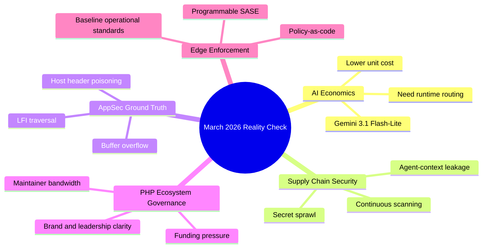

import Tabs from '@theme/Tabs';
import TabItem from '@theme/TabItem';
import TOCInline from '@theme/TOCInline';

Most of this week's "news" was marketing varnish over operational reality: cost curves, attack surface, and ecosystem governance. The useful signal was clear though: inference is cheaper, breaches are still boring and preventable, and PHP communities are finally saying the quiet part out loud about sustainability.  
If you ship production software, these items connect directly to budget, incident risk, and roadmap discipline.

<!-- truncate -->

<TOCInline toc={toc} minHeadingLevel={2} maxHeadingLevel={2} />

## Gemini 3.1 Flash-Lite: Cost Wins, If Your Guardrails Exist

> "Gemini 3.1 Flash-Lite is our fastest and most cost-efficient Gemini 3 series model yet."
>
> — Google announcement, [Link](https://blog.google/)

**Gemini 3.1 Flash-Lite** matters because it pushes the floor down on per-request intelligence. That does not mean "free reasoning." It means the old ~~bigger model everywhere~~ pattern is now a budget bug.

| Decision Axis | Flash-Lite Signal | Practical Call |
|---|---|---|
| Unit economics | Lower latency and cost ceiling | Route high-volume, low-risk paths here first |
| Reliability | Fast models still fail silently on edge reasoning | Add response validation and fallback tiers |
| Product scope | Cheap inference invites overuse | Put hard spend caps per feature, not just per org |
| Architecture | Multi-model routing becomes mandatory | Treat model selection as runtime policy |

:::info[Model Routing Is Now Core App Logic]
Static model choice in config files is done. Runtime routing by request class, risk level, and budget window is now part of backend architecture, not an AI sidecar.
:::

## Protecting Developers Means Protecting Their Secrets

> "Secrets don't just leak from Git. They accumulate in filesystems, env vars, and agent memory."
>
> — Security research summary, [Link](https://github.blog/security/)

**Secret sprawl** is still the fastest path from "internal convenience" to "external incident." Git scanning is table stakes; filesystem dumps, shell history, CI logs, and long-lived env vars are where teams still get burned.

:::danger[Stop Persisting Raw Secrets]
Kill plaintext `.env` drift and process-level secret reuse. Use short-lived credentials (`OIDC`/STS), secret managers, and explicit redaction in logs. If a token can live longer than a deploy window, it already lives too long.
:::

```bash title="scripts/secrets-scan.sh" showLineNumbers
#!/usr/bin/env bash
set -euo pipefail

repo_root="${1:-.}"
cd "$repo_root"

echo "[1/4] tracked file scan"
rg -n --hidden --glob '!.git' '(AKIA|AIza|ghp_|xoxb-|-----BEGIN (RSA|OPENSSH) PRIVATE KEY-----)' .

echo "[2/4] environment leak check"
printenv | rg -n '(TOKEN|SECRET|PASSWORD|API_KEY)' || true

echo "[3/4] history and temp artifacts"
rg -n --hidden --glob '!node_modules' --glob '!.git' '(password=|api_key=|secret=)' ~/.zsh_history /tmp 2>/dev/null || true

echo "[4/4] dedicated scanners"
# highlight-next-line
gitleaks detect --no-git --source . --report-format sarif --report-path gitleaks.sarif
# highlight-next-line
trufflehog filesystem --directory . --json > trufflehog.json
```

:::warning[Agent Memory Is Part of Your Threat Model]
If coding agents can read credentials, agents can also paste credentials into logs, patches, or chat context. Run secret scanners on generated diffs before merge, not after deploy.
:::

## Webapp Exploit Cluster: Host Header Poisoning, Buffer Overflow, LFI

> "[webapps] mailcow 2025-01a - Host Header Password Reset Poisoning"
>
> — Exploit feed, [Link](https://www.exploit-db.com/)

> "[webapps] Easy File Sharing Web Server v7.2 - Buffer Overflow"
>
> — Exploit feed, [Link](https://www.exploit-db.com/)

> "[webapps] Boss Mini v1.4.0 - Local File Inclusion (LFI)"
>
> — Exploit feed, [Link](https://www.exploit-db.com/)

Three old classes, same lesson: weak input trust keeps resurfacing under new UI paint.

| Product | Issue Class | Real Risk | Immediate Mitigation |
|---|---|---|---|
| mailcow 2025-01a | Host Header password-reset poisoning | Account takeover via poisoned reset links | Hardcode canonical host and reject untrusted `Host` |
| Easy File Sharing v7.2 | Buffer overflow | RCE / service crash | Patch or isolate behind strict network segmentation |
| Boss Mini v1.4.0 | LFI | Arbitrary file read, potential RCE chain | Normalize paths, deny traversal, strict allowlist includes |

```diff title="infra/nginx/mailcow-host-header-hardening.diff"
- proxy_set_header Host $host;
+ proxy_set_header Host mail.example.com;
+ if ($host !~* ^mail\.example\.com$) { return 444; }
```

:::caution[Exploit Class Age Is Irrelevant]
"Legacy bug class" does not mean "legacy impact." Modern blast radius is bigger because reset flows, internal metadata, and container file mounts are all richer targets now.
:::

## PHP Ecosystem Crossroads: Sustainability Is the Real Technical Constraint

> "Across the PHP ecosystem, a hard conversation is beginning to take shape... slower growth, tighter budgets, and a thinning contributor base."
>
> — The Drop Times, [Link](https://www.thedroptimes.com/)

**Sustainability debt** is now a delivery risk, not a community footnote. Drupal, Joomla, Magento, and Mautic share the same stress pattern: fewer maintainers, more complexity, higher expectation of AI-era velocity.

<Tabs>
<TabItem value="hype" label="Hype Story" default>

The narrative says AI integration and new tooling will "modernize everything."  
That skips governance, maintainer funding, and release discipline.

</TabItem>
<TabItem value="operator" label="Operator Reality">

No maintainer bandwidth means no secure patch cadence.  
No patch cadence means enterprise churn, regardless of feature roadmap.

</TabItem>
<TabItem value="call" label="What To Do">

Prioritize boring infrastructure work: CI stability, triage SLAs, module ownership maps, funded maintenance windows.

</TabItem>
</Tabs>

## Drupal 25th Anniversary Gala: Community Signal, Not Just Ceremony

> "The Drupal 25th Anniversary Gala will take place on 24 March from 7:00 to 10:00 PM at 610 S Michigan Ave, Chicago..."
>
> — Drupal community announcement, [Link](https://www.thedroptimes.com/)

The event matters because community concentration still drives contributor recruitment and strategic alignment. In practical terms: contributor energy and project clarity are production inputs.

<details>
<summary>Event details snapshot</summary>

- Date: `2026-03-24`
- Time: `19:00-22:00` (Chicago local time)
- Location: `610 S Michigan Ave, Chicago`
- Context: DrupalCon week, cross-community visibility

</details>

## January 2026 Baseline + Programmable SASE: Policy Is Becoming Software

> "Read about various happenings with Baseline during January 2026."
>
> — Baseline monthly digest, [Link](https://web.dev/)

> "As the only SASE platform with a native developer stack, we're giving you the tools to build custom, real-time security logic and integrations directly at the edge."
>
> — SASE platform announcement, [Link](https://www.cloudflare.com/)

The useful part here is not branding. It is the shift to **programmable policy** at the edge, where security controls become versioned code with testable behavior.

```yaml title="policy/edge-access.yaml"
service: internal-admin
rules:
  - id: geo-block
    when:
      country_not_in: [US, CA, CO]
    action: deny
  - id: mfa-required
    when:
      path_prefix: /admin
    action: require_mfa
  - id: token-age
    when:
      session_age_minutes_gt: 30
    action: reauthenticate
```

## The Bigger Picture



## Bottom Line

Cheap intelligence, exploitable defaults, and underfunded maintenance are colliding. The correct response is disciplined routing, aggressive secret hygiene, and governance choices that prioritize patch velocity over roadmap theater.

:::tip[Single Highest-ROI Move This Week]
Implement one CI gate that blocks merges on detected secrets (`gitleaks`/`trufflehog`) and untrusted host-header reset behavior tests. That one gate cuts both immediate breach probability and incident-response drag.
:::
