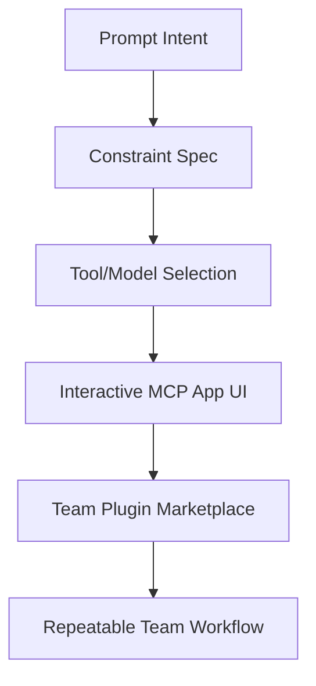
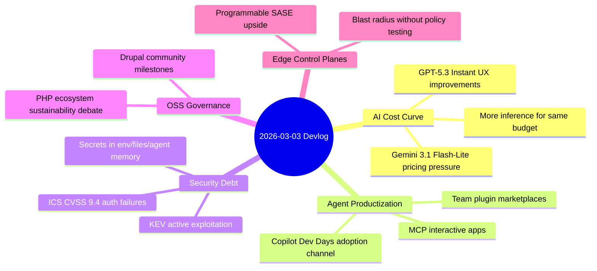

import Tabs from '@theme/Tabs';
import TabItem from '@theme/TabItem';
import TOCInline from '@theme/TOCInline';

The signal this week was simple: model pricing is collapsing, agent tooling is becoming productized, and security is still losing to fundamentals. Cheap inference and better chat UX are real. So are unauthenticated critical functions in live industrial systems, which is a far bigger story than any model demo.

<!-- truncate -->

<TOCInline toc={toc} minHeadingLevel={2} maxHeadingLevel={2} />

## Model Economics: Gemini 3.1 Flash-Lite, GPT-5.3 Instant, Node 25.8.0

Google shipped **Gemini 3.1 Flash-Lite** as the low-cost throughput play, and the price delta matters more than most benchmark screenshots. If input is $0.25/M and output is $1.5/M, architecture decisions change: more aggressive fan-out, more retries, more eval runs, less guilt.

> "Gemini 3.1 Flash-Lite is our fastest and most cost-efficient Gemini 3 series model yet."
>
> — Google, [Gemini 3.1 Flash-Lite](https://blog.google/innovation-and-ai/models-and-research/gemini-models/gemini-3-1-flash-lite/)

| Item | What changed | Why it matters in production |
|---|---|---|
| Gemini 3.1 Flash-Lite | Lower-cost Flash-Lite refresh with configurable thinking levels | Better unit economics for high-volume agent workflows |
| GPT-5.3 Instant + System Card | Emphasis on smoother everyday conversations + safety framing | Better default chat UX, but still requires hard eval gates |
| Node.js 25.8.0 (Current) | Current-line release cadence continues | Good for experimentation; bad default for conservative backend fleets |

<Tabs>
  <TabItem value="gemini" label="Gemini 3.1 Flash-Lite" default>
Low latency + low price means this is the batch/assist workhorse. The useful feature is not “AI magic,” it is predictable cost under load.
  </TabItem>
  <TabItem value="gpt" label="GPT-5.3 Instant">
Conversation polish matters for support agents and coding copilots. The System Card is the part worth reading before rollout, not after incident review.
  </TabItem>
  <TabItem value="node" label="Node.js 25.8.0">
Current releases are fine for labs and non-critical services. LTS remains the adult choice for core APIs with uptime targets.
  </TabItem>
</Tabs>

:::caution[Cheap Tokens Encourage Bad Architecture]
Lower model cost does not justify uncontrolled context growth. Set strict `max_tokens`, route simple tasks to lightweight models, and fail closed on tool-calling loops.
:::

## Agent Product Surface: MCP Apps, Team Plugin Marketplaces, Copilot Dev Days, Project Genie

MCP moving toward interactive UIs and private team marketplaces is what “agents in enterprise” actually needs: governance and distribution, not more demos. Copilot Dev Days is useful when teams treat it as workflow redesign, not autocomplete theater. Project Genie prompt craft is a reminder that tooling quality depends on input discipline.



:::info[Where the Real Value Shows Up]
The win is standardized internal plugins with clear ownership, versioning, and permission boundaries. Team marketplaces reduce copy-pasted prompt folklore and make behavior auditable.
:::

## Security Reality Check: Secrets Hygiene, KEV Additions, ICS/OT Advisories, Public Web Exploits

The security items this cycle were blunt: CISA KEV additions, multiple high-severity charging/industrial advisories, and public webapp exploit disclosures. Same lesson again: attackers still cash in on missing auth, weak auth controls, and basic injection/LFI classes.

> "Secrets don’t just leak from Git. They accumulate in filesystems, env vars, and agent memory."
>
> — Source, [Protecting Developers Means Protecting Their Secrets](https://www.gitguardian.com/)

:::danger[Operational Priority]
Treat CVSS 9.4 advisories in OT/charging stacks as incident-response candidates, not backlog tasks. Segment networks, enforce MFA/admin isolation, and patch with maintenance windows already approved.
:::

```yaml title=".github/workflows/secret-hygiene.yml" showLineNumbers
name: secret-hygiene
on:
  push:
    branches: [main]
  pull_request:
jobs:
  scan:
    runs-on: ubuntu-latest
    steps:
      - uses: actions/checkout@v4
      - name: Secret scan
        run: |
          # highlight-start
          gitleaks detect --source . --verbose --redact
          trufflehog filesystem . --fail --no-update
          # highlight-end
      - name: Block risky env files
        run: |
          # highlight-next-line
          test ! -f .env || (echo ".env committed"; exit 1)
```

```diff
- export API_KEY="hardcoded-prod-key"
+ export API_KEY="${API_KEY:?missing API_KEY at runtime}"
```

<details>
<summary>Advisory set captured in this devlog</summary>

- CISA KEV additions: `CVE-2026-21385` (Qualcomm chipset memory corruption), `CVE-2026-22719` (VMware Aria Operations command injection).
- ICS/OT advisory snapshots:
  - Mobiliti `e-mobi.hu` (critical auth/control issues)
  - ePower `epower.ie` (critical auth/control issues)
  - Everon OCPP Backends (critical auth/control issues)
  - Labkotec `LID-3300IP` (missing authentication for critical function)
  - Hitachi Energy `RTU500` and `Relion REB500` (exposure/outage and authorization boundary failures)
- Public webapp exploit disclosures referenced:
  - mailcow 2025-01a Host Header password reset poisoning
  - Easy File Sharing Web Server v7.2 buffer overflow
  - Boss Mini v1.4.0 LFI

</details>

## PHP/Drupal Ecosystem Signal: Sustainability, Governance, and Community Events

The Drop Times coverage and the 25th anniversary framing are useful because they force a non-marketing question: who is funding and maintaining the boring core work. “AI-ready architecture” sounds nice; contributor economics decides what survives.

| Ecosystem item | Practical read |
|---|---|
| “At the Crossroads of PHP” discussion | Sustainability and contributor throughput are now central technical risks |
| Drupal 25th Anniversary Gala (Mar 24, Chicago) | Community energy is strong; governance clarity still matters more |
| Baseline January 2026 digest | Incremental progress is happening, but velocity is uneven across projects |

:::warning[Misreading Community Activity]
Event volume is not delivery velocity. Track release quality, maintainer burnout signals, and issue response times before committing platform strategy.
:::

## Edge Security Claims: “Programmable SASE” Is Useful Only With Guardrails

“The truly programmable SASE platform” pitch is valid when programmability is scoped, tested, and observable. Unbounded custom logic at the edge can become a distributed outage machine.

```bash
# Minimum gate before shipping edge policy code
opa test policies/
conftest test ingress-config.yaml
k6 run edge-regression.js
```

## The Bigger Picture



## Bottom Line

Cheap models and better agent UX are real improvements. They do not reduce operational risk by themselves; in many orgs they increase it by accelerating fragile automation on top of weak security fundamentals.

:::tip[Single Action That Pays Off This Week]
Add mandatory secret scanning plus runtime secret injection checks in CI, then block merges on failure. It is the fastest way to cut real incident probability across AI, app, and infrastructure work.
:::
