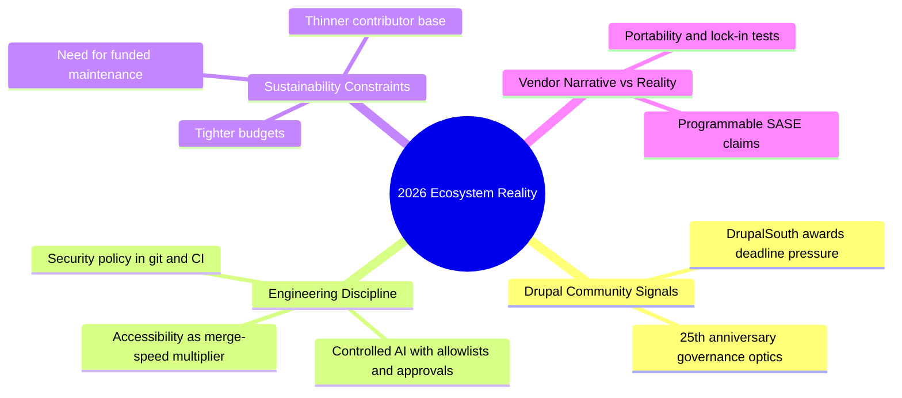

import Tabs from '@theme/Tabs';
import TabItem from '@theme/TabItem';
import TOCInline from '@theme/TOCInline';

This batch of updates has one common theme: the **Drupal** and broader PHP ecosystem is done pretending momentum is automatic. Deadlines are hard, budgets are tighter, and “AI-ready” now means architecture discipline, not adding another chatbot button. The useful signal is where teams are choosing operational rigor over branding theater.

<!-- truncate -->

<TOCInline toc={toc} minHeadingLevel={2} maxHeadingLevel={2} />

## DrupalSouth 2026 Splash Awards: Deadline Pressure Is Real

Submissions are open and close on **27 March 2026** for projects completed or significantly updated during 2025, ahead of the Wellington event in May. This matters because award-ready case studies force teams to document outcomes, not vibes.

> "Submissions are open for the DrupalSouth 2026 Splash Awards, with entries closing on 27 March 2026."
>
> — The Drop Times, [Announcement](https://www.thedroptimes.com)

| Submission Input | Why It Matters | Failure Mode if Missing |
|---|---|---|
| Baseline metrics (before release) | Proves impact claims | “Improved performance” with no evidence |
| Post-release outcomes | Shows real adoption | Nice screenshots, zero business value |
| Accessibility notes | Strengthens judging narrative | Project looks incomplete in 2026 |
| Delivery timeline | Confirms 2025 eligibility | Risk of disqualification |

:::caution[Deadline Triage]
Freeze your award narrative assets by **20 March 2026**. That gives one week to fix evidence gaps, legal approvals, and client sign-off before the 27 March cutoff.
:::

## Drupal 25th Anniversary Gala: Community Signal, Not Just Nostalgia

The gala is set for **24 March 2026, 7:00–10:00 PM**, at **610 S Michigan Ave, Chicago**, during DrupalCon Chicago. The important part is not the party; it is the public signal that the community is still organizing around long-term stewardship.

> "The Drupal 25th Anniversary Gala will take place on 24 March from 7:00 to 10:00 PM at 610 S Michigan Ave, Chicago."
>
> — Drupal community update, [Coverage](https://www.thedroptimes.com)

:::info[Why This Actually Matters]
Leadership clarity is easier to build when major community milestones are treated as governance moments, not just social events. If the room only celebrates history and avoids current funding and contributor capacity issues, it becomes a missed operational checkpoint.
:::

## Accessibility Microlearning: 15 Minutes That Remove Real Friction

AmyJune Hineline’s Linux Foundation microlearning focuses on practical contributor habits: alt text, global English, keyboard accessibility, and docs quality. This is the kind of short training that pays back immediately in PR review time.

> "Accessibility Fundamentals for Open Source Contributors... focuses on practical habits contributors can apply immediately."
>
> — Linux Foundation course release, [Report](https://www.thedroptimes.com)

```yaml title="a11y-pr-review-checklist.yml" showLineNumbers
name: accessibility-pr-gate
on:
  pull_request:
    paths:
      - "**/*.md"
      - "**/*.twig"
      - "**/*.html"
jobs:
  review:
    runs-on: ubuntu-latest
    steps:
      - name: Check image alt text
        run: ./scripts/check-alt-text.sh
      - name: Check keyboard trap regressions
        run: ./scripts/check-keyboard-nav.sh
      - name: Check plain-language docs
        run: ./scripts/check-global-english.sh
```

~~Accessibility training is “nice to have.”~~ Accessibility training is a merge-speed optimization when it prevents predictable review churn.

## PHP Ecosystem Crossroads: Sustainability Is an Operating Model Problem

The opinion piece calling out Drupal, Joomla, Magento, and Mautic is blunt for a reason: shared tech roots do not protect any project from contributor burnout and budget compression.

> "A hard conversation is beginning to take shape... slower growth, tighter budgets, and a thinning contributor base."
>
> — Ashraf Abed, The Drop Times, [Opinion](https://www.thedroptimes.com)

<Tabs>
  <TabItem value="reactive" label="Reactive Mode" default>
  Teams chase short-term fixes: launch campaigns, rotate slogans, publish roadmaps with no staffing model.  
  Result: temporary attention, same structural bottlenecks.
  </TabItem>
  <TabItem value="durable" label="Durable Mode">
  Teams fund maintainer time, enforce release hygiene, and tie roadmap items to real capacity.  
  Result: slower promises, higher delivery credibility.
  </TabItem>
</Tabs>

## Newsletter v4, Issue 9: AI-Ready vs Controlled AI

The newsletter’s useful thread is the tension between “AI-ready architecture” and “controlled AI.” One is systems engineering; the other is procurement theater if guardrails are absent.

```diff title="ai-policy.diff"
- AI assistant can call any external endpoint directly from production.
+ AI assistant restricted to allowlisted tools and audited service accounts.
+ All generated content requires human approval before publication.
+ Prompt and response logs retained for 90 days for incident review.
```

```php title="src/Security/AiExecutionPolicy.php" showLineNumbers
<?php

declare(strict_types=1);

namespace App\Security;

final class AiExecutionPolicy
{
    public function canExecute(string $tool, string $environment): bool
    {
        // highlight-next-line
        if ($environment === 'production' && $tool === 'raw_http') {
            return false;
        }

        $allowlist = ['search_index', 'content_draft', 'taxonomy_lookup'];

        // highlight-start
        if (!in_array($tool, $allowlist, true)) {
            return false;
        }
        // highlight-end

        return true;
    }
}
```

:::danger[Controlled AI Is a Security Requirement]
Any agent that can write content and call unrestricted endpoints is one prompt away from a data leak. Enforce tool allowlists and approval gates before shipping AI features into editorial or ops workflows.
:::

## “Truly Programmable SASE”: Marketing Claim vs Engineering Test

The claim about a “native developer stack” in SASE only matters if teams can ship custom policy logic safely, version it, test it, and roll it back quickly. Otherwise it is just a nicer dashboard with new billing lines.

> "As the only SASE platform with a native developer stack..."
>
> — Vendor marketing copy, [SASE page](https://www.cloudflare.com/sase/)

| Claim | Engineering Validation |
|---|---|
| Real-time custom logic at edge | Can policies be tested in CI with deterministic fixtures? |
| Integrations | Are APIs stable and versioned, with usable error contracts? |
| Developer-native workflow | Is policy config stored in git and deployable by pipeline? |

:::warning[Lock-In Trap]
If custom security logic is proprietary and non-portable, migration cost rises every quarter. Keep policy source in git and maintain an abstraction layer for provider-specific adapters.
:::

<details>
<summary>Signal-to-action mapping used for this devlog</summary>

- Awards and gala updates mapped to planning windows (March deadlines and events).
- Accessibility microlearning mapped to immediate PR gate automation.
- Ecosystem sustainability debate mapped to funding and maintainer-capacity checkpoints.
- AI architecture coverage mapped to strict execution-policy controls.
- SASE claim mapped to portability and CI validation criteria.

</details>

## The Bigger Picture



## Bottom Line

The signal this week is simple: serious teams are replacing slogans with operational controls, documented outcomes, and funding realism.

:::tip[Single Action That Pays Off Fast]
Create one `engineering-trust-checklist.md` in your repo this week with five non-negotiables: evidence for impact claims, accessibility PR gate, AI tool allowlist, policy-in-git requirement, and funded maintainer ownership for each roadmap stream.
:::
