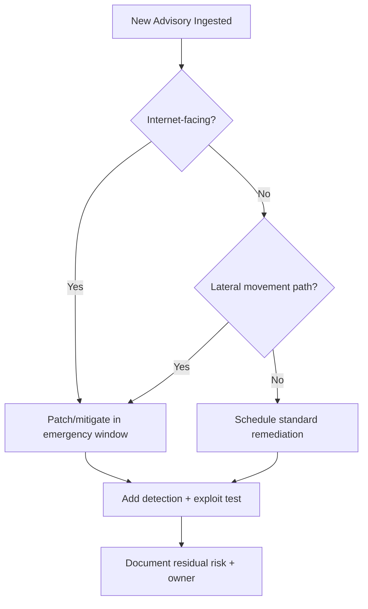

import Tabs from '@theme/Tabs';
import TabItem from '@theme/TabItem';
import TOCInline from '@theme/TOCInline';

Nine EV charging and OT advisories landed with CVSS scores above 9.0 — all rooted in missing or broken authentication. Meanwhile, two new model releases promise cheaper latency and Node.js 25.8.0 shipped as Current. The speed is nice; the patch debt is not.

<!-- truncate -->

<TOCInline toc={toc} minHeadingLevel={2} maxHeadingLevel={2} />

## Runtime and Model Releases Worth Tracking

**Node.js 25.8.0** dropped as Current, which matters if your team tests upstream runtime behavior before committing to LTS. **Gemini 3.1 Flash-Lite** and **GPT-5.3 Instant** are both chasing the same goal: shave latency, cut cost, improve everyday interaction quality. Good news for product feedback loops. Bad news if your prompts are sloppy and your guardrails are thin — those failures now propagate faster.

| Item | Why it matters operationally | Practical move |
|---|---|---|
| Node.js 25.8.0 (Current) | Early access to runtime behavior before LTS planning | Run CI matrix with `node@current` + `node@lts/*` now |
| Gemini 3.1 Flash-Lite | Cost/latency profile for high-volume workloads | Route classification/extraction workloads here first |
| GPT-5.3 Instant + System Card | Better conversational utility plus explicit safety framing | Add evals for instruction-following regressions before rollout |
| MCP Apps + Team Plugin Marketplaces | Shared private integrations reduce duplicate internal glue code | Move internal tools into governed plugin registry |

> "Gemini 3.1 Flash-Lite is our fastest and most cost-efficient Gemini 3 series model yet."
>
> — Google announcement note, [Gemini update](https://deepmind.google/)

> "CISA has added two new vulnerabilities to its Known Exploited Vulnerabilities Catalog, based on evidence of active exploitation."
>
> — CISA, [KEV Catalog](https://www.cisa.gov/known-exploited-vulnerabilities-catalog)

<Tabs>
<TabItem value="instant" label="GPT-5.3 Instant" default>

Best for conversational product surfaces where response quality under tight latency budgets matters more than raw depth.

</TabItem>
<TabItem value="flashlite" label="Gemini 3.1 Flash-Lite">

Best for high-throughput tasks where unit economics dominate and task complexity is moderate.

</TabItem>
<TabItem value="node" label="Node 25.8.0">

Not a model, but the same decision class: faster iteration only helps if CI and compatibility gates are already strict.

</TabItem>
</Tabs>

Lower latency models shift system bottlenecks toward orchestration, plugin I/O, and policy enforcement. If request volume spikes after a model swap, queue strategy and rate-limit policy become your primary reliability controls.

## OT and EV Advisories Alongside Old Web App Favorites

The CSAF batch this time around is blunt: multiple EV charging backend products and OT systems have high-severity findings, including authentication failures and denial-of-service vectors. Pair that with the webapp disclosures — mailcow host header poisoning, Easy File Sharing overflow, Boss Mini LFI — and you see the same story repeating: internet-facing software still breaks at trust boundaries before anything else.

| Advisory cluster | Affected examples | CVSS signal | Core failure mode |
|---|---|---|---|
| EV charging ecosystems | Mobiliti e-mobi.hu, ePower epower.ie, Everon OCPP Backends | 9.4 | Missing auth, weak auth-attempt controls, availability impact |
| Industrial/OT | Hitachi Energy RTU500, Hitachi Relion REB500, Labkotec LID-3300IP | High/Critical | Unauthorized control, data exposure, service disruption |
| Web apps | mailcow 2025-01a, Easy File Sharing 7.2, Boss Mini 1.4.0 | Critical patterns | Host-header poisoning, overflow, LFI |

:::danger[Stop treating secrets as a Git-only problem]
~~"Secrets leak only in commits."~~ They leak in env dumps, CI logs, local filesystems, shell history, crash reports, and agent memory/context. Run secret scanning on repos, runtime envs, artifact stores, and logs, then rotate anything exposed.
:::

Full vulnerability watchlist compiled today

- Mobiliti e-mobi.hu (all versions): critical auth/control issues, CVSS 9.4.
- ePower epower.ie (all versions): critical auth/control + DoS risk, CVSS 9.4.
- Everon OCPP Backends (`api.everon.io`, all versions): critical auth/control + DoS risk, CVSS 9.4.
- Labkotec LID-3300IP (all versions): missing authentication for critical function, CVSS 9.4.
- Hitachi Energy RTU500 affected firmware ranges: info exposure and potential outage impact.
- Hitachi Energy Relion REB500 affected versions: authenticated role abuse for unauthorized directory access/modification.
- mailcow 2025-01a: Host Header Password Reset Poisoning.
- Easy File Sharing Web Server v7.2: Buffer Overflow.
- Boss Mini v1.4.0: Local File Inclusion (LFI).
- CISA KEV additions: CVE-2026-21385 (Qualcomm memory corruption), CVE-2026-22719 (VMware Aria Operations command injection).

## KEV Additions Mean a Deadline, Not an FYI

When a CVE lands in the KEV catalog, treat it as active threat intel with an execution clock attached. Having seen the advisory is not a control. Validated mitigation is.

:::warning[KEV items require owner + due date immediately]
For each KEV CVE, assign one owner, one due date, one evidence artifact (patch output, config diff, or compensating control). No owner means no remediation.
:::

## Platform and Ecosystem Signals: Drupal/PHP, Project Genie, SASE

Drupal and the broader PHP ecosystem are having an overdue conversation about sustainability and contributor economics instead of hand-waving about growth. Project Genie's prompt-driven world generation looks interesting on paper, but practical value hinges on whether you can get deterministic, reproducible output from it. And programmable SASE? The claims hold up only if teams can ship policy as code with real auditability — not dashboard screenshots passed around in Slack.

| Signal | Practical interpretation | Decision filter |
|---|---|---|
| Project Genie world creation tips | Prompt quality now affects generated environment quality directly | Keep prompt templates versioned |
| Drupal "Crossroads of PHP" discussion | Ecosystem is confronting resource constraints directly | Fund maintenance, not just net-new features |
| Drupal 25th Anniversary Gala (Mar 24, Chicago) | Community coordination still matters for long-term roadmap health | Track governance and contributor pipeline, not just release notes |
| Baseline Jan 2026 digest | Operational cadence updates still useful for dependency risk tracking | Summarize monthly external dependencies in one internal brief |
| Programmable SASE announcement | Could be real if SDK + edge runtime are production-grade | Require policy test harness before adoption |

## What It Comes Down To

The operating model that holds up under pressure looks the same as last week and the week before: route faster models to the workloads that benefit from them, tie remediation SLAs directly to threat intel, and scan for secrets everywhere — not just in source control. **Single highest-ROI move: build one unified risk-register pipeline that ingests KEV + CSAF + internal asset inventory, auto-assigns owners, and blocks release if critical internet-facing findings have no mitigation evidence.** Boring works. Undisciplined doesn't.
