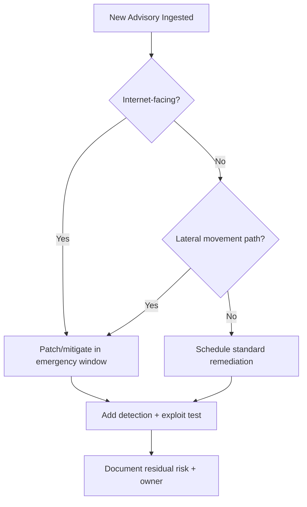
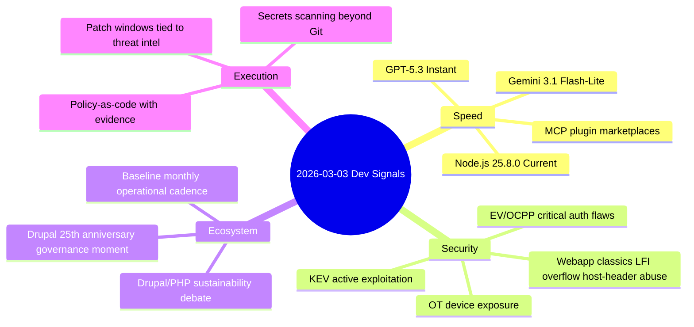

import Tabs from '@theme/Tabs';
import TabItem from '@theme/TabItem';
import TOCInline from '@theme/TOCInline';

The signal today was simple: velocity is up across runtimes and models, while security debt is still compounding in the places people pretend are "internal." Tooling got faster, agent UX got better, and critical infrastructure advisories kept proving that weak auth is still everywhere. Shipping speed is useful only if exploit speed is slower than patch speed.

<!-- truncate -->

<TOCInline toc={toc} minHeadingLevel={2} maxHeadingLevel={2} />

## Runtime and Model Releases Worth Attention

**Node.js 25.8.0** landing as Current is relevant for teams testing upcoming runtime behavior before it hardens in LTS. **Gemini 3.1 Flash-Lite** and **GPT-5.3 Instant** are both pushing the same angle: lower latency, lower cost, better day-to-day interaction quality. That is good for product loops, but it also means bad prompts and weak guardrails fail faster at scale.

| Item | Why it matters operationally | Practical move |
|---|---|---|
| Node.js 25.8.0 (Current) | Early access to runtime behavior before LTS planning | Run CI matrix with `node@current` + `node@lts/*` now |
| Gemini 3.1 Flash-Lite | Cost/latency profile for high-volume workloads | Route classification/extraction workloads here first |
| GPT-5.3 Instant + System Card | Better conversational utility plus explicit safety framing | Add evals for instruction-following regressions before rollout |
| MCP Apps + Team Plugin Marketplaces | Shared private integrations reduce duplicate internal glue code | Move internal tools into governed plugin registry |

> "Gemini 3.1 Flash-Lite is our fastest and most cost-efficient Gemini 3 series model yet."
>
> — Google announcement note, [Gemini update](https://deepmind.google/)

> "CISA has added two new vulnerabilities to its Known Exploited Vulnerabilities Catalog, based on evidence of active exploitation."
>
> — CISA, [KEV Catalog](https://www.cisa.gov/known-exploited-vulnerabilities-catalog)

<Tabs>
<TabItem value="instant" label="GPT-5.3 Instant" default>

Best for conversational product surfaces where response quality under tight latency budgets matters more than raw depth.

</TabItem>
<TabItem value="flashlite" label="Gemini 3.1 Flash-Lite">

Best for high-throughput tasks where unit economics dominate and task complexity is moderate.

</TabItem>
<TabItem value="node" label="Node 25.8.0">

Not a model, but the same decision class: faster iteration only helps if CI and compatibility gates are already strict.

</TabItem>
</Tabs>

:::info[Model speed changes architecture, not just UX]
Lower latency models shift system bottlenecks toward orchestration, plugin I/O, and policy enforcement. If request volume spikes after a model swap, queue strategy and rate-limit policy become primary reliability controls.
:::

## Security Reality Check: OT/EV Advisories and Old Web App Bugs

The CSAF batch is not subtle: multiple EV charging backend products and OT systems are showing high-severity issues (including auth failures and DoS vectors). Add the webapp disclosures (mailcow host header poisoning, Easy File Sharing overflow, Boss Mini LFI), and the pattern is familiar: internet-facing software still breaks at trust boundaries first.

| Advisory cluster | Affected examples | CVSS signal | Core failure mode |
|---|---|---|---|
| EV charging ecosystems | Mobiliti e-mobi.hu, ePower epower.ie, Everon OCPP Backends | 9.4 | Missing auth, weak auth-attempt controls, availability impact |
| Industrial/OT | Hitachi Energy RTU500, Hitachi Relion REB500, Labkotec LID-3300IP | High/Critical | Unauthorized control, data exposure, service disruption |
| Web apps | mailcow 2025-01a, Easy File Sharing 7.2, Boss Mini 1.4.0 | Critical patterns | Host-header poisoning, overflow, LFI |



:::danger[Stop treating secrets as a Git-only problem]
~~"Secrets leak only in commits."~~ They leak in env dumps, CI logs, local filesystems, shell history, crash reports, and agent memory/context. Run secret scanning on repos, runtime envs, artifact stores, and logs, then rotate anything exposed.
:::

```yaml title="security-watchlist.yaml" showLineNumbers
generated_at: "2026-03-03T22:09:00Z"
sources:
  - cisa_kev
  - csaf_vendor_feeds
  - webapps_disclosures
rules:
  # highlight-next-line
  kev_due_days: 7
  critical_cvss_threshold: 9.0
  internet_facing_priority: immediate
assets:
  # highlight-start
  - name: ev_charging_backends
    owner: secops
  - name: ot_gateways
    owner: platform
  # highlight-end
actions:
  - patch_or_mitigate
  - verify_exploitability
  - document_exceptions
```

<details>
<summary>Full vulnerability watchlist compiled today</summary>

- Mobiliti e-mobi.hu (all versions): critical auth/control issues, CVSS 9.4.
- ePower epower.ie (all versions): critical auth/control + DoS risk, CVSS 9.4.
- Everon OCPP Backends (`api.everon.io`, all versions): critical auth/control + DoS risk, CVSS 9.4.
- Labkotec LID-3300IP (all versions): missing authentication for critical function, CVSS 9.4.
- Hitachi Energy RTU500 affected firmware ranges: info exposure and potential outage impact.
- Hitachi Energy Relion REB500 affected versions: authenticated role abuse for unauthorized directory access/modification.
- mailcow 2025-01a: Host Header Password Reset Poisoning.
- Easy File Sharing Web Server v7.2: Buffer Overflow.
- Boss Mini v1.4.0: Local File Inclusion (LFI).
- CISA KEV additions: CVE-2026-21385 (Qualcomm memory corruption), CVE-2026-22719 (VMware Aria Operations command injection).

</details>

## CISA KEV Means Deadline, Not "FYI"

When KEV adds a CVE, treat it as active threat intel with an execution clock. "We saw it" is not a control; validated mitigation is.

:::warning[KEV items require owner + due date immediately]
For each KEV CVE, assign one owner, one due date, one evidence artifact (patch output, config diff, or compensating control). No owner means no remediation.
:::

```diff
# mitigation-policy.diff
- priority: normal
- due_days: 30
+ priority: emergency
+ due_days: 7
+ require_evidence: true
```

## Platform and Ecosystem Signals (Drupal/PHP + Project Genie + SASE)

The Drupal/PHP conversation is finally addressing sustainability and contributor economics instead of pretending growth is automatic. Project Genie prompt-driven world generation is interesting, but practical value depends on deterministic control and reproducibility. Programmable SASE claims are valid only if teams can ship policy as code with auditability, not screenshots.

| Signal | Practical interpretation | Decision filter |
|---|---|---|
| Project Genie world creation tips | Prompt quality now affects generated environment quality directly | Keep prompt templates versioned |
| Drupal "Crossroads of PHP" discussion | Ecosystem is confronting resource constraints directly | Fund maintenance, not just net-new features |
| Drupal 25th Anniversary Gala (Mar 24, Chicago) | Community coordination still matters for long-term roadmap health | Track governance and contributor pipeline, not just release notes |
| Baseline Jan 2026 digest | Operational cadence updates still useful for dependency risk tracking | Summarize monthly external dependencies in one internal brief |
| Programmable SASE announcement | Could be real if SDK + edge runtime are production-grade | Require policy test harness before adoption |

```bash
# prompt-ops quick check for generated worlds and policy experiments
git diff --name-only | rg "prompts/|policies/"
npm run test:prompt-regressions
npm run test:policy-e2e
```

## The Bigger Picture



## Bottom Line

The operating model that works is boring and strict: faster models for the right workloads, explicit threat-driven remediation SLAs, and zero tolerance for unmanaged secrets outside source control.

:::tip[Single highest-ROI move this week]
Create one unified `risk-register` pipeline that ingests KEV + CSAF + internal asset inventory, auto-assigns owners, and blocks release if critical internet-facing findings have no mitigation evidence.
:::
