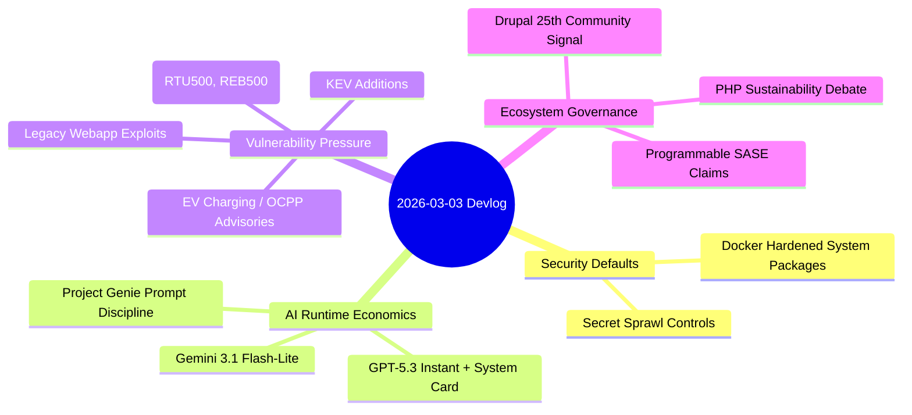

import Tabs from '@theme/Tabs';
import TabItem from '@theme/TabItem';
import TOCInline from '@theme/TOCInline';

Most updates today split into two buckets: real engineering progress and marketing varnish. The useful part was clear: better container hardening, faster cheap inference tiers, and brutal reminders that OT/charging infrastructure is still full of authentication failures. The fluff part stayed fluffy.

<!-- truncate -->

<TOCInline toc={toc} minHeadingLevel={2} maxHeadingLevel={2} />

## Docker hardening and secret hygiene finally met reality

Docker’s hardened packaging direction is practical: reduce image attack surface without forcing teams into weird custom distros. Pair that with secret-scanning discipline and the supply-chain story starts to look less performative.

> "Secure, minimal, production-ready images should be the default."
>
> — Docker, [Announcing Docker Hardened System Packages](https://www.docker.com/blog/announcing-docker-hardened-system-packages/)

> "Secrets don’t just leak from Git."
>
> — Truffle Security, [Protecting Developers Means Protecting Their Secrets](https://trufflesecurity.com/blog/protecting-developers-means-protecting-their-secrets)

:::danger[Stop treating secrets as a Git-only problem]
Scan runtime surfaces, not just commits: mounted volumes, `/proc/<pid>/environ`, CI artifacts, and shell histories. Add automatic revocation paths for leaked credentials; detection without rotation is theater.
:::

```yaml title="security/secret-scan-policy.yaml" showLineNumbers
version: 1
targets:
  - git
  - filesystem
  - env
  - ci_artifacts
rules:
  entropy_threshold: 4.2
  block_on_high_confidence: true
  allowlist_paths:
    - docs/examples/
rotation:
  provider: vault
  auto_rotate_on_detection: true
notifications:
  slack_channel: "#sec-alerts"
  create_ticket: true
```

## Runtime and model releases: speed is cheap, correctness is not

`Node.js 25.8.0 (Current)` is a velocity release, not a "forget forever" release. `Gemini 3.1 Flash-Lite` and `GPT-5.3 Instant` both push lower-latency, lower-cost interaction. Useful for routing and UX, not a free pass on eval quality. Project Genie’s "4 prompt tips" is the same old truth: prompt specificity beats prompt poetry.

| Release | What changed | Practical use | Trap |
|---|---|---|---|
| Node.js 25.8.0 | Current line update | Early validation for libs/tooling | Shipping to prod without matrix testing |
| Gemini 3.1 Flash-Lite | Faster/cheaper Gemini 3 tier | High-volume classification/routing | Assuming cheaper means "good enough" |
| GPT-5.3 Instant + System Card | Smoother chat profile + safety/perf framing | Assistant UX and low-latency workflows | Ignoring failure modes because response quality "feels" better |
| Project Genie prompt guidance | Better world-generation prompting | Structured generation inputs | Treating prompt hacks as architecture |

<Tabs>
  <TabItem value="gemini" label="Gemini 3.1 Flash-Lite" default>
Latency-cost optimized path for scale workloads. Good default when task complexity is bounded and output can be scored cheaply.
  </TabItem>
  <TabItem value="gpt" label="GPT-5.3 Instant">
Better conversational smoothness and broad utility. Use when interaction quality matters more than absolute lowest token cost.
  </TabItem>
</Tabs>

```diff
- "engines": { "node": "24.x" }
+ "engines": { "node": "25.8.0" }
```

:::caution[Current means churn by design]
Run `Current` in CI and staging first, then promote after dependency and regression checks. ~~Latest equals safest~~ is how teams sign up for weekend incident calls.
:::

## OT and webapp vulnerabilities: same root failures, different logos

Mobiliti e-mobi.hu, ePower epower.ie, Everon OCPP backends, and Labkotec LID-3300IP reported severe auth-related issues (many with CVSS 9.4). Hitachi Energy RTU500 and Relion REB500 advisories add outage and authorization boundary risks. The old web stack remains noisy too: `mailcow` host-header reset poisoning, `Easy File Sharing Web Server` overflow, `Boss Mini` LFI.

| Advisory group | Main weakness | Severity signal | Action this week |
|---|---|---|---|
| EV charging backends (Mobiliti/ePower/Everon) | Missing auth, weak auth controls, DoS exposure | CVSS v3 up to 9.4 | Isolate management plane, enforce MFA, patch immediately |
| Labkotec LID-3300IP | Missing auth for critical function | CVSS v3 9.4 | Block internet exposure, vendor fix deployment |
| Hitachi RTU500 / REB500 | Info exposure, outage, authz bypass paths | Industrial impact > CVSS optics | Apply vendor mitigations, segment OT/IT boundary |
| mailcow / Easy File Sharing / Boss Mini | Host header poisoning, BOF, LFI | Exploit-friendly classes | WAF signatures plus version upgrades now |

:::warning[KEV entries change patch priority]
CISA added `CVE-2026-21385` (Qualcomm memory corruption) and `CVE-2026-22719` (VMware Aria Operations command injection) to KEV. If an asset is exposed and affected, patching is an incident response task, not backlog grooming.
:::

```bash title="scripts/kev-priority-check.sh"
#!/usr/bin/env bash
set -euo pipefail
# highlight-next-line
KEV=("CVE-2026-21385" "CVE-2026-22719")
for cve in "${KEV[@]}"; do
  if rg -q "$cve" inventory/*.csv; then
    echo "[P1] affected asset found for $cve"
  else
    echo "[OK] no direct match for $cve in current inventory"
  fi
done
```

## Drupal/PHP ecosystem signals and the SASE developer push

The DropTimes "At the Crossroads of PHP" framing is blunt and mostly correct: contributor pressure and budget pressure are real. The Drupal 25th anniversary gala in Chicago is community momentum, but momentum only matters if maintainers are funded and roadmaps stay coherent. Baseline’s January digest and "programmable SASE" messaging both point to one thing: platform teams want programmable control planes, not another dashboard with pretty graphs.

> "The Drupal 25th Anniversary Gala will take place on 24 March..."
>
> — The Drop Times, [Drupal 25th Anniversary Gala Set for 24 March in Chicago](https://www.thedroptimes.com/)

<details>
<summary>Full ecosystem notes captured</summary>

At the Crossroads of PHP: sustainability pressure across Drupal, Joomla, Magento, and Mautic.
Drupal 25th Anniversary Gala: March 24, 2026, Chicago community event.
January 2026 Baseline digest: monthly updates worth tracking for platform maintainers.
Programmable SASE announcement: developer-native extensibility at the edge is the relevant claim; evaluate by API quality, policy latency, and rollback safety.
</details>

## The Bigger Picture



## Bottom Line

The pattern is consistent: hardening and patch velocity beat branding every time. Teams that win this cycle route cheap models intelligently, keep strict release gates, and treat KEV-class exposures as immediate operations work.

:::tip[One concrete move]
Create a single weekly "risk merge" where platform, app, and security owners review: `Current` runtime upgrades, KEV deltas, and secret-scan findings in one board. One meeting, one owner, one patch SLA.
:::
