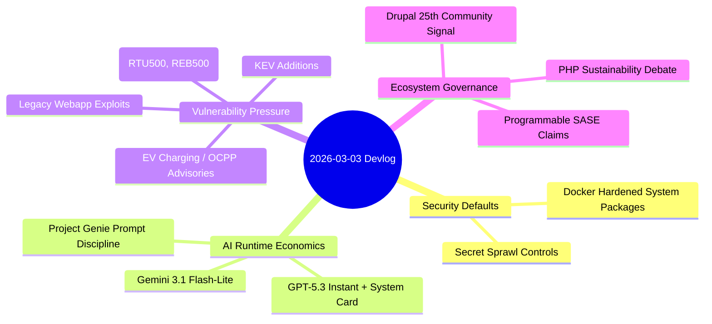

import Tabs from '@theme/Tabs';
import TabItem from '@theme/TabItem';
import TOCInline from '@theme/TOCInline';

Today's feed split cleanly into things you can ship and things you can safely ignore. On the shipping side: better container hardening defaults, cheaper inference tiers with real latency wins, and a fresh batch of OT/charging-infra advisories that all trace back to authentication failures nobody bothered to implement. The rest was press releases dressed up as product launches.

<!-- truncate -->

<TOCInline toc={toc} minHeadingLevel={2} maxHeadingLevel={2} />

## Docker Hardened Packages and Secret Scanning Beyond Git

Docker's hardened packaging direction makes sense: strip image attack surface down without pushing teams into exotic base distros nobody wants to maintain. Combine that with disciplined secret scanning and supply-chain security starts to feel less like a compliance checkbox and more like an engineering practice.

> "Secure, minimal, production-ready images should be the default."
>
> — Docker, [Announcing Docker Hardened System Packages](https://www.docker.com/blog/announcing-docker-hardened-system-packages/)

> "Secrets don't just leak from Git."
>
> — Truffle Security, [Protecting Developers Means Protecting Their Secrets](https://trufflesecurity.com/blog/protecting-developers-means-protecting-their-secrets)

:::danger[Stop treating secrets as a Git-only problem]
Scan runtime surfaces, not just commits: mounted volumes, `/proc/<pid>/environ`, CI artifacts, and shell histories. Add automatic revocation paths for leaked credentials; detection without rotation is a report that nobody reads.
:::

```yaml title="security/secret-scan-policy.yaml" showLineNumbers
version: 1
targets:
  - git
  - filesystem
  - env
  - ci_artifacts
rules:
  entropy_threshold: 4.2
  block_on_high_confidence: true
  allowlist_paths:
    - docs/examples/
rotation:
  provider: vault
  auto_rotate_on_detection: true
notifications:
  slack_channel: "#sec-alerts"
  create_ticket: true
```

## Runtime and Model Releases: Cheaper Tokens, Same Eval Burden

`Node.js 25.8.0 (Current)` lands as a velocity release — useful for early library validation, dangerous if you skip the matrix testing step. `Gemini 3.1 Flash-Lite` and `GPT-5.3 Instant` both compete on lower latency and lower cost per token, which helps routing and UX layers but says nothing about whether your evals still pass. Project Genie's "4 prompt tips" rehashes a truth that keeps needing repeating: prompt specificity matters more than prompt cleverness.

| Release | What changed | Practical use | Trap |
|---|---|---|---|
| Node.js 25.8.0 | Current line update | Early validation for libs/tooling | Shipping to prod without matrix testing |
| Gemini 3.1 Flash-Lite | Faster/cheaper Gemini 3 tier | High-volume classification/routing | Assuming cheaper means "good enough" |
| GPT-5.3 Instant + System Card | Smoother chat profile + safety/perf framing | Assistant UX and low-latency workflows | Ignoring failure modes because response quality "feels" better |
| Project Genie prompt guidance | Better world-generation prompting | Structured generation inputs | Treating prompt hacks as architecture |

<Tabs>
<TabItem value="gemini" label="Gemini 3.1 Flash-Lite" default>

Latency-cost optimized path for scale workloads. Good default when task complexity is bounded and output can be scored cheaply.

</TabItem>
<TabItem value="gpt" label="GPT-5.3 Instant">

Better conversational smoothness and broad utility. Use when interaction quality matters more than absolute lowest token cost.

</TabItem>
</Tabs>

```diff
- "engines": { "node": "24.x" }
+ "engines": { "node": "25.8.0" }
```

:::caution[Current means churn by design]
Run `Current` in CI and staging first, then promote after dependency and regression checks. ~~Latest equals safest~~ is how teams sign up for weekend incident calls.
:::

## OT and Webapp Vulnerabilities: Authentication Failures Across Industries

Mobiliti e-mobi.hu, ePower epower.ie, Everon OCPP backends, and Labkotec LID-3300IP all reported severe auth-related issues (many with CVSS 9.4). These are different vendors in different verticals shipping the same class of bug: missing or broken authentication on management interfaces. Hitachi Energy RTU500 and Relion REB500 advisories compound the picture with outage and authorization boundary risks in industrial control systems. Meanwhile the legacy web stack keeps producing: `mailcow` host-header reset poisoning, `Easy File Sharing Web Server` overflow, `Boss Mini` LFI.

| Advisory group | Main weakness | Severity signal | Action this week |
|---|---|---|---|
| EV charging backends (Mobiliti/ePower/Everon) | Missing auth, weak auth controls, DoS exposure | CVSS v3 up to 9.4 | Isolate management plane, enforce MFA, patch immediately |
| Labkotec LID-3300IP | Missing auth for critical function | CVSS v3 9.4 | Block internet exposure, vendor fix deployment |
| Hitachi RTU500 / REB500 | Info exposure, outage, authz bypass paths | Industrial impact > CVSS optics | Apply vendor mitigations, segment OT/IT boundary |
| mailcow / Easy File Sharing / Boss Mini | Host header poisoning, BOF, LFI | Exploit-friendly classes | WAF signatures plus version upgrades now |

:::warning[KEV entries change patch priority]
CISA added `CVE-2026-21385` (Qualcomm memory corruption) and `CVE-2026-22719` (VMware Aria Operations command injection) to KEV. If an asset is exposed and affected, patching is an incident response task, not backlog grooming.
:::

```bash title="scripts/kev-priority-check.sh"
#!/usr/bin/env bash
set -euo pipefail
# highlight-next-line
KEV=("CVE-2026-21385" "CVE-2026-22719")
for cve in "${KEV[@]}"; do
  if rg -q "$cve" inventory/*.csv; then
    echo "[P1] affected asset found for $cve"
  else
    echo "[OK] no direct match for $cve in current inventory"
  fi
done
```

## Drupal, PHP Sustainability, and the Programmable SASE Push

The DropTimes piece "At the Crossroads of PHP" is blunt and mostly on target: contributor burnout and shrinking budgets threaten Drupal, Joomla, Magento, and Mautic in parallel. The Drupal 25th anniversary gala in Chicago signals community energy, but energy without funded maintainers and coherent roadmaps tends to dissipate fast. On the infrastructure side, Baseline's January digest and the latest "programmable SASE" messaging share a common thread: platform teams want programmable control planes with real APIs, not another vendor dashboard.

> "The Drupal 25th Anniversary Gala will take place on 24 March..."
>
> — The Drop Times, [Drupal 25th Anniversary Gala Set for 24 March in Chicago](https://www.thedroptimes.com/)

<details>
<summary>Full ecosystem notes captured</summary>

At the Crossroads of PHP: sustainability pressure across Drupal, Joomla, Magento, and Mautic.
Drupal 25th Anniversary Gala: March 24, 2026, Chicago community event.
January 2026 Baseline digest: monthly updates worth tracking for platform maintainers.
Programmable SASE announcement: developer-native extensibility at the edge is the relevant claim; evaluate by API quality, policy latency, and rollback safety.
</details>

## How These Topics Connect



## What to Prioritize This Week

Across all four areas, the leverage point is the same: hardening defaults and patch velocity compound over time, while branding and announcements do not. Route cheap models through proper eval gates, keep strict release promotion policies for `Current` runtimes, and handle KEV-listed exposures as operations work with a deadline — not items that sit in a sprint backlog.

:::tip[One concrete move]
Create a single weekly "risk merge" where platform, app, and security owners review: `Current` runtime upgrades, KEV deltas, and secret-scan findings in one board. One meeting, one owner, one patch SLA.
:::
