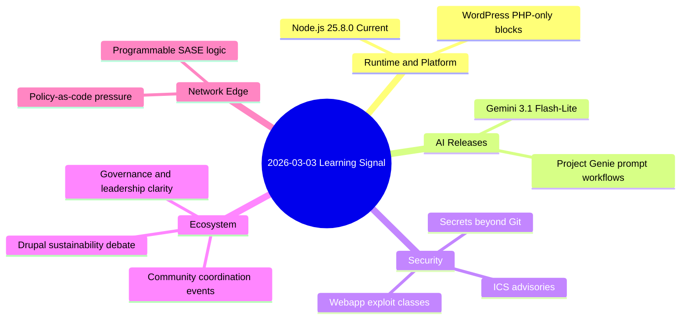

import Tabs from '@theme/Tabs';
import TabItem from '@theme/TabItem';
import TOCInline from '@theme/TOCInline';

Most release feeds are noise; this batch had real signal. The useful pattern is simple: runtimes got incremental wins, AI launches split between practical and theatrical, and security advisories kept proving that authentication and access control are still where systems fail in 2026. ~~"Modern stacks are safer by default now."~~ Not in infrastructure-facing software.

<!-- truncate -->

<TOCInline toc={toc} minHeadingLevel={2} maxHeadingLevel={2} />

## Runtime and CMS shifts that are actually shippable

**Node.js** 25.8.0 (Current) is exactly what Current releases should be: iterate fast, surface breakage early, and keep LTS users honest about upgrade debt.

For WordPress, the important change is **PHP-only block registration** via `register_block_type(..., [ 'auto_register' => true, 'render_callback' => ... ])`. This is useful for server-rendered blocks that do not need editor JS scaffolding.

```php title="plugin/blocks/server-kpi.php" showLineNumbers
<?php
if ( ! defined( 'ABSPATH' ) ) { exit; }

function acme_register_server_kpi_block() {
    register_block_type(
        __DIR__ . '/server-kpi',
        array(
            // highlight-next-line
            'auto_register'  => true,
            // highlight-start
            'render_callback' => function( $attributes, $content, $block ) {
                $value = isset( $attributes['value'] ) ? (int) $attributes['value'] : 0;
                return '<div class="acme-kpi">KPI: ' . esc_html( (string) $value ) . '</div>';
            },
            // highlight-end
        )
    );
}
add_action( 'init', 'acme_register_server_kpi_block' );
```

:::caution[Don't fake interactivity with PHP-only blocks]
Use PHP-only blocks for render-time composition, data reads, and controlled markup. Skip this path for rich client-side interactions, offline editing behavior, or block UIs that depend on dynamic JS state. For those, register full block assets and treat editor/runtime parity as a requirement.
:::

## AI launches: practical throughput vs demo theater

Google DeepMind's Project Genie tips are interesting for prompt craft, but this is still "prototype world synthesis," not production game tooling. Gemini 3.1 Flash-Lite is the more operational release because cost/latency curves decide what ships.

<Tabs>
<TabItem value="gemini" label="Gemini 3.1 Flash-Lite" default>

Better fit for high-volume inference where response cost dominates architecture decisions. Real value: lower per-request cost at acceptable quality, enabling wider automation coverage.

</TabItem>
<TabItem value="genie" label="Project Genie">

Useful for experimentation and internal prototyping of generated environments. Real risk: teams mistake "promptable world generation" for a replacement of deterministic content pipelines.

</TabItem>
</Tabs>

| Topic | Claimed Value | Engineering Reality | Decision |
|---|---|---|---|
| Gemini 3.1 Flash-Lite | Fastest, most cost-efficient Gemini 3 series model | Good for scale paths where latency + unit economics matter | Adopt for high-throughput, bounded-quality tasks |
| Project Genie prompt tips | Create new worlds with prompting | Useful for ideation, weak for reproducible production assets | Keep in R&D sandbox |

:::info[How to evaluate AI model announcements]
Track three numbers per workload: p95 latency, cost per 1K calls, and regression rate against your golden set. If one looks great while another collapses, that launch is marketing collateral, not platform strategy.
:::

## Security reality: secrets and critical infrastructure stayed fragile

The "Protecting Developers Means Protecting Their Secrets" thesis is correct: secret leakage is filesystem + env + memory, not just Git history. At the same time, ICS advisories from Hitachi Energy, Labkotec, ePower, Mobiliti, and Everon show the same old pattern: access control mistakes plus weak auth hardening.

:::danger[CVSS 9.4 in charging and control backends is an operations problem, not a backlog item]
Treat internet-exposed management planes as incident candidates immediately. Segment, restrict by allowlist, rotate credentials, and force authenticated API paths behind policy gateways before patch windows close.
:::

| Vendor/Product | Affected Scope (as published) | Primary Weakness | Impact |
|---|---|---|---|
| Hitachi Energy Relion REB500 | `<= 8.3` series noted in advisory summary | Unauthorized directory access/modification by authenticated roles | Integrity loss |
| Hitachi Energy RTU500 | CMU firmware ranges from advisory | Exposure of low-value user management info + potential outage | Availability + info exposure |
| Labkotec LID-3300IP | all versions listed | Missing authentication for critical function | Full operational compromise |
| ePower `epower.ie` | all versions listed | Missing auth + auth attempt controls + related weaknesses | Admin takeover / DoS |
| Mobiliti `e-mobi.hu` | all versions listed | Same class as above | Admin takeover / DoS |
| Everon OCPP backends | `api.everon.io` all listed versions | Same class as above | Admin takeover / DoS |

```bash title="ops/secret-hygiene-check.sh" showLineNumbers
#!/usr/bin/env bash
set -euo pipefail

# highlight-start
echo "[1] Scan tracked files"
gitleaks detect --source . --no-git --redact

echo "[2] Scan environment at runtime"
env | rg -i "(token|secret|password|key)" || true

echo "[3] Check process args for leaked creds"
ps aux | rg -i "(token|secret|password|apikey)" || true
# highlight-end

echo "[4] Enforce pre-commit secret scan"
test -f .git/hooks/pre-commit || cp scripts/pre-commit-gitleaks .git/hooks/pre-commit
chmod +x .git/hooks/pre-commit
```

## Commodity web exploit feed: still embarrassingly effective

Mailcow host header reset poisoning, Easy File Sharing Web Server buffer overflow, and Boss Mini LFI are not novel classes. They are reminders that old primitives keep working because patch velocity and exposure hygiene still lag.

```diff
- Password reset links derived from request Host header
+ Password reset links derived from canonical APP_URL config

- Public endpoint accepts unbounded payload into fixed buffer
+ Input length validated + safe copy routine + WAF rule for exploit signatures

- File include path from user-supplied parameter
+ Static allowlist map + realpath enforcement + extension lock
```

<details>
<summary>Quick triage checklist for these three classes</summary>

1. Reset poisoning: enforce canonical origin and sign reset URLs with short TTL.
2. Buffer overflow: patch immediately, then isolate service behind reverse proxy limits.
3. LFI: block traversal patterns at edge and replace dynamic include logic with allowlists.
4. For all three: verify exploitability in staging, then run targeted log hunts for indicators.

</details>

## Drupal and PHP ecosystem signal: governance and sustainability are now core engineering topics

The DropTimes discussion and Drupal ecosystem updates matter because contributor capacity and governance clarity directly affect release quality and maintenance continuity.

> "Across the PHP ecosystem, a hard conversation is beginning to take shape."
>
> — The Drop Times, [At the Crossroads of PHP](https://www.thedroptimes.com/)

> "The Drupal 25th Anniversary Gala will take place on 24 March from 7:00 to 10:00 PM at 610 S Michigan Ave, Chicago, during DrupalCon Chicago."
>
> — Drupal community announcement summary, [The Drop Times coverage](https://www.thedroptimes.com/)

January 2026 Baseline digest and the SASE "programmable platform" narrative reinforce one point: teams are converging on programmable policy layers, but policy quality is the bottleneck, not API availability.

## The Bigger Picture



## Bottom Line

Noise stays high; operational truth stays boring: auth boundaries, secret hygiene, and upgrade discipline decide outcomes.

:::tip[Single move with the highest payoff this week]
Create one enforced release gate that blocks deploys when any of these fail: secret scan, authz policy tests, and known-critical CVE exposure checks for internet-facing services. That single gate will prevent more incidents than any new model announcement or framework feature.
:::
