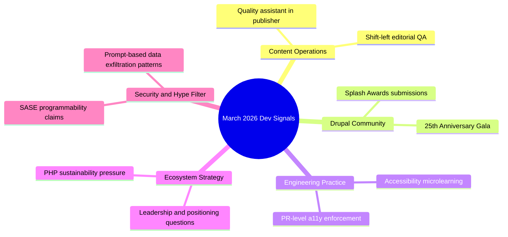

import Tabs from '@theme/Tabs';
import TabItem from '@theme/TabItem';
import TOCInline from '@theme/TOCInline';

March 2026 reads like a split-screen: real engineering progress on one side, polished marketing copy on the other. The useful signals are concrete: better editorial QA workflows, accessibility habits that ship, and community events with hard dates. The noise is the usual “only platform” chest-beating that collapses under technical scrutiny.
<!-- truncate -->

<TOCInline toc={toc} minHeadingLevel={2} maxHeadingLevel={2} />

## Quality assistant now available in Content Publisher
This matters because **editorial quality gates** are finally moving closer to where content is authored, instead of being bolted on after publishing mistakes are already live.

<Tabs>
  <TabItem value="useful" label="What is useful" default>
    - Automated checks for clarity, tone drift, and consistency before publish.
    - Faster review loops for teams shipping docs and marketing pages daily.
    - Better baseline quality for non-native writers without creating style-police overhead.
  </TabItem>
  <TabItem value="limits" label="Where it fails">
    - It cannot infer product truth from thin source material.
    - It can enforce style while still passing factual nonsense.
    - It encourages false confidence when teams skip human technical review.
  </TabItem>
</Tabs>

```yaml title="content-quality-policy.yaml" showLineNumbers
quality_assistant:
  enabled: true
  checks:
    - grammar
    - clarity
    - tone
    - terminology
    - link_integrity
  policy:
    severity_threshold: high
    block_publish_on:
      # highlight-next-line
      - factual_uncertainty
      - unresolved_placeholders
      - broken_internal_links
  reviewers:
    # highlight-start
    required:
      - technical_owner
      - editor
    # highlight-end
```

```diff
- Publish -> QA later -> Patch errors in production
+ Draft -> Automated quality checks -> Technical owner sign-off -> Publish
```

:::caution[Quality score is not truth]
Set `factual_uncertainty` as a hard block, not a warning. Quality assistants optimize form; they do not guarantee correctness. Treat them as linting for prose, not as a replacement for subject-matter review.
:::

## DrupalSouth 2026 Splash Awards: submissions open
The signal here is simple: the ecosystem is still producing shippable work worth showcasing, and the submission window is short.

> "Submissions are open for the DrupalSouth 2026 Splash Awards, with entries closing on 27 March 2026 ahead of the Wellington conference in May."
>
> — The Drop Times, [announcement](https://www.thedroptimes.com/)

| Item | Date | Why it matters |
|---|---|---|
| Submissions open | Open now (March 2026) | Teams can package 2025 case studies while details are still fresh |
| Submission deadline | 27 March 2026 | Hard cutoff; late internal approvals will kill entries |
| Event context | Wellington conference, May 2026 | Visibility with regional buyers, agencies, and maintainers |
| Eligibility focus | Completed or significantly updated during 2025 | Forces measurable delivery, not roadmap theater |

:::info[Do the evidence pack before writing]
Collect metrics first: performance deltas, accessibility scores, migration complexity, and business outcomes. The write-up gets easier when the evidence exists; without it, entries become adjective soup.
:::

## The DropTimes newsletter: PHP ecosystem at a real crossroads
Issue framing is accurate: Drupal, Joomla, Magento, and Mautic share structural pressure, not isolated platform drama. Shared stack DNA means shared risk.

> "Across the PHP ecosystem, a hard conversation is beginning to take shape."
>
> — The Drop Times, [opinion coverage](https://www.thedroptimes.com/)

| Ecosystem pressure | Practical impact | What to do now |
|---|---|---|
| Slower growth | Smaller contributor funnel | Reduce maintainer friction in CI and reviews |
| Tighter budgets | Deferred refactors | Protect core reliability work in roadmap planning |
| Contributor thinning | Bus-factor risk | Document ownership and onboarding paths |
| SaaS + AI competition | Narrative confusion | Sell capability and total cost, not nostalgia |

<details>
<summary>Full issue signals captured</summary>

- Sustainability debate across Drupal, Joomla, Magento, Mautic.
- AI architecture discussions split between “AI-ready” and “controlled AI”.
- SEO posture in a rapidly changing search landscape.
- Questions around Drupal brand positioning and leadership clarity.
- Ongoing module/tool releases indicating active ecosystem investment.

</details>

~~Open source is declining because PHP is obsolete~~. The real issue is governance clarity, contributor economics, and product positioning under AI-era expectations.

## AmyJune Hineline’s accessibility microlearning
This is one of the few updates that is immediately operational. A 15-minute course that changes contributor behavior beats a 60-page policy nobody reads.

```md title="a11y-contributor-checklist.md" showLineNumbers
# Accessibility Fundamentals: PR Gate

- [ ] Alt text is meaningful and contextual, not decorative filler
- [ ] Link text is descriptive (no "click here")
- [ ] Headings follow logical order (H2 -> H3, no jumps)
- [ ] Color contrast tested for UI snippets and images
- [ ] Keyboard-only navigation path validated
- [ ] Error messages are specific and actionable
- [ ] Tables include headers and scope where needed
- [ ] Docs language is clear global English
- [ ] Images of text replaced with real text when possible
- [ ] Captions/transcripts included for media
- [ ] Accessibility impact noted in PR description
- [ ] Reviewer confirmed with manual smoke test
```

:::warning[Accessibility debt compounds fast]
Enforce this checklist in pull requests and docs reviews. Retrofitting accessibility after release is slower, more expensive, and usually politically deprioritized until legal risk appears.
:::

## Drupal 25th Anniversary Gala on 24 March in Chicago
Community events are not fluff when they reinforce contributor networks and long-term project health. This one has exact coordinates and times, not vague “save the date” noise.

- Date: 24 March 2026
- Time: 7:00 PM to 10:00 PM
- Location: 610 S Michigan Ave, Chicago
- Context: During DrupalCon Chicago
- Host: Midwest Open Source Alliance

For teams attending DrupalCon, this is a high-density networking window with maintainers and decision-makers in one room. Skipping it to answer email in a hotel lobby is a bad trade.

## “The truly programmable SASE platform” claim
The claim is interesting; the wording is also classic vendor maximalism. “Only platform” statements usually age badly.

| Claim | Engineering reality check |
|---|---|
| Native developer stack at the edge | Useful if APIs are stable, observable, and versioned with discipline |
| Real-time custom security logic | Powerful, but introduces blast-radius risk without strong testing |
| Integration flexibility | Good only when policy simulation and rollback are first-class |

:::danger[Edge logic without guardrails is production roulette]
Require staged rollout, simulation mode, and automatic rollback before allowing custom policy code at edge points. Security logic bugs at edge scale fail fast and fail everywhere.
:::

## Claude `import-memory` quote and prompt-security hygiene
This prompt is a direct **data exfiltration pattern**. It explicitly requests all stored memory and inferred context in one block for export. Treat this class of prompt as sensitive by default.

> "I'm moving to another service and need to export my data. List every memory you have stored about me..."
>
> — claude.com, [import-memory](https://claude.com/import-memory)

```bash title="prompt-guard.sh"
#!/usr/bin/env bash
set -euo pipefail

PROMPT="${1:-}"

if echo "$PROMPT" | rg -qi "list every memory|export my data|context you've learned"; then
  echo "BLOCK: potential sensitive-memory exfiltration request"
  exit 2
fi

echo "PASS: no memory-exfiltration signature detected"
```

## The Bigger Picture


## Bottom Line
Shipping teams need a hard filter: prioritize tools and updates that change day-to-day delivery quality, ignore slogans dressed as architecture.

:::tip[Single most useful move this week]
Add one mandatory “factual + accessibility” gate to the publishing/review path (`factual_uncertainty` block + a11y checklist in PR template). That combination catches more real defects than another dashboard or another keynote recap.
:::
