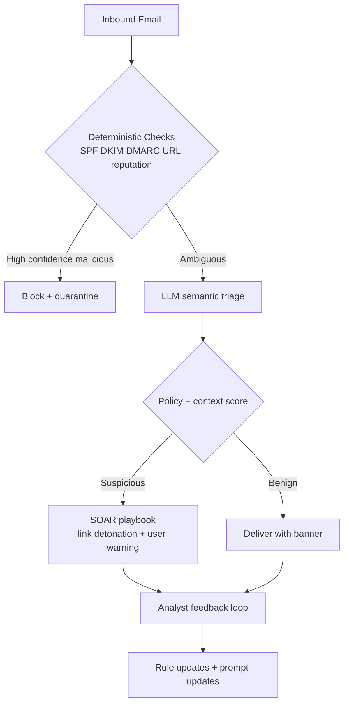

import Tabs from '@theme/Tabs';
import TabItem from '@theme/TabItem';
import TOCInline from '@theme/TOCInline';

Secrets leaked from shell history, crash dumps, and browser local storage outnumber secrets leaked from Git repos — and most rotation playbooks ignore every location except the repository. That gap, plus three webapp vulns that should have died a decade ago and a PHP ecosystem running on nostalgia fumes, made for a productive week of triage.

<!-- truncate -->

<TOCInline toc={toc} minHeadingLevel={2} maxHeadingLevel={2} />

## Secret Sprawl Beyond Git

The core point is simple: secrets leak from far more places than Git history. They persist in shell history, crash dumps, `.env` files, CI logs, browser local storage, and long-lived agent context. ~~Rotating the key doesn't help if the old value is still readable in ten other locations.~~

:::warning[Rotation Without Discovery Is Incomplete]
Rotate credentials and immediately run discovery scans across workstations, CI artifacts, and app storage. If old values still match after rotation, the incident is still open. Set hard TTLs for local secret files and enforce `0600` permissions — stale credentials sitting around for months are free attack surface.
:::

```bash title="scripts/secret-hunt.sh" showLineNumbers
#!/usr/bin/env bash
set -euo pipefail

ROOT="${1:-.}"

# highlight-next-line
rg -n --hidden -S "(AKIA[0-9A-Z]{16}|-----BEGIN (RSA|EC|OPENSSH) PRIVATE KEY-----|xox[baprs]-|ghp_[A-Za-z0-9]{36})" "$ROOT" \
  -g '!node_modules' -g '!.git' -g '!vendor' || true

# highlight-start
find "$ROOT" -type f \( -name ".env" -o -name "*.pem" -o -name "*.key" \) -print0 \
  | xargs -0 ls -l
# highlight-end

echo "Check shell history for accidental exports"
rg -n "export .*(_KEY|_TOKEN|_SECRET)=" ~/.zsh_history ~/.bash_history 2>/dev/null || true

echo "Validate process env leakage"
ps eww -ax | rg -n "(_KEY|_TOKEN|_SECRET)=" || true
```

## LLM-Assisted Phishing Defense: Where It Helps and Where It Doesn't

There is a survivorship-bias problem in phishing defense. Teams tune their filters based on what gets caught, ignoring everything that slipped through and only surfaced in a user report days later. LLMs can help close that gap, but they work best as **triage amplifiers** and **detection-rule generators** with human review — not standalone classifiers.



<Tabs>
<TabItem value="reactive" label="Reactive Stack" default>

IOC-first, incident-last. Cheap to run, expensive to recover from.

</TabItem>
<TabItem value="proactive" label="Proactive Stack">

Behavior-first with LLM-assisted anomaly explanations, then deterministic enforcement.

</TabItem>
<TabItem value="reality" label="What Actually Works">

Keep deterministic controls as gatekeepers; use LLMs only in ambiguous paths and post-delivery hunting.

</TabItem>
</Tabs>

## Three Webapp Vulns That Keep Coming Back

These three entries stood out because they represent old failure modes wearing new clothes. The underlying bugs — trusting user-controlled headers, skipping bounds checks, mapping user input to file paths — have been documented for over a decade. They still ship.

| Target | Vulnerability | Failure Mode | Practical Mitigation |
|---|---|---|---|
| mailcow 2025-01a | Host Header Password Reset Poisoning | Reset links generated from untrusted `Host` | Strict host allowlist; canonical reset domain |
| Easy File Sharing Web Server v7.2 | Buffer Overflow | Memory corruption from unchecked input length | Bound checks, modern compiler hardening, deprecate legacy service |
| Boss Mini v1.4.0 | Local File Inclusion (LFI) | User input mapped to file path | Realpath constraints + deny traversal + route allowlist |

:::danger[These Belong in Regular Testing, Not Annual Audits]
Password reset poisoning gives you account takeover. LFI gives you data exfiltration and often RCE adjacency. Buffer overflow in an internet-facing service is breach material. All three should be in your attack-path testing rotation, not buried in a yearly compliance checklist.
:::

<details>
<summary>Quick triage checklist used for all three</summary>

- Confirm exploit preconditions in a reproducible local environment.
- Measure blast radius: auth bypass, arbitrary read, arbitrary write, code execution.
- Patch with a deny-by-default control, then add a regression test.
- Verify logs capture attempted abuse patterns with enough context for IR.
- Ship mitigations and monitoring together; patch-only is incomplete.

</details>

```diff title="src/security/PasswordResetController.php"
- $resetUrl = "https://" . $_SERVER['HTTP_HOST'] . "/reset?token=" . $token;
+ // Canonical reset domain only; ignore request Host header.
+ $resetHost = $_ENV['RESET_HOST'];
+ $resetUrl = "https://" . $resetHost . "/reset?token=" . $token;
```

## PHP Ecosystem Pressure and Drupal at 25

The DropTimes framing is blunt and mostly correct: shared PHP communities are dealing with slower contributor growth, tighter budgets, and harder positioning against SaaS defaults. These are governance and product-strategy problems. No amount of syntax improvements will fix them.

> "The Drupal 25th Anniversary Gala will take place on 24 March from 7:00 to 10:00 PM at 610 S Michigan Ave, Chicago, during DrupalCon Chicago."
>
> — The Drop Times, [Drupal 25th Anniversary Gala Set for 24 March in Chicago](https://www.thedroptimes.com)

**A 25-year anniversary needs to produce more than nostalgia.** What matters is whether it converts into maintainership commitments, funding, and clearer product direction. If your framework's ecosystem health is shaky, that affects every team building on top of it — it is an engineering dependency worth tracking.

## Evaluating "Programmable SASE" Claims

The pitch sounds good on paper. For it to mean anything, "programmable" has to mean deployable policy code with low-latency execution and auditable rollback — not a dashboard with a webhook builder.

> "As the only SASE platform with a native developer stack, we're giving you the tools to build custom, real-time security logic and integrations directly at the edge."
>
> — Vendor announcement, [The truly programmable SASE platform](https://www.cloudflare.com)

Here is the acceptance test I would use: can a policy change go from commit to production in minutes, with deterministic rollback and full traceability? If yes, interesting. If no, it is a managed proxy with a marketing budget.

## Bottom Line

Engineering teams lose more time to quiet security drift than to headline zero-days. The week's takeaway is straightforward: get secret lifecycle control in place, close your phishing feedback loops, and put hard guardrails on the vuln classes that keep showing up decade after decade.

:::tip[One Thing to Ship This Week]
Add a CI job that fails builds when secret patterns appear in the repo, generated artifacts, or deployment manifests. Pair it with automatic credential revocation hooks. Detection without revocation just generates alerts nobody acts on.
:::
