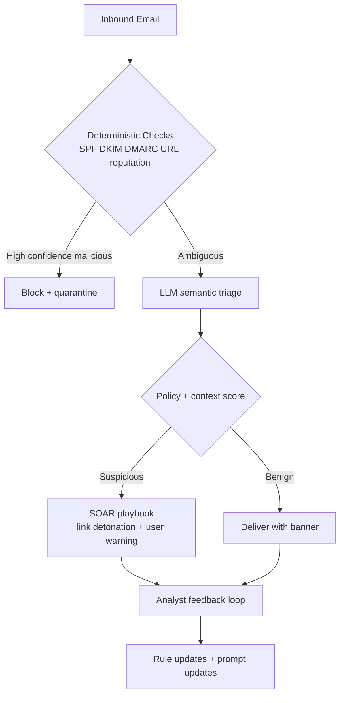
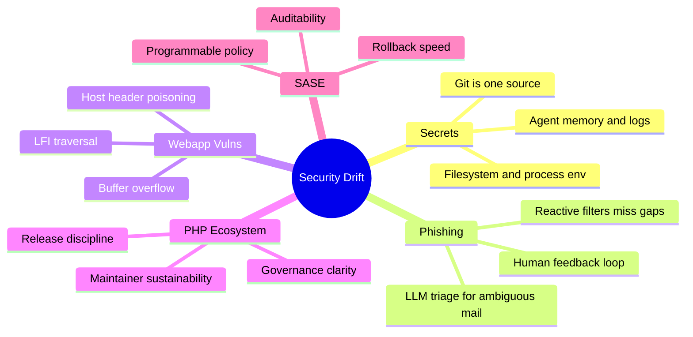

import Tabs from '@theme/Tabs';
import TabItem from '@theme/TabItem';
import TOCInline from '@theme/TOCInline';

Security incidents are rarely one dramatic breach. They are usually **operational drift**: secrets copied into random places, phishing detections tuned for yesterday, and ecosystems ignoring structural decline while marketing teams publish victory laps.  
This devlog compiles what held up under scrutiny and what deserves immediate engineering time.

<!-- truncate -->

<TOCInline toc={toc} minHeadingLevel={2} maxHeadingLevel={2} />

## Protecting Developers Means Protecting Their Secrets

The core point is simple: secrets leak from much more than Git history. They persist in shell history, crash dumps, `.env` files, CI logs, browser local storage, and long-lived agent context. ~~"We rotated the key, so we're good."~~ No, not if the secret is still readable in ten other places.

:::warning[Secret Rotation Without Secret Erasure Is Theater]
Rotate credentials and immediately run discovery scans across workstation, CI artifacts, and app storage. If old values still match after rotation, the incident is still active. Add a hard TTL for local secret files and enforce `0600` permissions so they cannot linger for months.
:::

```bash title="scripts/secret-hunt.sh" showLineNumbers
#!/usr/bin/env bash
set -euo pipefail

ROOT="${1:-.}"

# highlight-next-line
rg -n --hidden -S "(AKIA[0-9A-Z]{16}|-----BEGIN (RSA|EC|OPENSSH) PRIVATE KEY-----|xox[baprs]-|ghp_[A-Za-z0-9]{36})" "$ROOT" \
  -g '!node_modules' -g '!.git' -g '!vendor' || true

# highlight-start
find "$ROOT" -type f \( -name ".env" -o -name "*.pem" -o -name "*.key" \) -print0 \
  | xargs -0 ls -l
# highlight-end

echo "Check shell history for accidental exports"
rg -n "export .*(_KEY|_TOKEN|_SECRET)=" ~/.zsh_history ~/.bash_history 2>/dev/null || true

echo "Validate process env leakage"
ps eww -ax | rg -n "(_KEY|_TOKEN|_SECRET)=" || true
```

## From Reactive to Proactive: Closing the Phishing Gap With LLMs

The survivorship-bias analogy is accurate. Teams tune filters based on what they catch, not what bypasses controls and gets reported days later. LLMs are useful here, but not as "magic classifiers." They are best used as **triage amplifiers** and **detection-rule generators** with human review.



<Tabs>
<TabItem value="reactive" label="Reactive Stack" default>

IOC-first, incident-last. Cheap to run, expensive to recover from.

</TabItem>
<TabItem value="proactive" label="Proactive Stack">

Behavior-first with LLM-assisted anomaly explanations, then deterministic enforcement.

</TabItem>
<TabItem value="reality" label="What Actually Works">

Keep deterministic controls as gatekeepers; use LLMs only in ambiguous paths and post-delivery hunting.

</TabItem>
</Tabs>

## Webapp Vulns That Still Hurt in 2026

Three entries stood out because they are old failure modes that keep reappearing with minor cosmetic changes.

| Target | Vulnerability | Failure Mode | Practical Mitigation |
|---|---|---|---|
| mailcow 2025-01a | Host Header Password Reset Poisoning | Reset links generated from untrusted `Host` | Strict host allowlist; canonical reset domain |
| Easy File Sharing Web Server v7.2 | Buffer Overflow | Memory corruption from unchecked input length | Bound checks, modern compiler hardening, deprecate legacy service |
| Boss Mini v1.4.0 | Local File Inclusion (LFI) | User input mapped to file path | Realpath constraints + deny traversal + route allowlist |

:::danger[These Are Not "Edge Cases"]
Password reset poisoning is account takeover surface. LFI is data exfiltration and often RCE adjacency. Buffer overflow in internet-facing services is breach material, not "legacy debt." Put all three in regular attack-path testing, not annual audits.
:::

<details>
<summary>Quick triage checklist used for all three</summary>

- Confirm exploit preconditions in a reproducible local environment.
- Measure blast radius: auth bypass, arbitrary read, arbitrary write, code execution.
- Patch with a deny-by-default control, then add a regression test.
- Verify logs capture attempted abuse patterns with enough context for IR.
- Ship mitigations and monitoring together; patch-only is incomplete.

</details>

```diff title="src/security/PasswordResetController.php"
- $resetUrl = "https://" . $_SERVER['HTTP_HOST'] . "/reset?token=" . $token;
+ // Canonical reset domain only; ignore request Host header.
+ $resetHost = $_ENV['RESET_HOST'];
+ $resetUrl = "https://" . $resetHost . "/reset?token=" . $token;
```

## PHP Crossroads and Drupal's 25-Year Marker

The DropTimes framing is blunt and mostly correct: shared PHP communities are dealing with slower contributor growth, tighter budgets, and tougher positioning against SaaS defaults. This is governance and product strategy, not syntax debates.

> "The Drupal 25th Anniversary Gala will take place on 24 March from 7:00 to 10:00 PM at 610 S Michigan Ave, Chicago, during DrupalCon Chicago."
>
> — The Drop Times, [Drupal 25th Anniversary Gala Set for 24 March in Chicago](https://www.thedroptimes.com)

:::info[Community Events Are Signal, Not Just Ceremony]
A 25-year anniversary only matters if it converts nostalgia into maintainership, funding, and clearer product direction. Ecosystem stability is an engineering dependency, not marketing content.
:::

```yaml title="governance/maintainer-risk-register.yaml"
ecosystem: php
projects:
  - name: drupal
    risk: medium
    trigger: "maintainer churn > 15% annually"
    mitigation: "funded maintainership + release automation"
  - name: joomla
    risk: medium
    trigger: "security response SLA drift"
    mitigation: "shared incident response guild"
  - name: magento
    risk: high
    trigger: "extension supply-chain compromise"
    mitigation: "signed packages + mandatory SBOM"
```

## "Truly Programmable SASE Platform": Useful Claim, Needs Proof

This pitch can be real if "programmable" means deployable policy code with low-latency execution and auditable rollback, not just custom webhook glue.

> "As the only SASE platform with a native developer stack, we're giving you the tools to build custom, real-time security logic and integrations directly at the edge."
>
> — Vendor announcement, [The truly programmable SASE platform](https://www.cloudflare.com)

Use one acceptance test: policy change from commit to production in minutes, with deterministic rollback and traceability.

```php title="edge/policies/block_suspicious_reset.php" showLineNumbers
<?php

declare(strict_types=1);

// highlight-next-line
if (!defined('EDGE_RUNTIME')) { exit(1); }

$path = $_SERVER['REQUEST_URI'] ?? '/';
$host = $_SERVER['HTTP_HOST'] ?? '';

$allowedResetHosts = ['auth.example.com', 'accounts.example.com'];

if (str_starts_with($path, '/reset') && !in_array($host, $allowedResetHosts, true)) {
    header('HTTP/1.1 403 Forbidden');
    echo 'Blocked by edge policy';
    exit;
}

echo 'ok';
```

## The Bigger Picture




## Bottom Line

Engineering teams lose more time to silent security drift than to headline zero-days. Fix drift first: secret lifecycle control, phishing feedback loops, and hard guardrails on known vuln classes.

:::tip[Single Action That Pays Off This Week]
Add a CI job that fails builds when secret patterns appear in repo, generated artifacts, or deployment manifests, then pair it with automatic credential revocation hooks. Detection without revocation is noise.
:::
