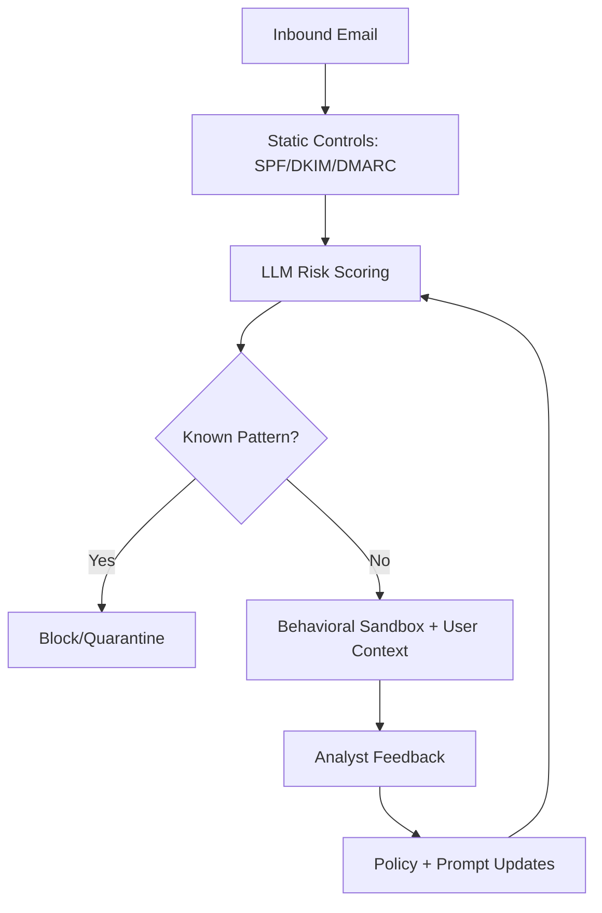

import Tabs from '@theme/Tabs';
import TabItem from '@theme/TabItem';
import TOCInline from '@theme/TOCInline';

A mailcow password-reset flaw lets attackers rewrite reset links by injecting a `Host` header — no authentication required, full account takeover. That single CVE anchors a broader pattern across today's batch: old bug classes (host poisoning, path traversal, buffer overflows) meeting new tooling layers like LLM-assisted triage and declarative edge policy.

<!-- truncate -->

<TOCInline toc={toc} minHeadingLevel={2} maxHeadingLevel={2} />

## Proactive Phishing Defense With LLMs

The survivorship-bias framing holds up: incident response only studies attacks that were noticed. `LLM`-assisted triage earns its keep when it moves teams past signature matching toward weak-signal clustering across headers, content intent, and user behavior.

> "LLMs can help us find the invisible weaknesses."
>
> — Learning item summary, [Context](https://mailcow.email/)



:::warning[Do Not Let the Model Auto-Act]
Keep `LLM` decisions advisory until false-positive rates are measured per sender segment. Gate enforcement behind deterministic controls (`SPF`, `DKIM`, allowlists, tenant policy), then promote actions gradually.
:::

## mailcow 2025-01a: Host Header Password Reset Poisoning

This one is operationally ugly because it abuses trust boundaries that teams rarely test in reset flows. If `Host` is accepted from untrusted input, reset links become attacker-controlled.

> "mailcow 2025-01a - Host Header Password Reset Poisoning"
>
> — Webapps advisory title, [mailcow](https://mailcow.email/)

```diff
- $resetUrl = "https://" . $_SERVER['HTTP_HOST'] . "/reset?token=" . $token;
+ $allowedHost = getenv('APP_PUBLIC_HOST');
+ if ($_SERVER['HTTP_HOST'] !== $allowedHost) {
+   throw new RuntimeException('Invalid host header');
+ }
+ $resetUrl = "https://" . $allowedHost . "/reset?token=" . $token;
```

:::danger[Reset Poisoning Is Account Takeover]
Pin canonical hostnames server-side and reject mismatches before link generation. Also validate reverse-proxy headers (`X-Forwarded-Host`) and lock trusted proxy IP ranges.
:::

## Easy File Sharing Web Server 7.2 and Boss Mini 1.4.0

Buffer overflows and `LFI` keep showing up because legacy software gets internet exposure without compensating controls. The bug class being old does not make the risk old.

| Target | Class | Practical Impact | Fast Containment |
|---|---|---|---|
| Easy File Sharing Web Server v7.2 | Buffer Overflow | Process crash / possible code execution | Isolate host, remove public exposure, patch or retire |
| Boss Mini v1.4.0 | Local File Inclusion | Config/secret leakage, pivot to deeper compromise | Canonicalize paths, block traversal, restrict file reads |
| mailcow 2025-01a | Host Header Poisoning | Password reset hijack | Host allowlist + strict proxy trust |

```php title="src/Http/DownloadController.php" showLineNumbers
<?php

if ( ! defined( 'ABSPATH' ) ) { exit; }

final class DownloadController
{
    public function handle(array $query): string
    {
        $base = '/srv/app/data/';
        $file = $query['file'] ?? '';

        // highlight-next-line
        $requested = realpath($base . $file);

        if ($requested === false) {
            throw new RuntimeException('Not found');
        }

        // highlight-start
        if (strpos($requested, $base) !== 0) {
            throw new RuntimeException('Path traversal blocked');
        }
        // highlight-end

        return file_get_contents($requested);
    }
}
```

**Before patching, map where these services are reachable** (`edge`, `VPN`, `flat LAN`). Most emergency fixes fail because the vulnerable service remains publicly routable through forgotten paths.

## PHP Ecosystem Under Shared Pressure (Drupal, Joomla, Magento, Mautic)

The DropTimes discussion surfaces what anyone running these stacks already feels: shared infrastructure strengths, shared contributor fatigue, shared budget crunch. The AI angle only matters where architecture draws explicit control boundaries.

> "slower growth, tighter budgets, and a thinning contributor base"
>
> — The Drop Times, [At the Crossroads of PHP](https://www.thedroptimes.com/)

<Tabs>
<TabItem value="ai-ready" label="AI-Ready Architecture" default>

Good: strict interfaces, queue boundaries, typed events, testable policy layers.
Bad: prompt calls embedded in controllers and cron jobs with no guardrails.

</TabItem>
<TabItem value="controlled-ai" label="Controlled AI">

Enforce model access through one service boundary, log prompts/responses, and require human override on high-impact actions.

</TabItem>
<TabItem value="seo-reality" label="SEO Reality">

Content quality and crawl stability still dominate. AI-generated volume without editorial controls degrades trust and ranking.

</TabItem>
</Tabs>

## Drupal 25th Anniversary Gala: A Community Milestone, Not a Roadmap

The March 24, 2026 Chicago gala is a healthy sign for the community. It tells you nothing about where the project ships next.

> "The Drupal 25th Anniversary Gala will take place on 24 March"
>
> — Event announcement, [The Drop Times](https://www.thedroptimes.com/)

Translate conference and community signals into concrete decisions: contributor onboarding targets, module maintenance ownership, and release quality metrics. **Sentiment without ownership tracking turns into noise that never reaches a backlog.**

## Programmable SASE: Useful Only If Policy Is Versioned

"The only SASE platform with a native developer stack" is a bold claim. It becomes meaningful only when policy is declarative, tested, and rolled out with the same discipline as application code.

<details>
<summary>Operational checklist for programmable edge policy</summary>

- Store policy in git and require code review.
- Run pre-deploy policy tests against known good/bad traffic fixtures.
- Roll out with staged percentages and instant rollback hooks.
- Emit decision logs with correlation IDs for SOC replay.
- Keep deterministic fallback rules if model services degrade.
</details>

## What I'm Taking Away

The failure modes in this batch are old acquaintances: host header trust, path traversal, buffer overflows. What changes is the tooling layer on top — LLM triage, programmable edge policy, declarative security config. The work that pays off is pinning trust boundaries in code and shipping policy through versioned pipelines, not waiting for the next CVE to force your hand.
