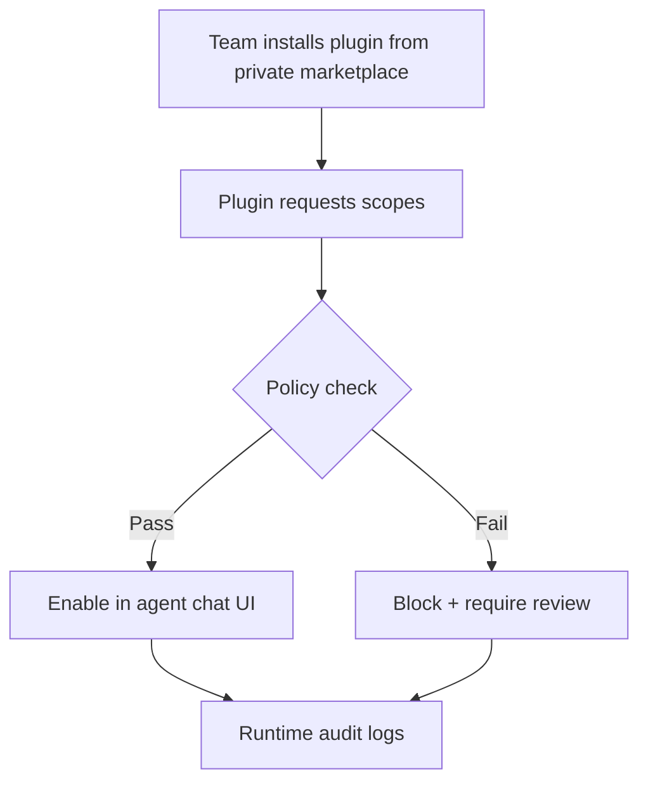
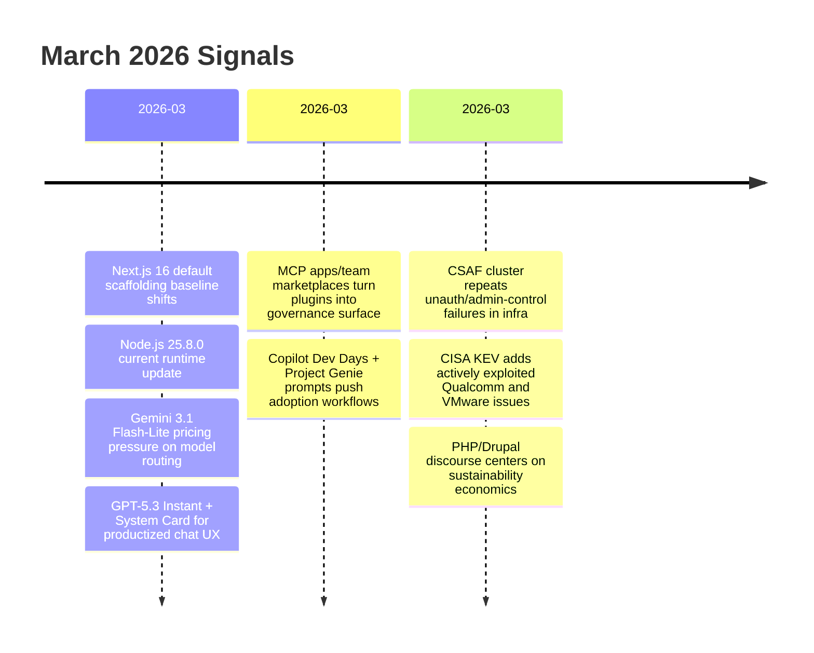

import Tabs from '@theme/Tabs';
import TabItem from '@theme/TabItem';
import TOCInline from '@theme/TOCInline';

The feed this week split into two buckets: faster/cheaper AI tooling, and the same old security failures wearing new vendor logos. On the platform side, costs are dropping and interfaces are getting friendlier. On the security side, unauthenticated admin paths and weak auth controls are still everywhere in critical infrastructure.

<!-- truncate -->

<TOCInline toc={toc} minHeadingLevel={2} maxHeadingLevel={2} />

## Runtime and Model Releases That Change Daily Engineering Work

> "Gemini 3.1 Flash-Lite is our fastest and most cost-efficient Gemini 3 series model yet."
>
> — Google, [Gemini 3.1 Flash-Lite](https://blog.google/innovation-and-ai/models-and-research/gemini-models/gemini-3-1-flash-lite/)

**Next.js 16** becoming the default for new sites and **Node.js 25.8.0 (Current)** means baseline assumptions changed in one week: scaffolds move forward, and your CI image lag turns into silent drift. Add **GPT-5.3 Instant** and **Gemini 3.1 Flash-Lite** and the practical question is no longer "which model is smartest," it is "which model is cheap enough to call constantly."

| Item | What changed | Why it matters | Immediate action |
|---|---|---|---|
| Next.js 16 default | New-site default moved forward | Team templates can diverge from production baselines | Pin framework version in project generators |
| Node.js 25.8.0 Current | Runtime current line advanced | Native API and package behavior can drift across environments | Lock Node via `.nvmrc`/CI matrix |
| Gemini 3.1 Flash-Lite | Low-cost tier + configurable thinking levels | Better fit for high-volume classification/routing | Route non-critical inference to Flash-Lite |
| GPT-5.3 Instant + System Card | Updated "everyday conversation" profile + safety doc | Better product UX, but still needs task-level evals | Keep per-task eval harness, not vibe checks |

<Tabs>
<TabItem value="gemini" label="Gemini 3.1 Flash-Lite" default>

At the cited pricing ($0.25/M input, $1.5/M output), Flash-Lite is the obvious default for routing, extraction, and first-pass drafts. Use higher tiers only when evals prove measurable lift.

</TabItem>
<TabItem value="gpt" label="GPT-5.3 Instant">

Great for conversational UX and operator tooling. Still not a free pass for autonomous actions; capability is not the same thing as reliable policy compliance.

</TabItem>
</Tabs>

:::caution[Default Versions Are Not a Migration Strategy]
When framework defaults change, generated code gets ahead of team conventions. Freeze scaffolding inputs (`next`, `node`, lint config), then upgrade intentionally with a changelog-based checklist.
:::

## Agent UX Is Becoming Product Surface, Not Just API Surface

**MCP Apps and Team Marketplaces for Plugins** signals a shift: agent extensibility is now a governance problem, not just an SDK problem. Add **GitHub Copilot Dev Days** and **Project Genie prompt tips**, and the pattern is clear: vendors are optimizing adoption mechanics, not only model quality.



:::warning[Plugin Marketplaces Expand Blast Radius]
Treat internal plugin publishing like production code deploys: signed releases, scope review, and audit logs. "Internal" does not mean safe; it means mistakes scale faster.
:::

## Security Feed: Same Bugs, Different Logos

> "CISA has added two new vulnerabilities to its Known Exploited Vulnerabilities (KEV) Catalog."
>
> — CISA, [KEV update](https://www.cisa.gov/known-exploited-vulnerabilities-catalog)

This week's CSAF stream is blunt: **Mobiliti e-mobi.hu**, **ePower epower.ie**, and **Everon OCPP Backends** report high-severity patterns (including missing authentication for critical function, weak auth throttling, and denial-of-service paths). **Labkotec LID-3300IP** lands with the same class of issue. **Hitachi Energy RTU500** and **Relion REB500** add access control and outage risk. Then KEV adds **CVE-2026-21385** (Qualcomm chipsets memory corruption) and **CVE-2026-22719** (VMware Aria Operations command injection). No novelty here, just recurring operational debt.

| Advisory | Risk snapshot | Severity signal |
|---|---|---|
| Mobiliti e-mobi.hu (all) | Unauth critical functions + auth control weaknesses | CVSS v3 9.4 |
| ePower epower.ie (all) | Same class as above; admin takeover/DoS paths | CVSS v3 9.4 |
| Everon OCPP Backends (all) | Backend control and disruption risk | CVSS v3 9.4 |
| Labkotec LID-3300IP (all) | Missing authentication for critical function | CVSS v3 9.4 |
| Hitachi RTU500 | User mgmt exposure + outage potential | High operational impact |
| Hitachi Relion REB500 | Role-based auth bypass on directory content | Privilege boundary failure |
| mailcow 2025-01a | Host header password reset poisoning | Account takeover vector |
| Easy File Sharing v7.2 | Buffer overflow | Remote code execution class risk |
| Boss Mini v1.4.0 | Local File Inclusion | Data exposure + pivot risk |

:::danger["Private Network" Is Not a Security Control]
Charging infrastructure and OT interfaces keep shipping with unauthenticated critical paths. Segmenting networks helps, but fix order is clear: kill unauth endpoints, enforce strong auth throttling, and monitor abnormal admin actions.
:::

```js title="security/triage-policy.js" showLineNumbers
const kev = new Set(["CVE-2026-21385", "CVE-2026-22719"]);

export function classify(vuln) {
  // highlight-next-line
  if (kev.has(vuln.cve)) return "patch-now";
  if (vuln.cvss >= 9.0 && vuln.exposed === true) return "patch-now";
  if (vuln.cvss >= 8.0) return "patch-this-week";
  return "scheduled";
}

export function owner(team) {
  // highlight-start
  if (team === "ot") return "infra-security";
  if (team === "web") return "appsec";
  // highlight-end
  return "platform";
}
```

```diff
- Priority = "CVSS only"
+ Priority = "KEV first, then CVSS+exposure"
- Patch window = "next sprint"
+ Patch window = "24h for KEV or exposed 9.x"
```

<details>
<summary>Full security watchlist captured this cycle</summary>

- Mobiliti e-mobi.hu CSAF
- ePower epower.ie CSAF
- Everon OCPP Backends CSAF
- Labkotec LID-3300IP CSAF
- Hitachi Energy RTU500 CSAF
- Hitachi Energy Relion REB500 CSAF
- CISA KEV additions: CVE-2026-21385, CVE-2026-22719
- mailcow 2025-01a host header password reset poisoning
- Easy File Sharing Web Server v7.2 buffer overflow
- Boss Mini v1.4.0 local file inclusion
- "Protecting Developers Means Protecting Their Secrets" security guidance
</details>

## PHP/Drupal Signals: Sustainability Is the Actual Story

The **DropTimes** "At the Crossroads of PHP" framing is accurate: contributor fatigue, tighter budgets, and fuzzy positioning are not a branding issue; they are maintenance economics. The **Drupal 25th Anniversary Gala** (March 24, 2026, Chicago) is symbolic, but the hard part is pipeline health and contributor retention. **January 2026 Baseline digest** reinforces the same theme: progress exists, but attention is fragmented.

:::info[Community Health Is a Technical Risk]
If maintainer bandwidth drops, release cadence and security response degrade. Treat ecosystem health as dependency risk, the same way runtime EOL is dependency risk.
:::

## Edge Security Is Becoming Code, Not Appliance Configuration

The "truly programmable SASE platform" claim is only useful if policies are versioned, reviewed, and tested like application code. ~~Clickops firewalling is enough~~ has been false for years.

```bash title="ops/sase-policy-check.sh"
#!/usr/bin/env bash
set -euo pipefail

POLICY_DIR="edge-policies"
FAILED=0

for f in "$POLICY_DIR"/*.rego; do
  echo "Validating $f"
  opa fmt --fail "$f" >/dev/null || FAILED=1
  conftest test "$f" || FAILED=1
done

if [ "$FAILED" -ne 0 ]; then
  echo "Policy validation failed"
  exit 1
fi

echo "Policy validation passed"
```

## The Bigger Picture



## Bottom Line

Cheap inference got cheaper, agent integrations got easier, and attack surface got wider in the same week. The right response is boring and effective: version pinning, policy gates, KEV-first patching, and strict secret handling.

:::tip[Single Highest-ROI Move]
Implement one triage rule today: `KEV OR exposed CVSS >= 9.0 => patch in 24h, with named owner`. This removes debate, cuts MTTR, and prevents backlog theater.
:::
