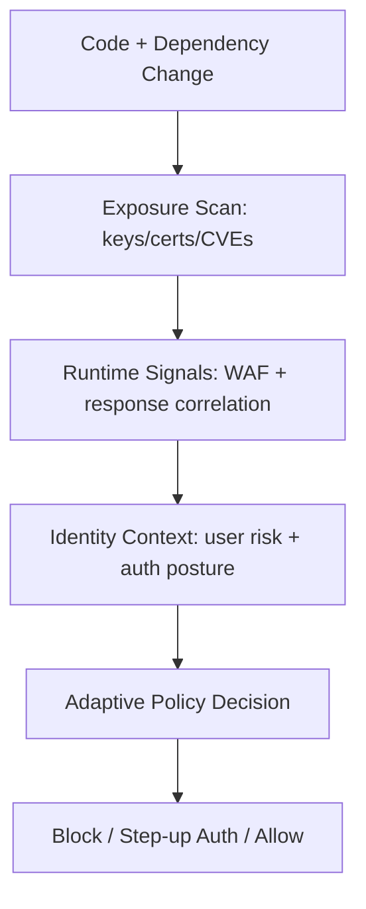
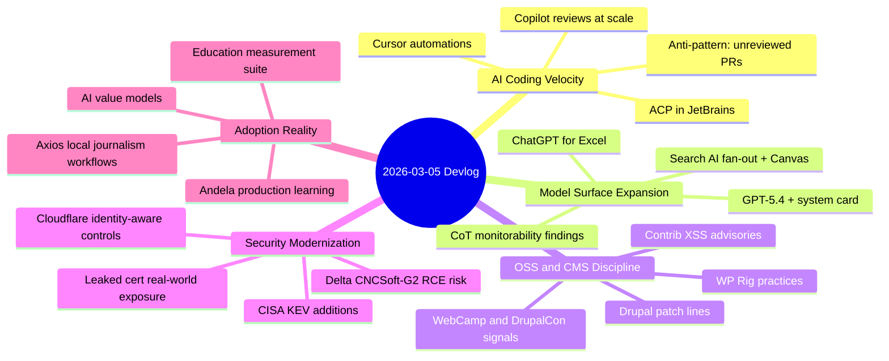

import Tabs from '@theme/Tabs';
import TabItem from '@theme/TabItem';
import TOCInline from '@theme/TOCInline';

This cycle had one clear pattern: **AI output velocity** keeps climbing, but quality and security controls haven't kept pace. The updates worth paying attention to were the ones tied to measurable operational changes. Everything else was launch copy dressed up as a changelog.

<!-- truncate -->

<TOCInline toc={toc} minHeadingLevel={2} maxHeadingLevel={2} />

## Review Gates for AI-Generated Code at Scale

GitHub crossed 60 million Copilot code reviews. The number by itself is impressive enough, but what matters more is the implication: review automation has become default infrastructure for teams shipping AI-assisted diffs daily. Combine that with Cursor automations and ACP support in JetBrains, and assistant output is now background traffic in most active repos.

~~More AI code means higher developer productivity by default~~. More AI code means higher review and regression pressure unless review gates are explicit.

> "Don't file pull requests with code you haven't reviewed yourself."
>
> — Simon Willison, [Agentic Engineering Patterns](https://simonwillison.net/guides/agentic-engineering-patterns/)

> "Shock! Shock! I learned yesterday that an open problem I'd been working on for several weeks had just been solved by Claude Opus 4.6..."
>
> — Donald Knuth, [claude-cycles.pdf](https://www-cs-faculty.stanford.edu/~knuth/papers/claude-cycles.pdf)

| Signal | Why it matters operationally | Action |
|---|---|---|
| Copilot reviews at 60M+ | Review volume has industrialized | Route high-risk diffs to mandatory human review |
| Cursor automations + JetBrains ACP | Assistant workflows move into existing IDEs | Standardize policy at repo/CI level, not IDE level |
| Qwen team turbulence | Open model strategy can shift overnight | Keep provider fallback paths and model abstraction |

:::caution[Unreviewed AI PRs Are a Team Tax]
Require author self-review plus one independent reviewer for any auth, billing, or dependency diff.
Auto-merge policies that ignore risk class create silent incident debt.
:::

```ts title="tools/review-gate.ts" showLineNumbers
import { readFileSync } from 'node:fs';

type Risk = 'low' | 'medium' | 'high';

function classifyRisk(filesChanged: number, touchesAuth: boolean, touchesDeps: boolean): Risk {
  // highlight-next-line
  if (touchesAuth || touchesDeps || filesChanged > 40) return 'high';
  if (filesChanged > 15) return 'medium';
  return 'low';
}

// highlight-start
export function requiresHumanReview(meta: { filesChanged: number; touchesAuth: boolean; touchesDeps: boolean }) {
  return classifyRisk(meta.filesChanged, meta.touchesAuth, meta.touchesDeps) !== 'low';
}
// highlight-end

const payload = JSON.parse(readFileSync('review-meta.json', 'utf8'));
process.exit(requiresHumanReview(payload) ? 1 : 0);
```

## Model Announcements Worth Reading vs. Skipping

GPT-5.4, its system card, CoT-control research, ChatGPT for Excel, Google AI Mode visual query fan-out, and Canvas-in-Search all dropped this cycle. The common thread: models are becoming execution surfaces — they run things, not just suggest things. That shift demands stronger governance, because when governance is weak, mistakes compound faster than insights.

<Tabs>
<TabItem value="openai" label="OpenAI Track" default>

GPT-5.4 + system card + reasoning control research + education measurement + Excel integrations.
Strong capability stack; usable only when policy, audit logs, and role boundaries are wired.

</TabItem>
<TabItem value="google" label="Google Search AI">

Visual search fan-out and Canvas add high-velocity synthesis directly in search UX.
Useful for drafting and prototyping, risky for unverified factual decisions.

</TabItem>
<TabItem value="cursor" label="Cursor Agents">

Always-on automations plus ACP in JetBrains shifts assistants from session tools to pipeline actors.
Treat agent triggers as production jobs with observability and kill switches.

</TabItem>
</Tabs>

:::info[Launch Demos Don't Replace Controls]
System cards and launch notes are useful inputs, but they aren't controls by themselves.
Controls live in policy files, CI gates, audit trails, and rollback procedures.
:::

## Drupal and WordPress: Patch Now, Ask Questions Later

Drupal 10.6.4 and 11.3.4 shipped bugfix releases with CKEditor5 47.6.0 updates. More urgently, contrib advisories SA-CONTRIB-2026-023 and -024 flagged XSS risk in Calculation Fields and Google Analytics GA4. If you run either module, upgrading before your next feature sprint is the move.

On the community side, things look healthy. Stanford WebCamp CFP is open, Dripyard is shipping training and sessions for DrupalCon Chicago, and UI Suite Display Builder keeps pushing no-Twig layout workflows forward. WP Rig also continues to be a solid anchor for modern theme development practice.

| Item | Immediate impact | Required move |
|---|---|---|
| Drupal 10.6.4 / 11.3.4 | Supported security windows and CKEditor updates | Patch now, stop running unsupported branches |
| SA-CONTRIB-2026-023 / -024 | Moderately critical XSS exposure | Upgrade contrib modules before feature work |
| WP Rig ecosystem updates | Better baseline for maintainable theme stacks | Use starter tooling, keep custom logic minimal |

```diff title="composer.json"
- "drupal/core-recommended": "^10.5"
+ "drupal/core-recommended": "^10.6.4 || ^11.3.4"
- "drupal/google_analytics_ga4": "^1.1.13"
+ "drupal/google_analytics_ga4": "^1.1.14"
- "drupal/calculation_fields": "^1.0.3"
+ "drupal/calculation_fields": "^1.0.4"
```

:::danger[Contrib XSS Will Cost You a Week]
Pin minimum safe versions in `composer.json` and enforce with CI.
If contrib is below advisory floor, fail the build before deployment artifacts are created.
:::

<details>
<summary>Patch and event notes</summary>

- Drupal 10.6.x security support: through December 2026; 10.4.x is already out of security support.
- Drupal 11.3.x security coverage: through December 2026.
- Stanford WebCamp 2026: online on April 30, 2026, hybrid program on May 1, 2026.
- Dripyard at DrupalCon Chicago: training, multiple sessions, site template coverage.
- UI Suite Initiative: Display Builder video walkthrough confirms low-code layout momentum.
- WP Builds #207: Rob Ruiz on WP Rig, modern starter workflows for classic and block themes.
</details>

## Security: Detection That Feeds Decisions, Not Just Dashboards

CISA added five KEVs this cycle. Delta CNCSoft-G2 has RCE potential via out-of-bounds write. Cloudflare pushed ARR, QUIC proxy mode rebuild, always-on detections, identity-aware gateway authorization, and user risk scoring. GitGuardian and Google disclosed 2,622 valid leaked-cert mappings as of September 2025, with 97% remediation after disclosure.

The "89% dormant majority" finding in open source supply chain research fits the pattern here. Stale dependencies are attack surface. Treating them as archived or harmless is how you end up in an incident post-mortem wondering why nobody checked.



:::warning[Log-Only Security Is a Delayed Incident Response]
If detection results sit in a dashboard but never trigger a policy decision, you've built a monitoring system that watches you get compromised.
Wire exploit signals and user risk scores directly into access controls.
:::

## How It All Connects




## What to Do This Week

Assistant output got faster. Review, patching, and policy enforcement need to keep up in the same sprint — not the next one.

:::tip[Single highest-ROI move]
Implement one repo-level risk gate this week: block merges when diffs touch auth/dependencies without human review and when dependency versions are below security advisory minimums.
That one gate covers AI code volume, CMS advisories, and supply-chain exposure in one control plane.
:::
