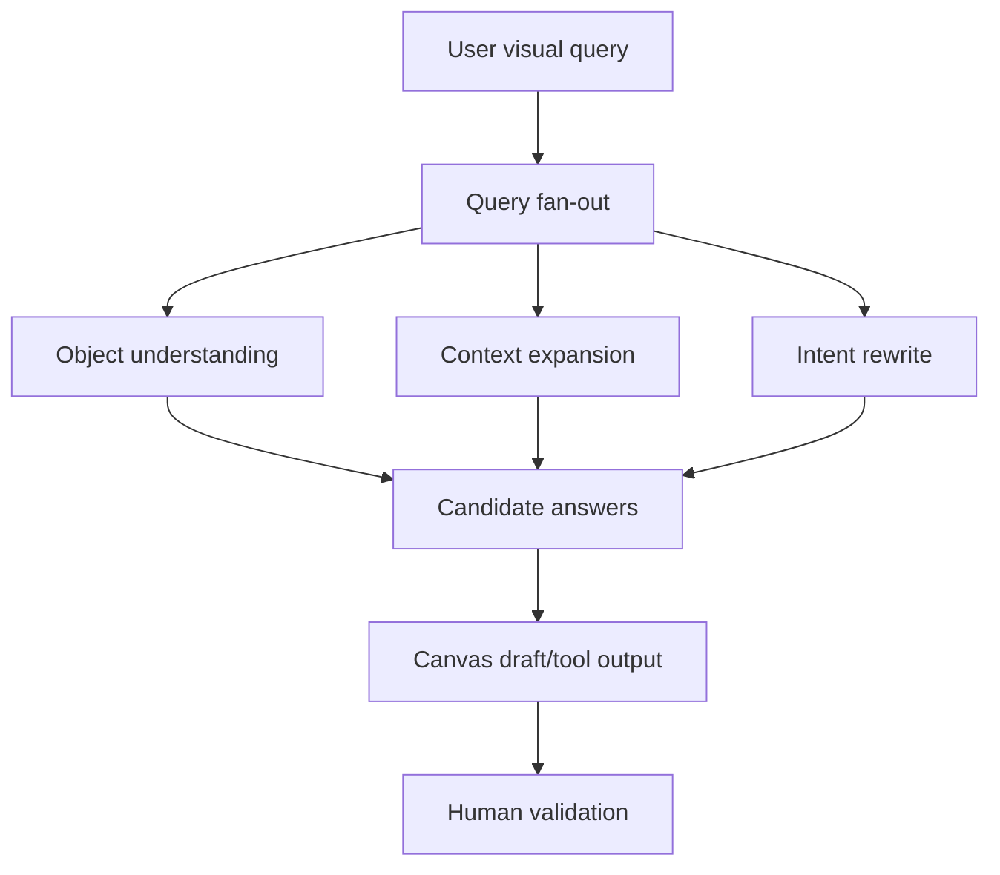
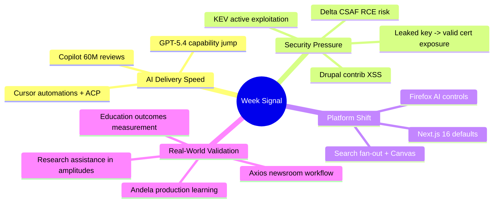

import Tabs from '@theme/Tabs';
import TabItem from '@theme/TabItem';
import TOCInline from '@theme/TOCInline';

The pattern across this batch is simple: model capability is rising fast, integration points are multiplying, and security debt is compounding at the same speed. Some announcements were useful, some were marketing noise, and a few were direct operational warnings. The practical takeaway is to treat AI adoption and patch discipline as one pipeline, not two separate tracks.

<!-- truncate -->

<TOCInline toc={toc} minHeadingLevel={2} maxHeadingLevel={2} />

## What Was Verified (Complete Index)

| Domain | Verified items compiled |
|---|---|
| AI platforms and tooling | GitHub Copilot code reviews passed 60M; GitHub + Andela on production AI learning; Cursor Automations; Cursor in JetBrains via ACP; OpenAI GPT-5.4; GPT-5.4 Thinking System Card; CoT-Control findings; Gemini 3.1 Flash-Lite; Next.js 16 default for new sites; Qwen team turbulence commentary |
| Search and user-facing AI | Google "Ask a Techspert" visual search fan-out explanation; Canvas in AI Mode rolled out in U.S. Search |
| Browser and product controls | Firefox AI controls interview with Ajit Varma ("user choice") |
| Security and infrastructure | CISA added 5 KEVs; Delta CNCSoft-G2 CSAF (RCE via out-of-bounds write); GitGuardian+Google cert/key leakage study (2,622 valid certs exposed); Cloudflare ARR, QUIC Proxy Mode rebuild, always-on detections, deepfake/laptop-farm defense with Nametag, Gateway Authorization Proxy, User Risk Scoring; "89% Problem" open-source resurrection risk |
| CMS and web ecosystem | Drupal 10.6.4 and 11.3.4 patch releases; SA-CONTRIB-2026-024 (GA4 module XSS); SA-CONTRIB-2026-023 (Calculation Fields XSS); UI Suite Display Builder walkthrough; Dripyard DrupalCon Chicago plans; WP Rig episode #207 |
| Education, media, research | OpenAI education opportunity toolkit; Learning Outcomes Measurement Suite; Axios local journalism AI workflow; graviton amplitudes preprint assisted by GPT-5.2 Pro; Donald Knuth quote on Claude solving his open problem |

## AI Coding Is Growing Up, But Review Discipline Is Still the Bottleneck

GitHub's 60M Copilot reviews and the Andela case study both point to the same thing: coding assistants are now normal production infrastructure, not experiments. Cursor's automations and ACP support in JetBrains confirm the "always-on agent" direction across IDEs.

~~AI coding means fewer reviews~~. Real teams that survive scale increase review gates, because generated volume rises faster than human attention.

> "Don't file pull requests with code you haven't reviewed yourself."
>
> — Simon Willison, [Agentic Engineering Patterns](https://simonwillison.net/guides/agentic-engineering-patterns/)

:::warning[Adoption rule that avoids chaos]
Set a hard policy: generated code is blocked from merge unless a human reviewer can explain the change in plain language and identify failure modes. Pair this with small PR size caps; large AI-generated dumps are where regressions hide.
:::

<Tabs>
<TabItem value="team-policy" label="Team Policy" default>

| Area | Do this | Not this |
|---|---|---|
| PR review | Require reviewer rationale in PR template | "LGTM" with no technical notes |
| AI usage | Track which files were AI-assisted | Pretend provenance does not matter |
| Merge control | Enforce status checks and diff size limits | Merge giant generated refactors |

</TabItem>
<TabItem value="tool-signals" label="Tool Signals">

| Signal | Why it matters |
|---|---|
| Copilot review volume | Confirms enterprise-scale usage patterns |
| Cursor automations | Shifts from assistant to background operator |
| JetBrains ACP | Removes IDE lock-in excuses |
| GPT-5.4 + system card | Better capability plus explicit safety framing |

</TabItem>
</Tabs>

## Search Is Becoming a Workspace, Not Just a Results List

Google's visual-search fan-out explanation and Canvas-in-Search rollout both move search toward task execution. This is useful when outputs are disposable drafts and dangerous when outputs are treated as authoritative without source checks.



:::caution[Search-canvas output is draft code/content]
Use Canvas-style output for scaffolding only. Promote nothing to production docs or code until linked sources are checked and copied into internal notes.
:::

## Security Signal Was Loud This Week

The KEV additions, Delta CSAF RCE risk, Drupal contrib XSS advisories, and Cloudflare detection updates all reinforce one point: exposure now comes from old software, weak identity checks, and stale assumptions about "monitor mode."

:::danger[Patch and exploit window is shrinking]
Treat KEV-listed CVEs and vendor CSAFs as immediate change tickets, not backlog ideas. If a component appears in your asset inventory and the version matches advisory criteria, patch or isolate in the same sprint.
:::

| Item | Operational impact | Action now |
|---|---|---|
| CISA KEV additions (Hikvision, Rockwell, Apple CVEs) | Active exploitation evidence | Check inventory and exposure paths within 24h |
| Delta CNCSoft-G2 out-of-bounds write | Potential remote code execution | Segment affected OT assets and apply vendor mitigations |
| Drupal GA4 `<1.1.14` and Calculation Fields `<1.0.4` | Admin-context XSS risk | Upgrade modules and review custom attribute input paths |
| GitGuardian+Google cert findings | Real cert abuse risk from leaked keys | Rotate keys, revoke certs, enforce secret scanning pre-commit |
| Cloudflare always-on detection/user risk updates | Better exploit confirmation and adaptive access control | Enable response-aware detection and risk-based policy decisions |

```yaml title="security/weekly-triage-policy.yaml" showLineNumbers
policy_version: 1
windows:
  kev_review_hours: 24
  high_risk_patch_days: 7
  medium_risk_patch_days: 30

triage:
  # highlight-next-line
  - source: cisa_kev
    priority: p0
    action: "inventory + patch_or_isolate"
  - source: vendor_csaf
    priority: p0
    action: "validate exploitability + mitigation"
  - source: drupal_sa_contrib
    priority: p1
    action: "upgrade module + regression test"
  - source: ct_leaked_keys
    priority: p0
    action: "rotate key + revoke cert + scan history"
```

## Drupal and WordPress: Patch Reality, Not Conference Theater

Drupal 10.6.4 and 11.3.4 are straightforward patch releases, but they include CKEditor5 updates with security context. Contrib advisories on GA4 and Calculation Fields are the real footgun for many teams because "admin-only" paths are often treated as trusted.

```diff title="composer.json"
 {
   "require": {
-    "drupal/core-recommended": "^10.6.3",
-    "drupal/google_analytics_ga4": "^1.1.13",
-    "drupal/calculation_fields": "^1.0.3"
+    "drupal/core-recommended": "^10.6.4",
+    "drupal/google_analytics_ga4": "^1.1.14",
+    "drupal/calculation_fields": "^1.0.4"
   }
 }
```

<details>
<summary>Release/advisory notes captured for follow-up</summary>

- Drupal `10.6.x` security support through **December 2026**; `10.5.x` through **June 2026**; `10.4.x` is out of security support.
- Drupal `11.3.x` security coverage through **December 2026**.
- CKEditor5 updated to `v47.6.0` in both trains.
- SA-CONTRIB-2026-024: Google Analytics GA4 XSS (`CVE-2026-3529`) affects `<1.1.14`.
- SA-CONTRIB-2026-023: Calculation Fields XSS (`CVE-2026-3528`) affects `<1.0.4`.
- Ecosystem signals: UI Suite Display Builder momentum, Dripyard DrupalCon activity, WP Rig's continued relevance for disciplined theme architecture.
</details>

## OpenAI, Education, and Media: Useful If Measurement Is Mandatory

GPT-5.4, CoT controllability findings, and the Learning Outcomes Measurement Suite are more credible together than separately. Capability claims without measurement are marketing. Measurement without deployment is theater.

> "Shock! Shock! I learned yesterday that an open problem I'd been working on for several weeks had just been solved by Claude Opus 4.6..."
>
> — Donald Knuth, [Claude Cycles (PDF)](https://www-cs-faculty.stanford.edu/~knuth/papers/claude-cycles.pdf)

The Axios local journalism case and the graviton-amplitudes preprint show the same practical pattern: AI creates value when scoped to workflow acceleration plus expert verification, not autonomous truth production.

:::info[What to copy from education pilots]
Adopt outcome metrics before broad rollout: baseline performance, intervention duration, and post-intervention retention checks. Without those three, "AI improved learning" is a slogan, not evidence.
:::

## The Bigger Picture



## Bottom Line

Velocity increased across coding, search, and content workflows, but the signal from security advisories and exploit catalogs was even stronger. Teams shipping AI-assisted changes without strict review policy, patch cadence, and measurable outcomes are accumulating failure debt at high speed.

:::tip[Single most actionable move]
Create one weekly `AI + Security` review meeting with a fixed agenda: generated-code review exceptions, KEV/CSAF exposure checks, and module/framework patch status. One pipeline, one owner, one dashboard.
:::
