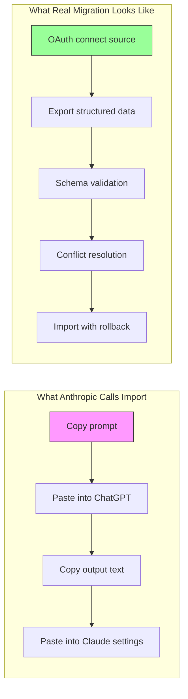

import Tabs from '@theme/Tabs';
import TabItem from '@theme/TabItem';

Anthropic launched [claude.com/import-memory](https://claude.com/import-memory), marketed as a way to "transfer your preferences and context from other AI providers to Claude." Sounds like real infrastructure. It is not. The entire mechanism is a prompt you paste into your current AI, copy the output, and paste it into Claude's memory settings. This could have been done in 2023.

<!-- truncate -->

## What "Import Memory" Actually Does

The process has exactly two steps:

1. Copy a pre-written prompt into ChatGPT, Gemini, or whatever AI you use
2. The prompt asks the AI to dump your preferences and instructions as text
3. Paste that text into Claude's memory settings at `claude.ai/settings/capabilities`

That is it. There is no API call. No OAuth handshake. No data pipeline. No export format. No protocol.

```text title="What the 'import' actually is"
User → copies prompt → pastes into ChatGPT → ChatGPT outputs text summary
User → copies text → pastes into Claude memory settings → done
```

:::caution[This Is Not Migration]
The word "import" implies a technical integration — a file format, an API endpoint, some kind of structured data exchange. What actually happens is indistinguishable from asking your AI "summarize my custom instructions and preferences" and then pasting the result somewhere else. You could have done this with a sticky note.
:::

## The Prompt That Could Have Been Written in 2023

Here is the core of what the "import" prompt does: it asks your current AI to describe how you like to work. That is a capability every LLM has had since GPT-3.5.

<Tabs>
<TabItem value="anthropic" label="Anthropic's Import" default>

```text title="What Anthropic provides"
A pre-written prompt that asks your current AI to:
- List your communication preferences
- Describe your working style
- Export custom instructions
- Summarize recurring topics
```

</TabItem>
<TabItem value="diy" label="DIY (always worked)">

```text title="What you could always type yourself"
"Summarize everything you know about my preferences,
working style, and any custom instructions I've given you.
Format it as a bullet list I can paste into another tool."
```

</TabItem>
</Tabs>

The output is identical. The only difference is Anthropic hosts the prompt on a nice URL and calls it a feature.

:::info[The Real Technical Barrier to AI Migration]
Actual migration would require: API access to conversation history, structured export formats (JSON schemas for preferences, conversation threads, file attachments), authentication flows between providers, and conflict resolution when imported preferences contradict existing ones. None of that exists here.
:::

## What Real Migration Would Look Like

| Feature | Claude Import Memory | Actual Migration |
|---------|---------------------|------------------|
| Data format | Free-text copy-paste | Structured JSON/YAML schema |
| Authentication | None | OAuth2 between providers |
| Conversation history | Not transferred | Indexed and searchable |
| File attachments | Not transferred | Re-uploaded or linked |
| Custom instructions | Paraphrased by source AI | Exported verbatim |
| Verification | None | Diff/review before import |
| Rollback | Delete from settings | Versioned snapshots |
| Automation | Fully manual | API-driven, scriptable |

The gap between "copy-paste a prompt" and "migrate between AI providers" is the same gap between emailing yourself a file and using a version control system.



## Why the Framing Matters

This is not about whether the feature is useful. Pasting your preferences into a new tool is fine. The problem is calling it "import" and positioning it as competitive infrastructure.

:::warning[Marketing vs. Engineering]
When a company frames a UX convenience as a technical capability, it sets false expectations. Users assume there is a data pipeline behind the button. There is not. The next time Anthropic ships an actual integration feature, the word "import" will already be diluted.
:::

Every AI provider could ship this exact "feature" in an afternoon — because it is a prompt, not a product. The honest framing would be: "Here is a prompt that helps you describe your preferences so you can paste them into Claude." That is a blog post, not a feature launch.

:::tip[If You Actually Want to Migrate AI Context]
Export your custom instructions manually from each provider (ChatGPT: Settings → Personalization → Custom Instructions). Store them in a markdown file in your own repo. When you switch tools, paste the relevant sections. You do not need a branded URL to do this.
:::

## Bottom Line

Claude Import Memory is a copy-paste workflow with a marketing page. The underlying technique — asking an AI to summarize your preferences — has been available since the first ChatGPT custom instructions shipped in July 2023. Calling it "import" is generous. Calling it "migration" is misleading.

The feature works fine for what it is. Just do not mistake a prompt for a protocol.

:::tip[The Takeaway]
If a provider calls something "import" or "migration," check if there is an API behind it. If the mechanism is "copy text from A, paste into B," that is a workflow tip — not infrastructure. Real migration has schemas, auth flows, and rollback. Everything else is marketing.
:::
