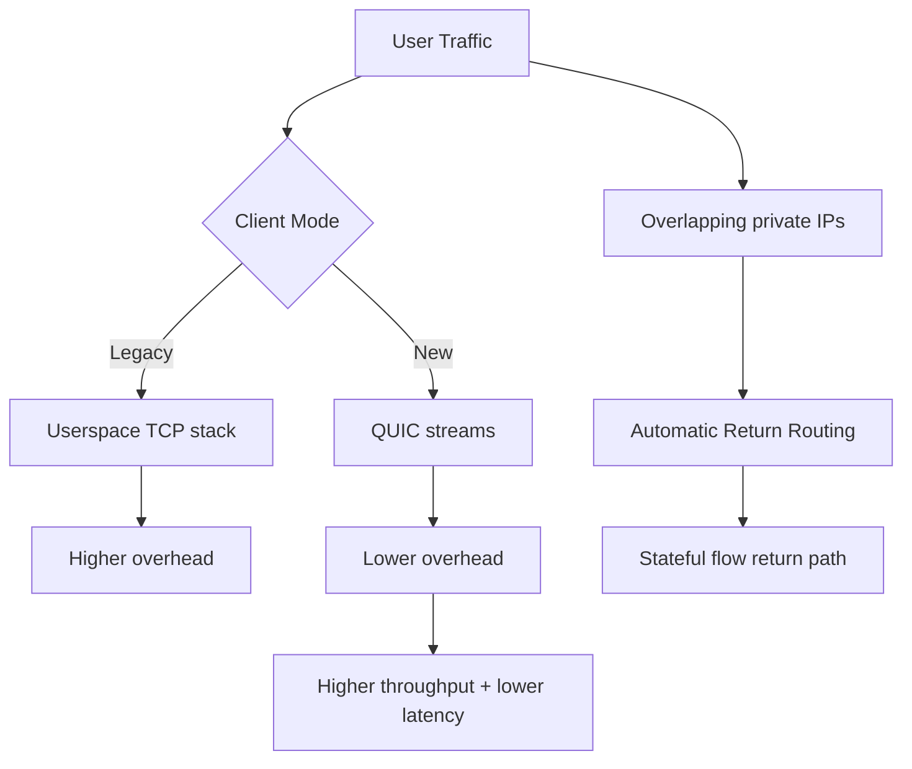

import Tabs from '@theme/Tabs';
import TabItem from '@theme/TabItem';
import TOCInline from '@theme/TOCInline';

Google and GitGuardian traced roughly one million leaked private keys back to 140k certificates — 2,622 of them still valid. Meanwhile, two Drupal contrib modules ship XSS advisories that most teams will ignore until they become incidents. The gap between "patch available" and "patch applied" remains the industry's favorite self-inflicted wound.

<!-- truncate -->

<TOCInline toc={toc} minHeadingLevel={2} maxHeadingLevel={2} />

## Drupal Core and Contrib Security Patches

> "Drupal 10.6.4 is a patch (bugfix) release ... ready for use on production sites."
>
> — Drupal Core release notes, [Drupal.org](https://www.drupal.org/project/drupal/releases/10.6.4)

> "Drupal 11.3.4 is a patch (bugfix) release ... ready for use on production sites."
>
> — Drupal Core release notes, [Drupal.org](https://www.drupal.org/project/drupal/releases/11.3.4)

Core support windows are explicit now: Drupal 10.6.x and 11.3.x are supported through December 2026; 10.4.x is already out. ~~Running an older minor because it still works~~ is how you schedule your next incident.

| Release | Status (2026-03-05) | Security window | Immediate action |
|---|---|---|---|
| Drupal 11.3.4 | Current patch | Until Dec 2026 | Patch if on 11.3.x |
| Drupal 10.6.4 | Current patch | Until Dec 2026 | Patch if on 10.x |
| Drupal 10.5.x | Supported | Until Jun 2026 | Plan minor upgrade |
| Drupal 10.4.x and below | Unsupported | Ended | Upgrade now |

:::danger[Contrib XSS advisories are not optional]
`Google Analytics GA4` (&lt;1.1.14, CVE-2026-3529) and `Calculation Fields` (&lt;1.0.4, CVE-2026-3528) both carry moderately critical XSS risk. Any admin-facing route with unsanitized attributes or expression input becomes a pivot for stored or reflected payloads.
Patch immediately, then grep custom modules for similar attribute passthrough patterns.
:::

Core patch details worth tracking

- CKEditor5 moved to `v47.6.0` in both Drupal 10.6.4 and 11.3.4.
- That upstream includes a security fix for General HTML Support XSS.
- Drupal Security Team review says built-in implementations are not considered exploitable, but pinned old editor assets in downstream stacks are still risk.

## Cloudflare One: Transport and Identity Changes Worth Adopting

**Automatic Return Routing (ARR)** solves overlapping private IPs without hand-built NAT/VRF sprawl. **QUIC Proxy Mode** removes user-space TCP overhead and Cloudflare reports roughly 2x throughput improvement. On the identity side, **User Risk Scoring**, **Gateway Authorization Proxy**, and Nametag-backed onboarding push policy away from static allow/deny toward continuous identity confidence.

<Tabs>
<TabItem value="arr" label="ARR vs NAT/VRF" default>

ARR uses stateful flow tracking for return-path correctness.
Decision logic moves from brittle route math to session-aware forwarding.

</TabItem>
<TabItem value="proxy" label="QUIC Proxy Mode">

QUIC streams reduce head-of-line blocking and stack overhead in client proxy paths.
Result: better throughput and lower latency for remote users.

</TabItem>
</Tabs>

If Access policies still assume binary trust (`allow`/`deny`) and static device posture, they are stale. Integrate user risk score signals, identity verification checkpoints, and clientless device controls in the same policy graph.

## Supply Chain Exposure: Leaked Keys and Zombie Dependencies

Google and GitGuardian linked roughly 1M leaked private keys to 140k certificates and found 2,622 valid certs still active as of September 2025. That is a production blast-radius problem, full stop.

Meanwhile, "The 89% Problem" highlights the other side of this: LLM-generated code keeps reviving abandoned packages, quietly re-importing old vulnerabilities under fresh commit timestamps. A recent commit date tells you almost nothing about whether a package is safe.

Require package health metadata in CI: maintainer continuity, issue response latency, signing, and incident history. "Recently updated" alone is cosmetic — treat it as a weak trust signal, not a gate.

## AI Product Releases: What Has Operational Impact

Signals with direct developer impact:
- **Cursor in JetBrains IDEs** via ACP broadens adoption where teams already live.
- **Next.js 16 default for new sites** changes baseline scaffolding assumptions.
- **Node.js 25.8.0 (Current)** matters for toolchain compatibility tests.
- **Gemini 3.1 Flash-Lite** is cheap and fast, well-suited for high-volume classification and extraction tasks.
- **OpenAI Learning Outcomes Measurement Suite** stands out because it measures educational effect over time rather than relying on one-shot benchmarks.
- **Google Search Canvas in AI Mode** is handy for drafting docs and prototypes. Not a substitute for repository discipline, but a reasonable scratchpad.

Signals to treat as watchlist, not immediate migration:
- Qwen team turbulence despite strong 3.5 model momentum.
- Project Genie world-building tips: interesting, but niche unless simulation tooling is core to your stack.
- Copilot Dev Days: useful for team enablement, no direct architecture change.

## WordPress and Drupal Community Updates

- Dripyard is using DrupalCon Chicago as a serious distribution push: training sessions, talks, and template workshops. That looks like real product-channel execution.
- UI Suite Display Builder video shows "no Twig/CSS" layout assembly in Drupal. Worth watching if your team is bottlenecked on theming.
- WP Rig maintainer interview confirms starter themes still have value when they encode standards and teach architecture, not just generate boilerplate.

> "Don't file pull requests with code you haven't reviewed yourself."
>
> — Simon Willison, [Agentic Engineering Patterns](https://simonwillison.net/guides/agentic-engineering-patterns/)

Hard to argue with that one.

## Research and Culture Worth Noting

Donald Knuth publicly acknowledging Claude Opus 4.6 solving an open problem is a real marker. When serious experts update their priors in public, that carries more weight than any product launch blog post.

A new preprint extending single-minus amplitudes to gravitons, with GPT-5.2 Pro assisting derivation and verification, reinforces a pattern I keep seeing: model utility peaks when paired with expert validation loops. Autonomous claims without that loop remain unreliable.

## Bottom Line

Shipping posture this week is straightforward: patch Drupal core and contrib immediately, tighten supply chain trust gates, and adopt AI tooling only where you can point to a specific operational metric that improves.

:::tip[Single action with highest ROI]
Run a 48-hour security sprint: upgrade Drupal to 10.6.4/11.3.4, patch `google_analytics_ga4` and `calculation_fields`, rotate leaked key material, and enforce dependency health checks in CI before merging anything AI-generated.
:::
