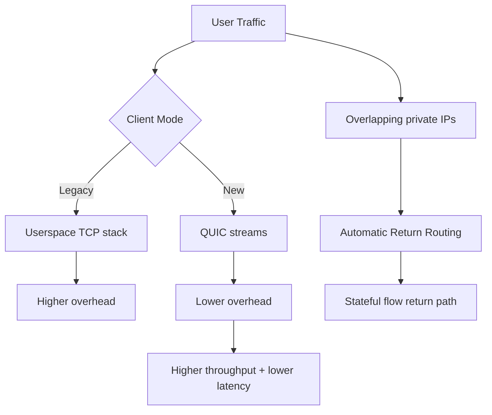
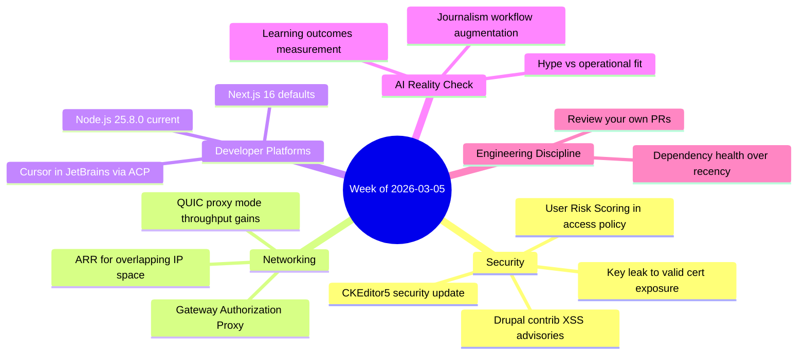

import Tabs from '@theme/Tabs';
import TabItem from '@theme/TabItem';
import TOCInline from '@theme/TOCInline';
import IdealImage from '@theme/IdealImage';

This batch had a clear pattern: maintenance work is shipping real risk reduction, while a lot of AI announcements are mostly packaging. Drupal core/contrib patches and identity-aware network controls are concrete. Model and IDE announcements are useful, but only after filtering hype from operational impact.

<!-- truncate -->

<TOCInline toc={toc} minHeadingLevel={2} maxHeadingLevel={2} />

<IdealImage img={require('@site/static/img/vs-social-card.png')} alt="Devlog social card" />

## Drupal Core and Contrib: Patch Now, Not Later

> "Drupal 10.6.4 is a patch (bugfix) release ... ready for use on production sites."
>
> — Drupal Core release notes, [Drupal.org](https://www.drupal.org/project/drupal/releases/10.6.4)

> "Drupal 11.3.4 is a patch (bugfix) release ... ready for use on production sites."
>
> — Drupal Core release notes, [Drupal.org](https://www.drupal.org/project/drupal/releases/11.3.4)

Core support windows are explicit now: Drupal 10.6.x and 11.3.x are supported through December 2026; 10.4.x is already out. ~~Running an older minor is fine if it still works~~ is how incidents get scheduled.

| Release | Status (2026-03-05) | Security window | Immediate action |
|---|---|---|---|
| Drupal 11.3.4 | Current patch | Until Dec 2026 | Patch if on 11.3.x |
| Drupal 10.6.4 | Current patch | Until Dec 2026 | Patch if on 10.x |
| Drupal 10.5.x | Supported | Until Jun 2026 | Plan minor upgrade |
| Drupal 10.4.x and below | Unsupported | Ended | Upgrade now |

:::danger[Contrib XSS advisories are not optional]
`Google Analytics GA4` (&lt;1.1.14, CVE-2026-3529) and `Calculation Fields` (&lt;1.0.4, CVE-2026-3528) both carry moderately critical XSS risk. Any admin-facing route with unsanitized attributes or expression input becomes a pivot for stored or reflected payloads.  
Patch immediately, then grep custom modules for similar attribute passthrough patterns.
:::

```php title="web/modules/custom/security_audit/src/Command/ContribAuditCommand.php" showLineNumbers
<?php

declare(strict_types=1);

namespace Drupal\security_audit\Command;

if (!defined('ABSPATH')) { exit; } // highlight-line

final class ContribAuditCommand {
  public function run(array $modules): array {
    $findings = [];
    foreach ($modules as $name => $version) {
      // highlight-start
      if ($name === 'google_analytics_ga4' && version_compare($version, '1.1.14', '<')) {
        $findings[] = 'Upgrade google_analytics_ga4 to >=1.1.14 (CVE-2026-3529)';
      }
      if ($name === 'calculation_fields' && version_compare($version, '1.0.4', '<')) {
        $findings[] = 'Upgrade calculation_fields to >=1.0.4 (CVE-2026-3528)';
      }
      // highlight-end
    }
    return $findings;
  }
}
```

<details>
<summary>Core patch details worth tracking</summary>

- CKEditor5 moved to `v47.6.0` in both Drupal 10.6.4 and 11.3.4.
- That upstream includes a security fix for General HTML Support XSS.
- Drupal Security Team review says built-in implementations are not considered exploitable, but pinned old editor assets in downstream stacks are still risk.

</details>

## Cloudflare One: Architecture Shifts That Actually Move the Needle

**Automatic Return Routing (ARR)** solves overlapping private IPs without hand-built NAT/VRF sprawl. **QUIC Proxy Mode** removes user-space TCP overhead and reports ~2x throughput. **User Risk Scoring**, **Gateway Authorization Proxy**, and Nametag-backed onboarding push policy from static allow/deny toward continuous identity confidence.

<Tabs>
  <TabItem value="arr" label="ARR vs NAT/VRF" default>
    ARR uses stateful flow tracking for return-path correctness.  
    Decision logic moves from brittle route math to session-aware forwarding.
  </TabItem>
  <TabItem value="proxy" label="QUIC Proxy Mode">
    QUIC streams reduce head-of-line blocking and stack overhead in client proxy paths.  
    Result: better throughput and lower latency for remote users.
  </TabItem>
</Tabs>



:::warning[Policy model changed]
If Access policies still assume binary trust (`allow`/`deny`) and static device posture, they are stale. Integrate user risk score signals, identity verification checkpoints, and clientless device controls in the same policy graph.
:::

## Supply Chain Reality: Key Leaks and Dormant Dependencies

Google + GitGuardian linked roughly 1M leaked private keys to 140k certificates and found 2,622 valid certs still active as of September 2025. That is not a "developer hygiene" story; it is production blast radius.

"The 89% Problem" adds the second half: LLM-generated code revives abandoned packages, so old vulnerabilities get re-imported under new commit timestamps.

```diff title="security/controls/dependency-policy.diff"
- allow_if: package_is_recently_updated
+ allow_if: package_has_maintainer_activity_12m
+ allow_if: package_has_release_signing
+ allow_if: no_known_credential_leak_association
+ deny_if: cert_or_key_exposure_unremediated
```

:::caution[Fresh commit date is a weak trust signal]
Require package health metadata in CI: maintainer continuity, issue response latency, signing, and incident history. "Recently updated" alone is cosmetic.
:::

## AI Product Announcements: Useful, But Filter Hard

Signals with direct developer impact:
- **Cursor in JetBrains IDEs** via ACP broadens adoption where teams already live.
- **Next.js 16 default for new sites** changes baseline scaffolding assumptions.
- **Node.js 25.8.0 (Current)** matters for toolchain compatibility tests.
- **Gemini 3.1 Flash-Lite** is cheap/fast; good for high-volume classification and extraction.
- **OpenAI Learning Outcomes Measurement Suite** is meaningful because it measures educational effect over time, not one-shot benchmark theater.
- **Google Search Canvas in AI Mode** is practical for draft docs/prototypes, not a substitute for repository discipline.

Signals to treat as "watchlist, not immediate migration":
- Qwen team turbulence despite strong 3.5 model momentum.
- Project Genie world-building tips: interesting, but niche unless simulation tooling is core.
- Copilot Dev Days: useful for team enablement, no direct architecture change.

## WordPress and Drupal Community Notes That Matter

- Dripyard is using DrupalCon Chicago as a serious distribution push: training + talks + template session. That is product-channel execution, not swag theater.
- UI Suite Display Builder video shows "no Twig/CSS" layout assembly in Drupal; useful for teams reducing theme bottlenecks.
- WP Rig maintainer interview confirms starter themes still matter when they encode standards and teach architecture, not just scaffold files.

> "Don't file pull requests with code you haven't reviewed yourself."
>
> — Simon Willison, [Agentic Engineering Patterns](https://simonwillison.net/guides/agentic-engineering-patterns/)

That quote stays undefeated.

## Research and Culture Signals

Donald Knuth publicly acknowledging Claude Opus 4.6 solving an open problem is a real marker: serious experts are updating priors in public. Separate that from announcement churn.

A new preprint extending single-minus amplitudes to gravitons, with GPT-5.2 Pro assisting derivation/verification, is another indicator: model utility is strongest when paired with expert validation loops, not autonomous claims.

## The Bigger Picture



## Bottom Line

Shipping posture this week is simple: patch Drupal core/contrib immediately, harden supply chain trust gates, and adopt AI tooling only where the operational metric improves.

:::tip[Single action with highest ROI]
Run a 48-hour security sprint: upgrade Drupal to 10.6.4/11.3.4, patch `google_analytics_ga4` and `calculation_fields`, rotate leaked key material, and enforce dependency health checks in CI before merging anything AI-generated.
:::
