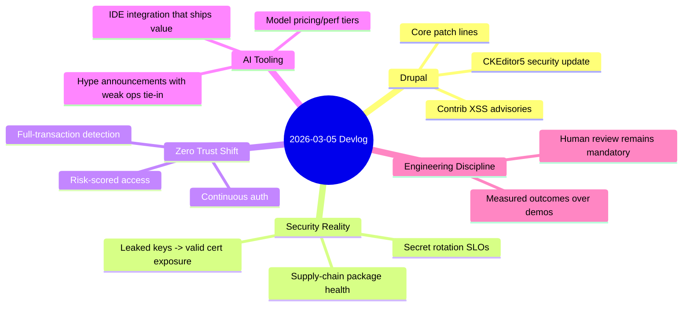

import Tabs from '@theme/Tabs';
import TabItem from '@theme/TabItem';
import TOCInline from '@theme/TOCInline';

The pattern today is simple: patch discipline and identity controls are real engineering, while most AI announcements are positioning. Drupal core and contrib shipped concrete security-relevant updates; infra/security vendors pushed more continuous enforcement patterns; AI ecosystem news ranged from useful to noisy. ~~"Latest" means "safe enough"~~ is still how teams get burned.

<!-- truncate -->

<TOCInline toc={toc} minHeadingLevel={2} maxHeadingLevel={2} />

## Drupal Core: 10.6.4 and 11.3.4 Are Maintenance, Not Optional

> "Drupal 10.6.4 is a patch (bugfix) release ... ready for use on production sites."
>
> — Drupal.org, [Drupal 10.6.4 release](https://www.drupal.org/project/drupal/releases/10.6.4)

> "Drupal 11.3.4 is a patch (bugfix) release ... ready for use on production sites."
>
> — Drupal.org, [Drupal 11.3.4 release](https://www.drupal.org/project/drupal/releases/11.3.4)

**Why this matters:** both branches pulled in CKEditor 5 `v47.6.0`, including an XSS fix in General HTML Support. If a team is still debating patch cadence, that debate is already stale.

| Branch | Current patch | Security support window | Operational message |
|---|---:|---|---|
| Drupal 11.3.x | 11.3.4 | Until December 2026 | Safe target for active 11.x estates |
| Drupal 10.6.x | 10.6.4 | Until December 2026 | Stable 10.x target |
| Drupal 10.5.x | latest 10.5 patch line | Until June 2026 | Transitional only |
| Drupal 10.4.x and older | EOL for security | Ended | Upgrade immediately |

:::warning[Patch release complacency]
Treating patch releases as "can wait" is how known vulnerabilities stay live for months. Put Drupal patch lines on a fixed deployment train and enforce maximum patch age in CI.
:::

```yaml title="ops/drupal-release-policy.yaml" showLineNumbers
release_policy:
  drupal_core:
    cadence: weekly
    max_patch_age_days: 14
    supported_targets:
      # highlight-next-line
      - "11.3.x"
      - "10.6.x"
  editor_stack:
    ckeditor5:
      required_min_version: "47.6.0"
  gates:
    - composer_validate
    - security_advisory_check
    - smoke_test_admin_login
```

<details>
<summary>Support-window notes to pin in your runbook</summary>

- Drupal 10.6.x security support: through December 2026.
- Drupal 10.5.x security support: through June 2026.
- Drupal 10.4.x: security support ended.
- Drupal 11.3.x security coverage: through December 2026.
- CKEditor5 update in both release lines includes security remediation context.

</details>

## Drupal Contrib Security: Two Fresh XSS Advisories (2026-03-04)

Projects flagged:

- **Google Analytics GA4** (`SA-CONTRIB-2026-024`, `CVE-2026-3529`), affected `<1.1.13`
- **Calculation Fields** (`SA-CONTRIB-2026-023`, `CVE-2026-3528`), affected `<1.0.4`

Both are "moderately critical," both are XSS class issues, both are avoidable with tighter input/attribute validation.

:::danger[Action now, not next sprint]
If either module is installed, upgrade first, then review any custom code that extends its input paths. XSS advisory fixed in vendor code does not sanitize your local shortcuts.
:::

```diff title="composer.json (contrib module bump)"
 {
   "require": {
-    "drupal/google_analytics_ga4": "^1.1.12",
-    "drupal/calculation_fields": "^1.0.3"
+    "drupal/google_analytics_ga4": "^1.1.13",
+    "drupal/calculation_fields": "^1.0.4"
   }
 }
```

## Secrets and Certificates: Leaks Stay Real Until Revoked

GitGuardian + Google mapped leaked private keys to real certs: ~1M leaked keys tied to ~140k certs; **2,622 certs were still valid** as of September 2025. Remediation hit 97%, which is good and still leaves a dangerous tail.

**Why this matters:** secret scanning that stops at "detected" is theater. Detection without forced rotation is an incident queue.

:::caution[Detection-only programs fail quietly]
Implement an SLO for revocation/rotation time. If secret leak MTTR is not measured, it is not controlled.
:::

## Cloudflare's Direction: Continuous Enforcement Beats Point Checks

Announcements across WAF and Zero Trust all point the same way:

- Full-transaction + attack-signature detection to reduce "log vs block" tuning pain
- Mandatory auth + independent MFA from boot to resource access
- Gateway Authorization Proxy for clientless/device-constrained environments
- User Risk Scoring for adaptive access policy
- Nametag partnership to reduce onboarding identity fraud/laptop farms

This is practical: identity and risk become continuous signals, not one-time gates.

## AI Tooling Wave: Separate Useful Changes from Marketing Vapor

<Tabs>
<TabItem value="useful-now" label="Useful Now" default>

- Cursor via ACP in JetBrains IDEs: real workflow impact for teams standardized on IntelliJ/PyCharm/WebStorm.
- Next.js 16 default for new sites: changes baseline assumptions for greenfield JS stacks.
- Node.js 25.8.0 current: relevant for experimentation, not automatic prod target.
- Gemini 3.1 Flash-Lite pricing/perf tier: viable for cost-sensitive high-volume paths.

</TabItem>
<TabItem value="needs-proof" label="Needs Proof">

- "Canvas in AI Mode in Search": promising UX, unclear production integration story.
- "Project Genie world-building tips": interesting, but not directly tied to delivery reliability.
- "Copilot Dev Days": community value depends entirely on practical follow-through.

</TabItem>
<TabItem value="watch-closely" label="Watch Closely">

- Qwen team turbulence: model quality can stay high while org risk spikes.
- "89% Dormant Majority" package revival thesis: true pattern, needs dependency health gates to avoid supply-chain regressions.

</TabItem>
</Tabs>

## Engineering Culture Signal: Review Discipline Is Non-Negotiable

> "Don't file pull requests with code you haven't reviewed yourself."
>
> — Simon Willison, [Agentic Engineering Patterns](https://simonwillison.net/guides/agentic-engineering-patterns/)

That sentence should be printed over every AI-assisted repo. "The model wrote it" is not a review strategy.

```bash title="ci/review-guard.sh"
#!/usr/bin/env bash
set -euo pipefail

changed_files=$(git diff --name-only origin/main...HEAD)
test -n "$changed_files"

# highlight-start
echo "Run static analysis + tests before PR is mergeable"
npm run lint
npm test
# highlight-end

echo "Require human review checklist completion"
```

## WordPress and Practical Craft: WP Rig Still Matters

Rob Ruiz's WP Rig discussion is useful because it stays grounded in maintainability: starter theme as a teaching surface, not a magic scaffold. Agencies shipping both classic and block-based themes still benefit from opinionated baseline tooling.

## AI + Research + Education + Journalism: The Useful Thread

- OpenAI Learning Outcomes Measurement Suite: finally pushing evaluation toward longitudinal outcomes, not benchmark screenshot theater.
- Axios AI workflow claims: plausible when framed as workflow acceleration around local journalism constraints.
- Graviton amplitude preprint + model-assisted derivation/verification: strong example of AI as collaborator in hard math, not substitute for proof culture.
- Knuth's Claude quote is the right attitude update: skeptical, then evidence-driven revision.

> "I learned yesterday that an open problem ... had just been solved by Claude Opus 4.6."
>
> — Donald Knuth, [paper note](https://www-cs-faculty.stanford.edu/~knuth/papers/claude-cycles.pdf)

## The Bigger Picture



## Bottom Line

Most teams do not have an "AI problem"; they have a patching and identity enforcement problem wearing an AI costume.

:::tip[Single highest ROI move this week]
Create one security pipeline gate that fails deploys when Drupal core/contrib has known security advisories or patch age exceeds 14 days, and wire secret-rotation MTTR into the same dashboard.
:::
